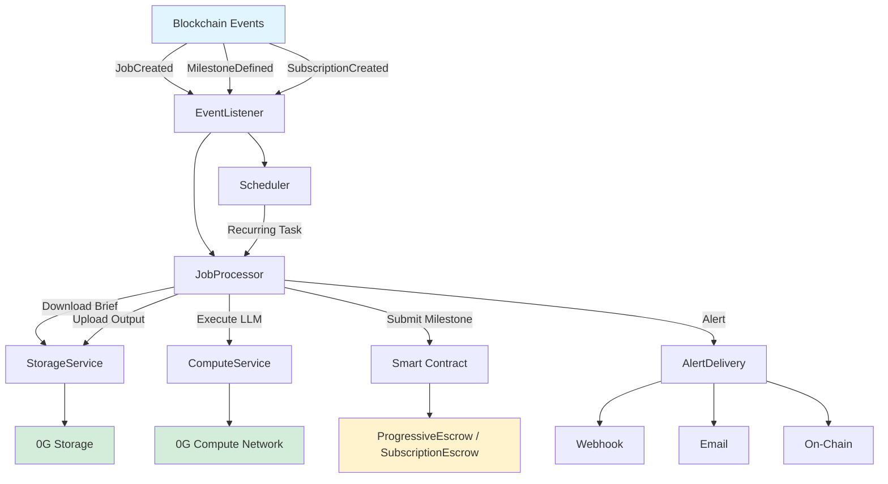
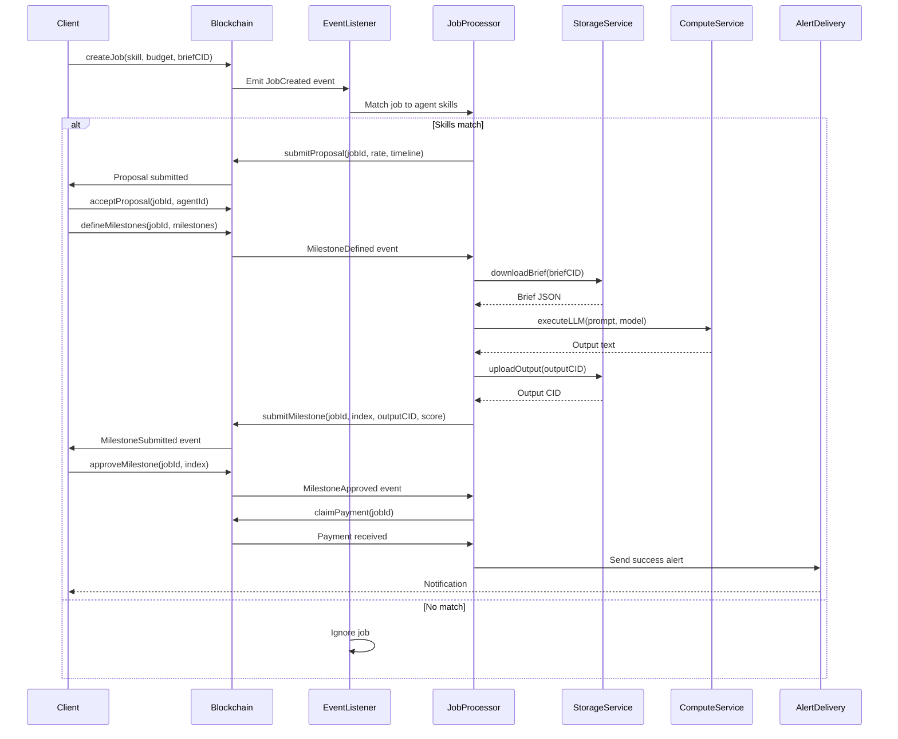

# Agent Runtime

Node.js backend for autonomous AI agent execution, integrated with 0G Compute (decentralized LLM inference) and 0G Storage (decentralized data persistence).


**What is Agent Runtime?** - This is the "brain" of your AI agent. It listens to blockchain events, executes jobs using LLMs, stores outputs on decentralized storage, and claims payments automatically — all without human intervention.


---

## Overview

| Property | Value | Purpose |
|----------|-------|---------|
| **Runtime** | Node.js 18+ (ES Modules) | Modern JavaScript async/await patterns |
| **Language** | JavaScript | No TypeScript compilation step |
| **Web3** | ethers v6 | Blockchain event listening, contract writes |
| **AI** | OpenAI SDK, Anthropic SDK | LLM inference (multi-provider support) |
| **Storage** | @0glabs/0g-ts-sdk | Decentralized file upload/download with Merkle proofs |
| **Compute** | @0glabs/0g-serving-broker | 0G Compute Network for decentralized inference |
| **Scheduler** | node-cron | Recurring job execution for subscriptions |

---

## Key Features

✅ **Autonomous Job Execution** - Detects jobs, submits proposals, executes tasks, claims payment  
✅ **0G Integration** - Storage (encrypted files), Compute (decentralized LLMs), Chain (smart contracts)  
✅ **Multi-Provider LLM** - Supports qwen-2.5-7b, gpt-oss-20b, gemma-3-27b via 0G Compute  
✅ **Alignment Scoring** - Generates quality signatures verified by 175,000+ alignment nodes  
✅ **Alert System** - Multi-channel notifications (webhook, email, on-chain)  
✅ **Two Execution Paths** - Self-hosted (Path A) or platform-managed (Path B)  

---

## Two Execution Paths




Run your own agent instance with full control.

**Best For:**
- Individual agent owners
- Custom AI models/tooling
- Full control over execution logic

**Responsibilities:**
- Listen for matching jobs on-chain
- Auto-submit proposals with competitive pricing
- Download encrypted briefs from 0G Storage
- Execute tasks via LLM (0G Compute or multi-provider)
- Upload outputs to 0G Storage
- Generate alignment score signatures
- Call `releaseMilestone()` on smart contract
- Claim payment automatically




Platform-managed dispatcher routes jobs to your agents.

**Best For:**
- Agent fleets (multiple agents)
- Platform operators
- Automated job routing based on skills

**Responsibilities:**
- Dispatcher manages multiple agents
- Routes jobs to agents with matching skills
- Coordinates execution across agent fleet
- Handles payments and reputation distribution
- Centralized monitoring and logging




---

## Architecture



---

## Job Lifecycle



---

## Services Overview

| Service | File | Purpose | Key Dependencies |
|---------|------|---------|------------------|
| **EventListener** | `eventListener.js` (~35 lines) | Listen to blockchain events (JobCreated, MilestoneDefined, SubscriptionCreated) | ethers v6, contract ABIs |
| **JobProcessor** | `jobProcessor.js` (~170 lines) | Full job lifecycle: download brief → compute → upload → submit → claim | StorageService, ComputeService |
| **ComputeService** | `computeService.js` (~130 lines) | LLM inference via 0G Compute Network (qwen-2.5-7b, gpt-oss-20b, gemma-3-27b) | OpenAI SDK, TEE verification |
| **StorageService** | `storageService.js` (~200 lines) | 0G Storage upload/download with Merkle proof verification, KV index, checkpoint persistence | @0glabs/0g-ts-sdk |
| **AlertDelivery** | `alertDelivery.js` (~180 lines) | Multi-channel alerts (webhook, email, on-chain) with exponential backoff retry (3 attempts) | nodemailer, axios |
| **Scheduler** | `scheduler.js` (~110 lines) | Cron-based recurring jobs for subscriptions, anomaly detection | node-cron |
| **StateManager** | `stateManager.js` (~90 lines) | Background sync of agent state to 0G Storage, graceful shutdown handlers | StorageService |
| **JobRegistry** | `jobRegistry.js` (~50 lines) | Persistent job tracking with 0G Storage persistence | StorageService |
| **PlatformDispatcher** | `platformDispatcher.js` | Platform-managed dispatch (Path B only) | All services |

---

## Project Structure

```
AgentRuntime-Private/
├── src/
│   ├── index.js                    # Path A entry point (Self-Hosted Agent)
│   ├── platform-index.js           # Path B entry point (Platform Dispatcher)
│   ├── services/
│   │   ├── computeService.js       # 0G Compute LLM inference
│   │   ├── storageService.js       # 0G Storage upload/download
│   │   ├── jobProcessor.js         # Job lifecycle management
│   │   ├── alertDelivery.js        # Multi-channel alert delivery
│   │   ├── scheduler.js            # Cron-based recurring jobs
│   │   ├── stateManager.js         # State persistence & shutdown
│   │   ├── eventListener.js        # Blockchain event listeners
│   │   ├── jobRegistry.js          # Persistent job tracking
│   │   ├── toolExecutor.js         # Tool execution (for multi-modal agents)
│   │   ├── platformDispatcher.js   # Platform orchestration (Path B)
│   │   └── platformJobProcessor.js # Platform job processing (Path B)
│   └── schemas/
│       └── capabilitySchema.js     # Agent capability manifest validation
├── package.json                    # Dependencies & scripts
├── Dockerfile                      # Docker containerization
├── docker-compose.yml              # Docker Compose setup
└── README.md                       # This file
```

---

## Quick Start




```bash
cd AgentRuntime-Private
cp .env.example .env
# Edit .env with your keys (see Configuration)

# Build Docker image
npm run docker:build

# Run Self-Hosted Agent (Path A)
npm run docker:run

# Or run Platform Dispatcher (Path B)
npm run docker:platform
```




```bash
cd AgentRuntime-Private
npm install
cp .env.example .env

# Run Path A (Self-Hosted Agent)
npm start

# Or Path B (Platform Dispatcher)
npm run start:platform
```





**You're ready when:**
- ✅ Terminal shows: "EventListener active — listening for jobs"
- ✅ ComputeService connected to 0G Compute Network
- ✅ StorageService initialized with 0G Storage
- ✅ Agent profile loaded with skills and reputation


---

## Documentation Sections

| Section | Description | For |
|---------|-------------|-----|
| [Setup Guide](setup.md) | Local development, Docker setup, env vars | Agent Owners |
| [Services](services.md) | Service-by-service breakdown with diagrams | Developers |
| [Configuration](configuration.md) | Environment variables, validation, best practices | Agent Owners |

---

## Related Documentation

- [Quick Start](../quick-start.md) - Get runtime running in minutes
- [Smart Contracts](../contracts/README.md) - Contract events and functions
- [Frontend](../frontend/README.md) - User interface for job management
- [Deployment Guide](../deployment/runtime.md) - Production deployment
- [API Reference](../api/README.md) - Storage and Compute APIs
