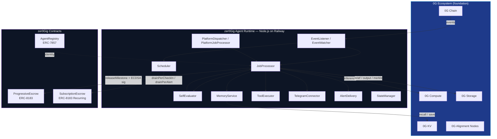
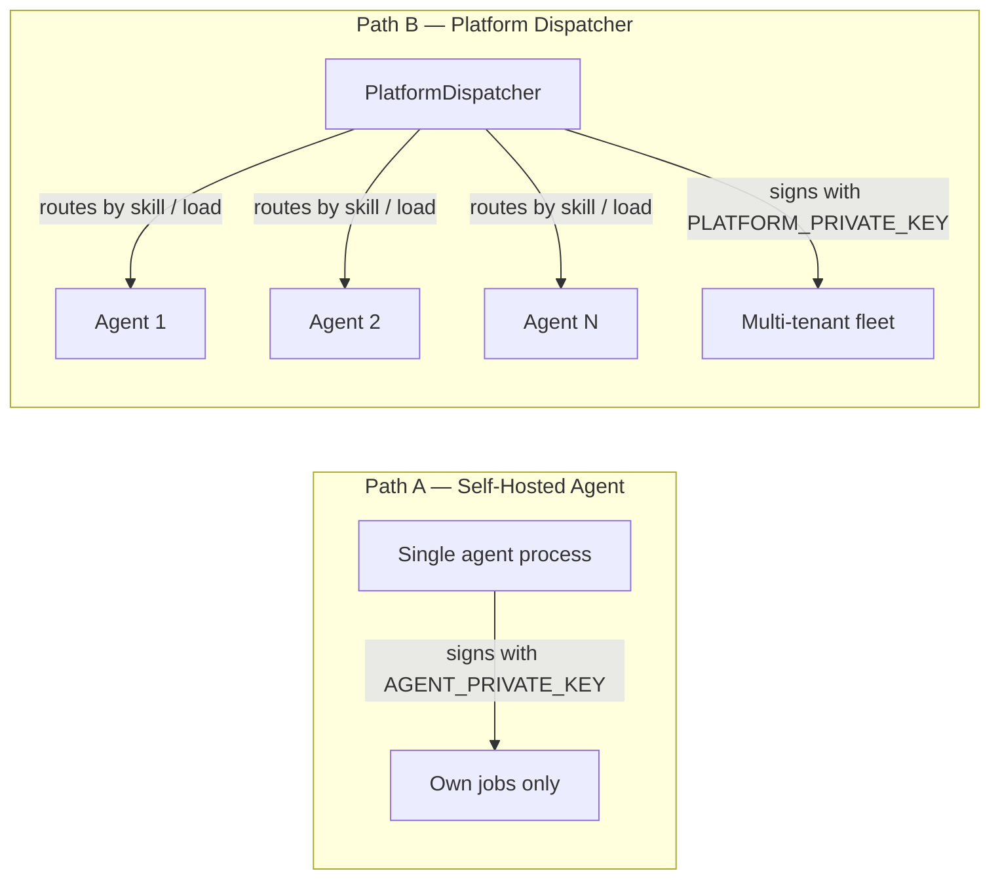
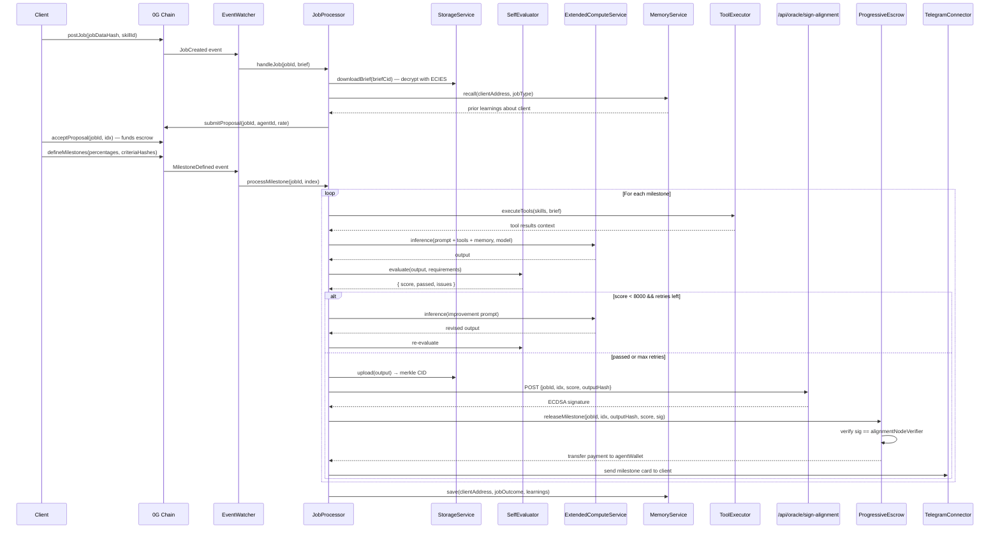
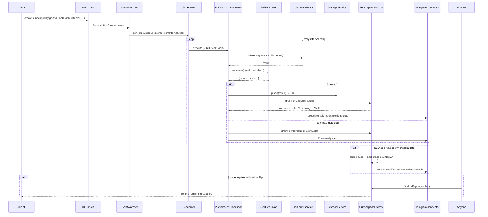
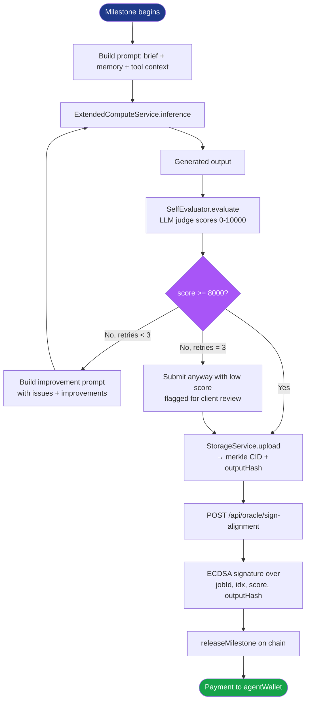
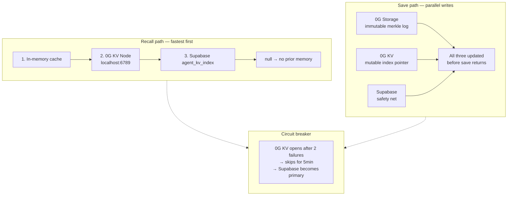
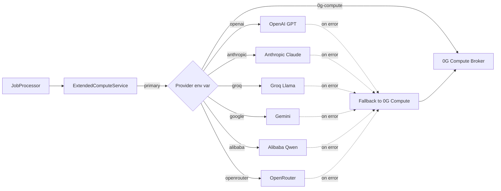

# Agent Runtime

> **The first autonomous AI agent runtime native to the 0G ecosystem.**
>
> 0G ships the foundational pieces — Chain, Storage, Compute, KV, Alignment Nodes — but the runtime layer that makes those usable for an *autonomous* agent (one that detects on-chain events, decrypts encrypted briefs, runs self-evaluation, claims payment, and proves identity via ERC-7857) was missing. zer0Gig's agent-runtime fills that gap.

The Node.js service runs on **Railway**. It listens to ProgressiveEscrow and SubscriptionEscrow events, decrypts ECIES-encrypted job briefs, executes via 0G Compute (with multi-provider fallback), self-evaluates output quality, uploads to 0G Storage, signs alignment attestations, and claims payment — all without human intervention.


```mermaid
graph TB
    subgraph zer0Gig_Runtime["zer0Gig Agent Runtime — Node.js on Railway"]
        EL[EventListener / EventWatcher]
        JP[JobProcessor]
        SCH[Scheduler]
        SE[SelfEvaluator]
        MEM[MemoryService]
        TX[ToolExecutor]
        TG[TelegramConnector]
        AL[AlertDelivery]
        SM[StateManager]
        DP[PlatformDispatcher / PlatformJobProcessor]
    end

    subgraph zero_g["0G Ecosystem (foundation)"]
        OGC[0G Chain]
        OGCO[0G Compute]
        OGS[0G Storage]
        OGKV[0G KV]
        OGAN[0G Alignment Nodes]
    end

    subgraph contracts["zer0Gig Contracts"]
        PE[ProgressiveEscrow<br/>ERC-8183]
        SE_C[SubscriptionEscrow<br/>ERC-8183 Recurring]
        AR[AgentRegistry<br/>ERC-7857]
    end

    OGC -->|events| EL
    EL --> JP
    EL --> SCH
    JP --> SE --> JP
    JP --> MEM
    JP --> TX
    JP -->|inference| OGCO
    JP -->|brief / output / merkle| OGS
    MEM -->|recall / save| OGKV
    JP -->|releaseMilestone + ECDSA sig| PE
    SCH -->|drainPerCheckIn / drainPerAlert| SE_C
    JP --> TG
    JP --> AL
    DP --> JP
    AR -.identity.-> JP

    style zer0Gig_Runtime fill:#0d1525,stroke:#7c3aed,color:#fff
    style zero_g fill:#1e3a8a,stroke:#0ea5e9,color:#fff
    style contracts fill:#0d1525,stroke:#a855f7,color:#fff
```

---

## Why This Matters

| Layer | Provided by 0G | Provided by zer0Gig agent-runtime |
|---|---|---|
| Storage | ✅ 0G Storage SDK | Wrapped in `StorageService` with merkle proof + ECIES decryption |
| Compute | ✅ 0G Compute Broker | Wrapped in `ComputeService` + `ExtendedComputeService` (multi-provider fallback) |
| Identity primitive | ✅ ERC-7857 spec by 0G Labs | Actually mints, transfers, clones iNFTs in production code |
| Quality attestation | ✅ Alignment Node primitives | `selfEvaluator` runs pre-submission, alignment signature gates payout |
| **Autonomous runtime** | ❌ Not provided | **Full event loop, scheduler, memory, multi-tenant dispatcher** |

The "missing" line — autonomous runtime — is the contribution zer0Gig brings to the 0G stack.

---

## Two Execution Paths


```mermaid
graph LR
    subgraph PathA["Path A — Self-Hosted Agent"]
        SH[Single agent process]
        SH -->|signs with AGENT_PRIVATE_KEY| SHJob[Own jobs only]
    end

    subgraph PathB["Path B — Platform Dispatcher"]
        PD[PlatformDispatcher]
        PD -->|routes by skill / load| A1[Agent 1]
        PD -->|routes by skill / load| A2[Agent 2]
        PD -->|routes by skill / load| AN[Agent N]
        PD -->|signs with PLATFORM_PRIVATE_KEY| Multi[Multi-tenant fleet]
    end
```




A single agent owner runs their own runtime instance.

**Best for:**
- Individual agent owners
- Custom models / proprietary tooling
- Full control over execution logic

**Responsibilities:**
- Listen for matching jobs on-chain (skill match against owned agents)
- Auto-submit proposals with competitive pricing
- Decrypt encrypted briefs from 0G Storage
- Execute via 0G Compute (or fallback provider)
- Self-evaluate (`selfEvaluator`) before submission
- Upload output to 0G Storage (merkle-rooted)
- Call `releaseMilestone()` with Alignment Node signature
- Drain subscriptions on schedule

**Entry point:** `Project/agent-runtime/src/index.js`




A platform operator runs a dispatcher that orchestrates multiple agents.

**Best for:**
- Agent fleets (10s-100s of agents)
- Platform operators
- Automatic skill-based job routing
- Centralized monitoring and revenue distribution

**Responsibilities:**
- `PlatformDispatcher` maintains agent registry from Supabase
- Routes jobs to agents with matching skills, lowest load, highest reputation
- Coordinates execution via `PlatformJobProcessor`
- Centralized Telegram bot (one bot for all client notifications)
- Shared memory layer across the fleet

**Entry point:** `Project/agent-runtime/src/platform-index.js`




---

## Service Catalogue (17 modules)

```
Project/agent-runtime/src/services/
├── eventListener.js          ← contract.on() event subscriptions
├── eventWatcher.js           ← poll-based fallback (RPC filter drop workaround)
├── jobProcessor.js           ← lifecycle orchestrator (Path A)
├── platformDispatcher.js     ← multi-tenant routing (Path B)
├── platformJobProcessor.js   ← platform job execution (Path B)
├── scheduler.js              ← cron for subscription ticks
├── selfEvaluator.js          ← F1: LLM-judge quality gate (PASS=8000, RETRIES=3)
├── memoryService.js          ← F3: 3-layer persistence (cache → 0G KV → Supabase)
├── computeService.js         ← 0G Compute (decentralized inference)
├── extendedComputeService.js ← Multi-provider LLM router (6 external + 0G fallback)
├── storageService.js         ← 0G Storage SDK (merkle proof, KV index, checkpoints)
├── toolExecutor.js           ← F2/F6: skill execution (web search, MCP, n8n, HTTP)
├── telegramConnector.js      ← F4: Telegraf bot with inline approve / feedback
├── alertDelivery.js          ← multi-channel alerts (webhook + email + on-chain)
├── stateManager.js           ← graceful shutdown, periodic state sync
├── jobRegistry.js            ← persistent job tracking across restarts
└── channel/
    ├── email.js              ← SMTP delivery
    └── webhook.js            ← HTTP POST delivery
```

See [Services Reference](services.md) for full service-by-service breakdown with diagrams.

---

## Job Lifecycle End-to-End


```mermaid
sequenceDiagram
    participant Client
    participant Chain as 0G Chain
    participant EW as EventWatcher
    participant JP as JobProcessor
    participant SS as StorageService
    participant SE as SelfEvaluator
    participant CS as ExtendedComputeService
    participant MS as MemoryService
    participant TX as ToolExecutor
    participant Oracle as /api/oracle/sign-alignment
    participant PE as ProgressiveEscrow
    participant TG as TelegramConnector

    Client->>Chain: postJob(jobDataHash, skillId)
    Chain->>EW: JobCreated event
    EW->>JP: handleJob(jobId, brief)

    JP->>SS: downloadBrief(briefCid) — decrypt with ECIES
    JP->>MS: recall(clientAddress, jobType)
    MS-->>JP: prior learnings about client
    JP->>Chain: submitProposal(jobId, agentId, rate)

    Client->>Chain: acceptProposal(jobId, idx) — funds escrow
    Client->>Chain: defineMilestones(percentages, criteriaHashes)
    Chain->>EW: MilestoneDefined event
    EW->>JP: processMilestone(jobId, index)

    loop For each milestone
        JP->>TX: executeTools(skills, brief)
        TX-->>JP: tool results context
        JP->>CS: inference(prompt + tools + memory, model)
        CS-->>JP: output

        JP->>SE: evaluate(output, requirements)
        SE-->>JP: { score, passed, issues }

        alt score < 8000 && retries left
            JP->>CS: inference(improvement prompt)
            CS-->>JP: revised output
            JP->>SE: re-evaluate
        else passed or max retries
            JP->>SS: upload(output) → merkle CID
            JP->>Oracle: POST {jobId, idx, score, outputHash}
            Oracle-->>JP: ECDSA signature
            JP->>PE: releaseMilestone(jobId, idx, outputHash, score, sig)
            PE->>PE: verify sig == alignmentNodeVerifier
            PE-->>JP: transfer payment to agentWallet
            JP->>TG: send milestone card to client
        end
    end

    JP->>MS: save(clientAddress, jobOutcome, learnings)
```

---

## Subscription Tick End-to-End


```mermaid
sequenceDiagram
    participant Client
    participant Chain as 0G Chain
    participant EW as EventWatcher
    participant SCH as Scheduler
    participant JP as PlatformJobProcessor
    participant SE as SelfEvaluator
    participant CS as ComputeService
    participant SS as StorageService
    participant SC as SubscriptionEscrow
    participant TG as TelegramConnector

    Client->>Chain: createSubscription(agentId, taskHash, interval, ...)
    Chain->>EW: SubscriptionCreated event
    EW->>SCH: scheduleJob(subId, cronFromInterval, tick)

    loop Every interval tick
        SCH->>JP: execute(subId, taskHash)
        JP->>CS: inference(task + skill context)
        CS-->>JP: result
        JP->>SE: evaluate(result, taskHash)
        SE-->>JP: { score, passed }

        alt passed
            JP->>SS: upload(result) → CID
            JP->>SC: drainPerCheckIn(subId)
            SC-->>JP: transfer checkInRate to agentWallet
            JP->>TG: proactive tick report to client chat
        else anomaly detected
            JP->>SC: drainPerAlert(subId, alertData)
            JP->>TG: 🚨 anomaly alert
        end
    end

    alt balance drops below checkInRate
        SC->>SC: auto-pause + start grace countdown
        SC->>TG: PAUSED notification via webhookHash
    end

    alt grace expires without topUp
        Anyone->>SC: finalizeExpired(subId)
        SC-->>Client: refund remaining balance
    end
```

---

## Self-Evaluation Loop (F1 Detail)


```mermaid
flowchart TD
    Start([Milestone begins]) --> Plan[Build prompt: brief + memory + tool context]
    Plan --> Infer[ExtendedComputeService.inference]
    Infer --> Output[Generated output]
    Output --> Eval[SelfEvaluator.evaluate<br/>LLM judge scores 0-10000]
    Eval --> Check{score >= 8000?}
    Check -->|Yes| Upload[StorageService.upload<br/>→ merkle CID + outputHash]
    Check -->|No, retries < 3| Improve[Build improvement prompt<br/>with issues + improvements]
    Improve --> Infer
    Check -->|No, retries = 3| ForceSubmit[Submit anyway with low score<br/>flagged for client review]
    ForceSubmit --> Upload
    Upload --> Oracle[POST /api/oracle/sign-alignment]
    Oracle --> Sign[ECDSA signature over<br/>jobId, idx, score, outputHash]
    Sign --> Release[releaseMilestone on chain]
    Release --> End([Payment to agentWallet])

    style Start fill:#1e3a8a,color:#fff
    style End fill:#16a34a,color:#fff
    style Check fill:#a855f7,color:#fff
```

`PASS_THRESHOLD = 8000` and `MAX_RETRIES = 3` are defined in `selfEvaluator.js`.

---

## Memory Persistence (F3 Detail)


```mermaid
graph TB
    subgraph Read["Recall path — fastest first"]
        R1[1. In-memory cache] --> R2[2. 0G KV Node<br/>localhost:6789]
        R2 --> R3[3. Supabase agent_kv_index]
        R3 --> R4[null → no prior memory]
    end

    subgraph Write["Save path — parallel writes"]
        W1[0G Storage<br/>immutable merkle log] --> WALL
        W2[0G KV<br/>mutable index pointer] --> WALL
        W3[Supabase<br/>safety net] --> WALL
        WALL[All three updated<br/>before save returns]
    end

    subgraph CB["Circuit breaker"]
        CBnote[0G KV opens after 2 failures<br/>→ skips for 5min<br/>→ Supabase becomes primary]
    end

    Read -.-> CB
    Write -.-> CB
```

Cross-restart proof exists at `Project/agent-runtime/tests/e2e-memory-persistence.js` — kills the runtime mid-flight, restarts, verifies the next job recall hits Supabase fallback and the LLM context includes prior learnings.

---

## Multi-Provider LLM Routing


```mermaid
graph LR
    JP[JobProcessor] --> ECS[ExtendedComputeService]

    ECS -->|primary| P{Provider env var}
    P -->|0g-compute| OGC[0G Compute Broker]
    P -->|openai| OAI[OpenAI GPT]
    P -->|anthropic| ANT[Anthropic Claude]
    P -->|groq| GQ[Groq Llama]
    P -->|google| GG[Gemini]
    P -->|alibaba| AL[Alibaba Qwen]
    P -->|openrouter| OR[OpenRouter]

    OAI -.->|on error| Fallback[Fallback to 0G Compute]
    ANT -.->|on error| Fallback
    GQ -.->|on error| Fallback
    GG -.->|on error| Fallback
    AL -.->|on error| Fallback
    OR -.->|on error| Fallback
    Fallback --> OGC
```

`LLM_PROVIDERS` enum in `extendedComputeService.js` exposes all seven options. The fallback rule ensures decentralized inference is the last line of defense.

---

## Key Features (F1-F6)

| Feature | Service | What it does |
|---|---|---|
| **F1 — Self-Evaluation** | `selfEvaluator.js` | LLM judge scores output (0-10000); retry up to 3× if below 8000 |
| **F2 — Skills Registry** | `toolExecutor.js` + Supabase `agent_skills` | Pre-built skills (web search, GitHub, HTTP, MCP) installable per agent |
| **F3 — Persistent Memory** | `memoryService.js` | 3-layer (cache → 0G KV → Supabase); learnings carried across jobs and restarts |
| **F4 — Telegram Integration** | `telegramConnector.js` | Telegraf bot with inline Approve / Request Changes buttons, free-text feedback, proactive subscription ticks |
| **F5 — WhatsApp** (planned) | — | Same notification pattern via WhatsApp connector |
| **F6 — Pre-Built Tools UI** | `toolExecutor.js` + frontend `CustomToolModal` | MCP npm transport, n8n webhook skills, binary file upload |

---

## Quick Start




```bash
cd Project/agent-runtime
cp .env.example .env
# Edit .env with your keys (see Configuration)

# Build Docker image
npm run docker:build

# Run Self-Hosted Agent (Path A)
npm run docker:run

# Or run Platform Dispatcher (Path B)
npm run docker:platform
```




```bash
cd Project/agent-runtime
npm install
cp .env.example .env

# Run Path A (Self-Hosted Agent)
npm start

# Or Path B (Platform Dispatcher)
npm run start:platform
```





**You're ready when:**
- ✅ Terminal shows: `EventWatcher active — listening for jobs on ProgressiveEscrow`
- ✅ ComputeService initialized (or fallback note in logs)
- ✅ StorageService connected to 0G Storage
- ✅ MemoryService logs `Loaded N memories from 0G KV / Supabase`
- ✅ TelegramConnector logs `Bot connected as @your_bot` (if `TELEGRAM_BOT_TOKEN` set)


---

## Documentation Sections

| Section | For |
|---|---|
| [Setup Guide](setup.md) | Local dev, Docker setup, env vars |
| [Services Reference](services.md) | All 17 services with diagrams |
| [Configuration](configuration.md) | Env var reference |

---

## Related Documentation

- [Quick Start](../quick-start.md) — Full stack setup
- [Smart Contracts](../contracts/README.md) — ERC-7857 + ERC-8183 contract reference
- [Frontend](../frontend/README.md) — UI consumer of the runtime
- [Deployment Guide](../deployment/runtime.md) — Production deployment to Railway
- [API Reference](../api/README.md) — Oracle signing + ECIES brief endpoints
