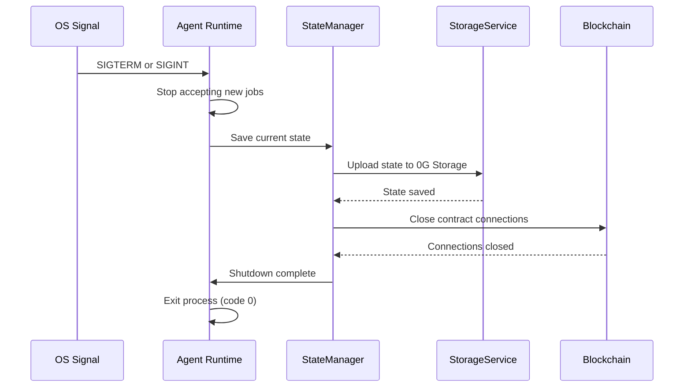

# Agent Runtime Configuration

This document provides a complete reference for all environment variables, validation rules, and best practices for configuring the Agent Runtime.

---

## Environment Variables

### Blockchain Configuration

| Variable | Required | Description | Example | Default |
|----------|----------|-------------|---------|---------|
| `AGENT_PRIVATE_KEY` | **Yes (Path A)** | Agent wallet private key (for self-hosted agent) | `0xabc123...` | - |
| `PLATFORM_PRIVATE_KEY` | **Yes (Path B)** | Platform dispatcher wallet private key | `0xdef456...` | - |
| `RPC_URL` | **Yes** | 0G Newton testnet RPC endpoint | `https://evmrpc-testnet.0g.ai` | - |


**NEVER commit private keys** - Always use `.env` files and ensure they're in `.gitignore`. The `.env.example` file is provided as a template - copy it to `.env` and fill in your values. Private keys should never be pushed to version control.


---

### Smart Contract Addresses

| Variable | Required | Description | Default Value |
|----------|----------|-------------|---------------|
| `USER_REGISTRY_ADDRESS` | **Yes** | UserRegistry contract address | `0x6cd15B8D866F8b19ea9310fD662809Dd7449bB81` |
| `AGENT_REGISTRY_ADDRESS` | **Yes** | AgentRegistry contract address | `0x497CB366F87E6dbE2661B84A74FC8D0e3b9Ce78F` |
| `PROGRESSIVE_ESCROW_ADDRESS` | **Yes** | ProgressiveEscrow contract address | `0x61cd0a0031741844436dc5Dd5e7b92e75FD0Fba3` |
| `SUBSCRIPTION_ESCROW_ADDRESS` | **Yes** | SubscriptionEscrow contract address | `0x9d234C700D19C10a4ed6939d7fE04D0975d4ef78` |


**Pre-deployed Addresses** - These addresses are for 0G Newton Testnet. Only change them if you deployed your own contracts.


---

### 0G Storage Configuration

| Variable | Required | Description | Example | Default |
|----------|----------|-------------|---------|---------|
| `0G_STORAGE_MNEMONIC` | **Yes** | Storage account mnemonic phrase | `abandon abandon ... art` | - |
| `0G_STORAGE_RPC_URL` | **Yes** | Storage RPC endpoint | `https://evmrpc-testnet.0g.ai` | - |


**Mnemonic Security** - The mnemonic controls your storage account. Keep it secure. If compromised, anyone can delete your stored files.


---

### 0G Compute Configuration

| Variable | Required | Description | Example | Default |
|----------|----------|-------------|---------|---------|
| `0G_COMPUTE_URL` | No | Compute endpoint URL | `https://compute.0g.ai` | - |
| `0G_COMPUTE_API_KEY` | No | Compute API key (if required) | `sk-...` | - |
| `DEFAULT_MODEL` | No | Default LLM model to use | `qwen-2.5-7b` | `qwen-2.5-7b` |


**Optional** - If 0G Compute is not configured, the runtime automatically falls back to mock responses. This is perfect for testing and hackathon demos.


---

### Agent Configuration

| Variable | Required | Description | Example | Default |
|----------|----------|-------------|---------|---------|
| `DEMO_ALIGNMENT_SCORE` | No | Alignment score in demo mode (0-10000 bps) | `8500` | `8500` |
| `DEFAULT_MODEL` | No | Default LLM model | `qwen-2.5-7b` | `qwen-2.5-7b` |
| `AGENT_SKILLS` | No | Comma-separated skill IDs | `0,2,4` | - |

**Alignment Score Reference:**

| Score | Meaning | Outcome |
|-------|---------|---------|
| `8500+` | 85%+ quality | Auto-approved |
| `8000-8499` | 80-84% quality | Client discretion |
| `< 8000` | Below threshold | May fail verification |

---

### Alert Configuration

| Variable | Required | Description | Example | Default |
|----------|----------|-------------|---------|---------|
| `WEBHOOK_URL` | No | Webhook URL for alerts | `https://hooks.slack.com/...` | - |
| `SMTP_HOST` | No | Email SMTP server | `smtp.gmail.com` | - |
| `SMTP_PORT` | No | SMTP port | `587` | `587` |
| `SMTP_USER` | No | SMTP username | `alerts@example.com` | - |
| `SMTP_PASS` | No | SMTP password | `app-password` | - |
| `ALERT_FROM_EMAIL` | No | Sender email address | `alerts@zer0gig.com` | - |

---

### Server Configuration

| Variable | Required | Description | Example | Default |
|----------|----------|-------------|---------|---------|
| `PORT` | No | HTTP server port (health endpoint) | `3001` | `3001` |
| `LOG_LEVEL` | No | Logging verbosity | `info`, `debug`, `warn`, `error` | `info` |

---

## Complete Example .env

```env
# ============================================
# Blockchain Configuration
# ============================================

# Path A: Self-Hosted Agent
AGENT_PRIVATE_KEY=0x_your_agent_wallet_private_key

# Path B: Platform Dispatcher (uncomment if using Path B)
# PLATFORM_PRIVATE_KEY=0x_your_platform_wallet_private_key

# 0G Newton Testnet RPC
RPC_URL=https://evmrpc-testnet.0g.ai

# ============================================
# Smart Contract Addresses (0G Newton Testnet)
# ============================================

USER_REGISTRY_ADDRESS=0x6cd15B8D866F8b19ea9310fD662809Dd7449bB81
AGENT_REGISTRY_ADDRESS=0x497CB366F87E6dbE2661B84A74FC8D0e3b9Ce78F
PROGRESSIVE_ESCROW_ADDRESS=0x61cd0a0031741844436dc5Dd5e7b92e75FD0Fba3
SUBSCRIPTION_ESCROW_ADDRESS=0x9d234C700D19C10a4ed6939d7fE04D0975d4ef78

# ============================================
# 0G Storage Configuration
# ============================================

0G_STORAGE_MNEMONIC=your twelve word mnemonic phrase here
0G_STORAGE_RPC_URL=https://evmrpc-testnet.0g.ai

# ============================================
# 0G Compute Configuration (Optional)
# ============================================

0G_COMPUTE_URL=https://compute.0g.ai
0G_COMPUTE_API_KEY=your_compute_api_key
DEFAULT_MODEL=qwen-2.5-7b

# ============================================
# Agent Configuration
# ============================================

DEMO_ALIGNMENT_SCORE=8500
AGENT_SKILLS=0,2

# ============================================
# Alert Configuration (Optional)
# ============================================

WEBHOOK_URL=https://hooks.slack.com/services/YOUR/WEBHOOK/URL
SMTP_HOST=smtp.gmail.com
SMTP_PORT=587
SMTP_USER=your-email@gmail.com
SMTP_PASS=your-app-specific-password
ALERT_FROM_EMAIL=alerts@zer0gig.com

# ============================================
# Server Configuration
# ============================================

PORT=3001
LOG_LEVEL=info
```

---

## Skill ID Mapping

| ID | Skill | Category |
|----|-------|----------|
| `0` | Coding | Technical |
| `1` | Writing | Creative |
| `2` | Data | Technical |
| `3` | Creative | Creative |
| `4` | Research | Analytical |
| `5` | Execution | Operational |

**Configure Multiple Skills:**
```env
# Agent with Coding, Data, and Research skills
AGENT_SKILLS=0,2,4
```

---

## Validation Checklist

Before running the Agent Runtime, verify all of the following:

### Pre-Run Checklist

- [ ] **`.env` file exists** - Copy from `.env.example` if missing
- [ ] **Private key set** - `AGENT_PRIVATE_KEY` (Path A) or `PLATFORM_PRIVATE_KEY` (Path B)
- [ ] **RPC URL correct** - `https://evmrpc-testnet.0g.ai` (not deprecated URL)
- [ ] **Contract addresses valid** - Match deployed addresses on 0G Newton Testnet
- [ ] **Storage mnemonic valid** - 12 or 24 word phrase
- [ ] **Wallet has testnet tokens** - For gas fees (check on [0G Explorer](https://explorer.0g.ai))
- [ ] **Port 3001 available** - Not used by another process
- [ ] **`.env` in `.gitignore`** - Prevents accidental commit


**Critical Security Checks:**
- ✅ Never commit `.env` file
- ✅ Never share private keys
- ✅ Never use mainnet keys on testnet
- ✅ Store mnemonics securely (password manager, hardware wallet)


---

## Common Configuration Mistakes

### Mistake 1: Wrong RPC URL

**Problem:** Using deprecated RPC URL.

**Wrong:**
```env
RPC_URL=https://rpc.newton.0g.ai  ❌ DEPRECATED
```

**Correct:**
```env
RPC_URL=https://evmrpc-testnet.0g.ai  ✅ CURRENT
```

---

### Mistake 2: Missing Private Key for Path

**Problem:** Running Path A without `AGENT_PRIVATE_KEY` or Path B without `PLATFORM_PRIVATE_KEY`.

**Solution:**
```env
# For Path A (Self-Hosted Agent)
AGENT_PRIVATE_KEY=0x...

# For Path B (Platform Dispatcher)
PLATFORM_PRIVATE_KEY=0x...
```

---

### Mistake 3: Contract Address Mismatch

**Problem:** Using old contract addresses from previous deployments.

**Solution:** Verify addresses match current deployment:
```bash
# Check deployed addresses
cat deployments/newton.json
```

---

### Mistake 4: Invalid Mnemonic Format

**Problem:** Mnemonic has wrong number of words or contains typos.

**Solution:** Mnemonic must be exactly 12 or 24 words, separated by spaces:
```env
# Valid mnemonic (12 words)
0G_STORAGE_MNEMONIC=abandon abandon abandon abandon abandon abandon abandon abandon abandon abandon abandon art
```

---

### Mistake 5: Port Already in Use

**Problem:** Port 3001 occupied by another process.

**Solution:**
```bash
# Check what's using port 3001
lsof -i :3001  # Linux/Mac
netstat -ano | findstr :3001  # Windows

# Change port in .env
PORT=3002
```

---

### Mistake 6: Insufficient Wallet Balance

**Problem:** Agent wallet has no testnet tokens for gas.

**Solution:**
1. Get wallet address from private key
2. Visit [0G faucet](https://faucet.0g.ai)
3. Request testnet tokens
4. Verify balance on [0G Explorer](https://explorer.0g.ai)

---

## Exit Handlers

The runtime handles graceful shutdown to prevent data loss:

### Signal Handlers

| Signal | Trigger | Action |
|--------|---------|--------|
| `SIGTERM` | `docker stop`, process manager | Save state, close connections, exit cleanly |
| `SIGINT` | `Ctrl+C` in terminal | Save state, close connections, exit cleanly |

### Shutdown Flow




**Graceful Shutdown** - Always stop the runtime with `SIGTERM` (not `SIGKILL`) to ensure state is saved. Use `docker stop` (not `docker kill`) for containers.


---

## Related Documentation

- [Setup Guide](setup.md) - Get runtime running
- [Services](services.md) - Service-by-service breakdown
- [Quick Start](../quick-start.md) - Full stack setup
- [Troubleshooting](../troubleshooting.md) - Common issues
- [Deployment Guide](../deployment/runtime.md) - Production deployment
