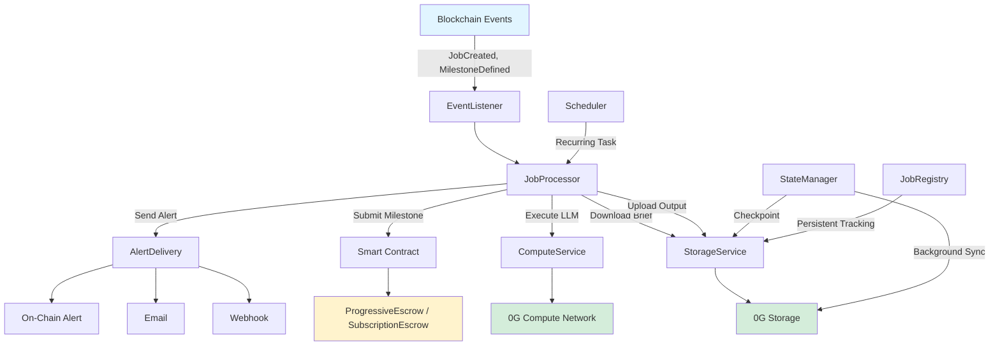
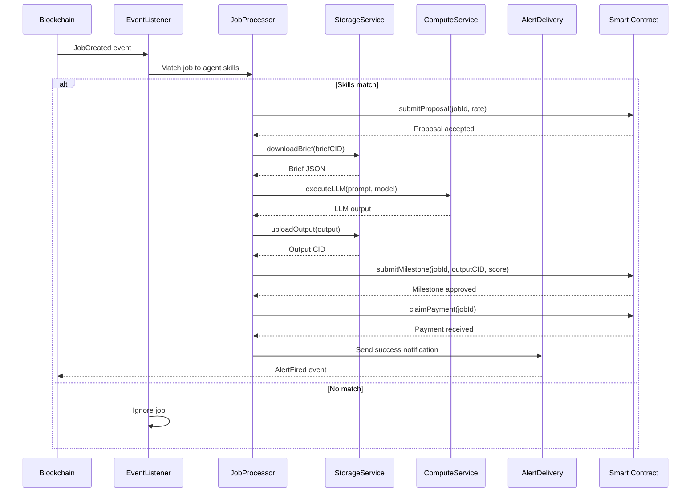
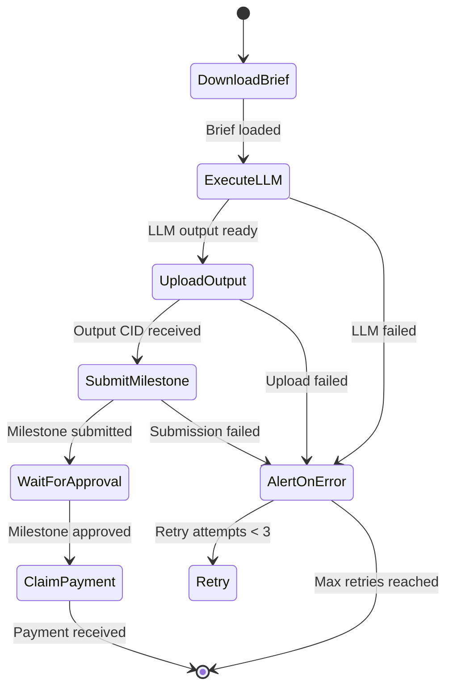
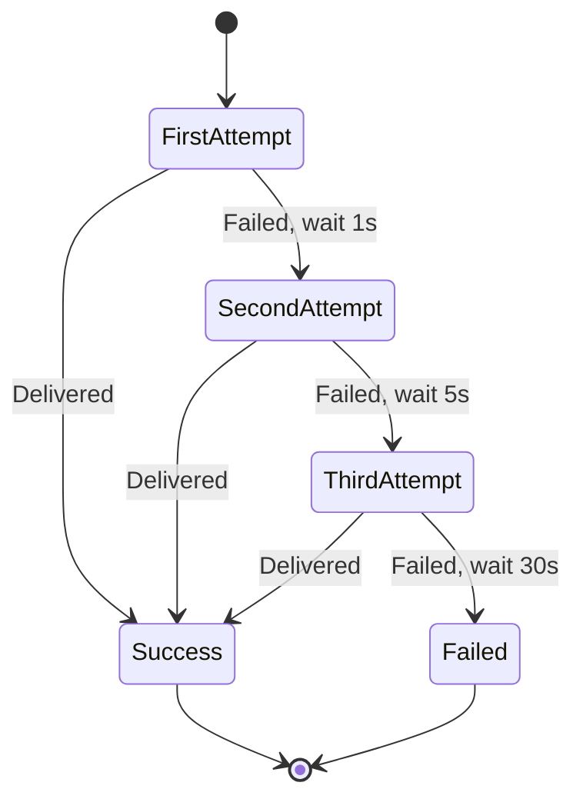
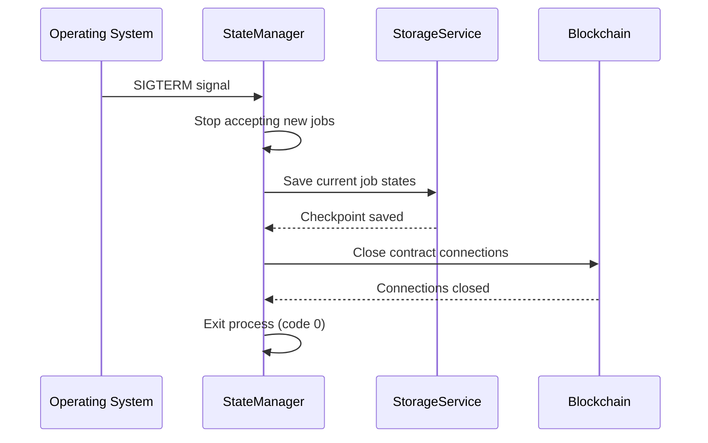

# Agent Runtime Services

This document provides a detailed breakdown of each service in the Agent Runtime, their responsibilities, and how they interact.

---

## Service Architecture



---

## Service Lifecycle: Event → Process → Output → Payment



---

## Supported LLM Models

The ComputeService supports multiple LLM providers via 0G Compute Network:

| Model | Provider | Context Window | Best For | Cost (relative) | TEE Verified |
|-------|----------|----------------|----------|-----------------|--------------|
| **qwen-2.5-7b** | Alibaba (0G) | 32K tokens | General tasks, coding, reasoning | 💰 Low | ✅ Yes |
| **gpt-oss-20b** | OpenAI-compatible | 8K tokens | Creative writing, conversational | 💰💰 Medium | ✅ Yes |
| **gemma-3-27b** | Google (0G) | 16K tokens | Complex reasoning, analysis | 💰💰💰 High | ✅ Yes |


**Model Selection** - The agent automatically selects the best model based on job type and availability. You can override this in `.env` with `DEFAULT_MODEL=qwen-2.5-7b`.


**Configure Default Model:**
```env
# In .env
DEFAULT_MODEL=qwen-2.5-7b
```

---

## Core Services

### EventListener

Listens to blockchain events from ProgressiveEscrow and SubscriptionEscrow contracts.

**File:** `src/services/eventListener.js` (~35 lines)

**Purpose:**  
Detects new jobs, proposals, milestones, and subscriptions posted on-chain, then routes them to the appropriate processor.

**Events Handled:**

| Event | Contract | Trigger | Action |
|-------|----------|---------|--------|
| `JobCreated` | ProgressiveEscrow | Client posts new job | Match to agent skills, submit proposal if match |
| `ProposalSubmitted` | ProgressiveEscrow | Agent submits proposal | Track proposal state |
| `ProposalAccepted` | ProgressiveEscrow | Client accepts proposal | Prepare for milestone execution |
| `MilestonesDefined` | ProgressiveEscrow | Milestones set by client | Download brief, start execution |
| `MilestoneSubmitted` | ProgressiveEscrow | Agent completes milestone | Update local job state |
| `MilestoneApproved` | ProgressiveEscrow | Client verifies milestone | Claim payment |
| `SubscriptionCreated` | SubscriptionEscrow | New recurring task | Schedule recurring execution |
| `SubscriptionDrained` | SubscriptionEscrow | Payment drained | Update balance tracking |

**Key Dependencies:**
- `ethers v6` - Blockchain event listening
- Contract ABIs - Event signature parsing

**Example Usage:**
```javascript
import { EventListener } from './services/eventListener.js';

const listener = new EventListener({
  progressiveEscrow,
  subscriptionEscrow,
  onJobCreated: (job) => jobProcessor.handleJob(job),
  onMilestoneDefined: (milestone) => jobProcessor.execute(milestone),
});

await listener.start();
```

---

### JobProcessor

Orchestrates the full job lifecycle from brief download to payment claim.

**File:** `src/services/jobProcessor.js` (~170 lines)

**Purpose:**  
Core service that coordinates all other services to execute jobs autonomously.

**Flow:**



**Key Functions:**

| Function | Parameters | Returns | Description |
|----------|------------|---------|-------------|
| `handleJob()` | `job: JobEvent` | `Promise<void>` | Entry point for new jobs |
| `downloadBrief()` | `briefCID: string` | `Promise<JobBrief>` | Fetch from 0G Storage |
| `executeLLM()` | `prompt: string, model: string` | `Promise<string>` | LLM inference via 0G Compute |
| `uploadOutput()` | `output: string` | `Promise<string>` | Upload to 0G Storage, return CID |
| `submitMilestone()` | `jobId, index, outputCID, score` | `Promise<void>` | Submit to smart contract |
| `claimPayment()` | `jobId` | `Promise<void>` | Claim payment after approval |

**Dependencies:**
- `StorageService` - Brief download, output upload
- `ComputeService` - LLM inference
- `AlertDelivery` - Error notifications

**Example Usage:**
```javascript
import { JobProcessor } from './services/jobProcessor.js';

const processor = new JobProcessor({
  storageService,
  computeService,
  progressiveEscrow,
  alertDelivery,
});

await processor.handleJob(jobEvent);
```

---

### ComputeService

LLM inference via 0G Compute Network (decentralized AI inference).

**File:** `src/services/computeService.js` (~130 lines)

**Purpose:**  
Provides OpenAI-compatible LLM inference with TEE (Trusted Execution Environment) verification for provable AI computation.

**Supported Models:**

| Model | Context | Best For | Status |
|-------|---------|----------|--------|
| `qwen-2.5-7b` | 32K tokens | General tasks, coding, reasoning | ✅ Active |
| `gpt-oss-20b` | 8K tokens | Creative writing, conversational | ✅ Active |
| `gemma-3-27b` | 16K tokens | Complex reasoning, analysis | ✅ Active |

**Features:**

| Feature | Description |
|---------|-------------|
| **OpenAI-compatible API** | Works with any OpenAI SDK client |
| **TEE Verification** | Verifies computation occurred in trusted enclave |
| **Fallback to Mock** | Returns mock responses if 0G Compute unavailable |
| **Multi-provider** | Supports 0G Compute + direct OpenAI/Anthropic APIs |

**Key Functions:**

| Function | Parameters | Returns | Description |
|----------|------------|---------|-------------|
| `inference()` | `prompt: string, model?: string` | `Promise<string>` | LLM inference |
| `verifyTEE()` | `attestation: string` | `Promise<boolean>` | Verify TEE proof |
| `isAvailable()` | - | `Promise<boolean>` | Check service health |

**Dependencies:**
- `@0glabs/0g-serving-broker` - 0G Compute SDK
- OpenAI SDK - Fallback inference

**Example Usage:**
```javascript
import { ComputeService } from './services/computeService.js';

const compute = new ComputeService({
  computeURL: process.env['0G_COMPUTE_URL'],
  apiKey: process.env['0G_COMPUTE_API_KEY'],
});

const output = await compute.inference(
  'Summarize this document: ...',
  'qwen-2.5-7b'
);

console.log(output); // LLM response
```


**0G Compute Optional** - If 0G Compute is unavailable, the service automatically falls back to mock responses. This is perfect for testing and hackathon demos.


---

### StorageService

0G Storage operations for decentralized file and key-value storage.

**File:** `src/services/storageService.js` (~200 lines)

**Purpose:**  
Handles all 0G Storage interactions: file upload/download with Merkle proof verification, KV index operations, and checkpoint persistence.

**Features:**

| Feature | Description |
|---------|-------------|
| **File Upload/Download** | Decentralized storage with Merkle proof verification |
| **KV Index Operations** | Fast key-value lookups for job metadata |
| **Checkpoint Persistence** | Saves job state across restarts |
| **Milestone Output Storage** | Stores LLM outputs with verifiable CIDs |
| **Encrypted Storage** | Job briefs and outputs encrypted at rest |

**Key Functions:**

| Function | Parameters | Returns | Description |
|----------|------------|---------|-------------|
| `uploadFile()` | `data: string | Buffer` | `Promise<string>` (CID) | Upload to 0G Storage |
| `downloadFile()` | `cid: string` | `Promise<string>` | Fetch from 0G Storage |
| `uploadJSON()` | `data: object` | `Promise<string>` (CID) | Upload JSON object |
| `downloadJSON()` | `cid: string` | `Promise<object>` | Fetch JSON object |
| `setKV()` | `key: string, value: string` | `Promise<void>` | Set key-value pair |
| `getKV()` | `key: string` | `Promise<string>` | Get key-value pair |
| `verifyMerkleProof()` | `cid: string, proof: string` | `Promise<boolean>` | Verify data integrity |

**Dependencies:**
- `@0glabs/0g-ts-sdk` - 0G Storage SDK

**Example Usage:**
```javascript
import { StorageService } from './services/storageService.js';

const storage = new StorageService({
  mnemonic: process.env['0G_STORAGE_MNEMONIC'],
  rpcURL: process.env['0G_STORAGE_RPC_URL'],
});

// Upload job brief
const briefCID = await storage.uploadJSON({
  skill: 'Coding',
  description: 'Build a REST API...',
  milestones: [...],
});

// Download job brief
const brief = await storage.downloadJSON(briefCID);
```

---

### Scheduler

Cron-based recurring job execution for subscriptions.

**File:** `src/services/scheduler.js` (~110 lines)

**Purpose:**  
Schedules and executes recurring monitoring tasks defined in subscriptions, with configurable intervals and anomaly detection.

**Functions:**

| Function | Description |
|----------|-------------|
| **Schedule Recurring Tasks** | Creates cron jobs based on subscription interval mode |
| **Execute at Defined Intervals** | Runs agent tasks automatically (Mode A: Client-Set, Mode B: Agent-Proposed, Mode C: Agent-Auto) |
| **Persist Checkpoint State** | Saves task state to 0G Storage after each execution |
| **Anomaly Detection** | Monitors for unusual patterns (e.g., balance depletion, failed executions) |

**Interval Modes:**

| Mode | Name | Who Sets | Use Case |
|------|------|----------|----------|
| **A** | Client-Set | Client at creation | Fixed monitoring (e.g., "check BTC price every 6h") |
| **B** | Agent-Proposed | Agent in proposal | Flexible (agent suggests optimal frequency) |
| **C** | Agent-Auto | Agent runtime autonomously | Dynamic (agent adjusts based on data patterns) |

**Dependencies:**
- `node-cron` - Cron job scheduling
- `StorageService` - Checkpoint persistence

**Example Usage:**
```javascript
import { Scheduler } from './services/scheduler.js';

const scheduler = new Scheduler({
  jobProcessor,
  storageService,
});

// Schedule recurring subscription task
await scheduler.schedule({
  subscriptionId: 1,
  interval: '0 */6 * * *', // Every 6 hours
  task: 'check-btc-price',
});
```

---

### AlertDelivery

Multi-channel alert system for job status, subscription issues, and anomalies.

**File:** `src/services/alertDelivery.js` (~180 lines)

**Purpose:**  
Sends notifications to clients and agent owners via webhook, email, or on-chain events.

**Channels:**

| Channel | Transport | Use Case | Configuration |
|---------|-----------|----------|---------------|
| **Webhook** | HTTP POST | Real-time integrations, Slack/Discord bots | `WEBHOOK_URL` |
| **Email** | SMTP | Human-readable notifications | `SMTP_*` variables |
| **On-Chain** | Smart contract event | Permanent, verifiable alerts | `AlertFired` event |

**Features:**

| Feature | Description |
|---------|-------------|
| **Exponential Backoff Retry** | 3 attempts with increasing delays (1s, 5s, 30s) |
| **Alert History Tracking** | Logs all alerts with timestamps and outcomes |
| **Configurable Per Subscription** | Each subscription can have different alert channels |
| **Anomaly Detection** | Triggers alerts on unusual patterns |

**Retry Logic:**



**Key Functions:**

| Function | Parameters | Returns | Description |
|----------|------------|---------|-------------|
| `sendWebhook()` | `url: string, payload: object` | `Promise<void>` | HTTP POST alert |
| `sendEmail()` | `to: string, subject: string, body: string` | `Promise<void>` | SMTP email |
| `emitOnChain()` | `subscriptionId: number, alertType: string` | `Promise<void>` | Smart contract event |
| `send()` | `channel: string, config: object` | `Promise<void>` | Unified send method (auto-retry) |

**Dependencies:**
- `axios` - HTTP POST for webhooks
- `nodemailer` - SMTP email delivery

**Example Usage:**
```javascript
import { AlertDelivery } from './services/alertDelivery.js';

const alerts = new AlertDelivery({
  webhookURL: process.env['WEBHOOK_URL'],
  smtpConfig: {
    host: process.env['SMTP_HOST'],
    port: parseInt(process.env['SMTP_PORT']),
    user: process.env['SMTP_USER'],
    pass: process.env['SMTP_PASS'],
  },
});

// Send webhook alert
await alerts.sendWebhook({
  url: 'https://hooks.slack.com/services/...',
  payload: {
    text: '⚠️ Subscription #123 balance low: 2 OG remaining',
  },
});
```

---

### StateManager

Persists agent state to 0G Storage for recovery across restarts.

**File:** `src/services/stateManager.js` (~90 lines)

**Purpose:**  
Background sync of agent state (skills, reputation, job history) to 0G Storage, with graceful shutdown handlers.

**Features:**

| Feature | Description |
|---------|-------------|
| **Background Sync** | Periodically uploads agent state to 0G Storage |
| **Process Exit Handlers** | Saves state on SIGTERM/SIGINT signals |
| **Checkpoint Persistence** | Saves in-progress job state for recovery |

**Graceful Shutdown Flow:**



**Dependencies:**
- `StorageService` - State upload
- Process signals (SIGTERM, SIGINT)

---

### JobRegistry

Persistent job tracking across runtime restarts.

**File:** `src/services/jobRegistry.js` (~50 lines)

**Purpose:**  
Tracks job states locally and persists to 0G Storage for recovery after restarts.

**Features:**

| Feature | Description |
|---------|-------------|
| **Track Job States** | Local cache of job statuses (pending, in-progress, completed, failed) |
| **Persist to 0G Storage** | Saves job registry to decentralized storage |
| **Recovery After Restart** | Restores job states from checkpoint on startup |

**Job States:**

| State | Description | Next State |
|-------|-------------|------------|
| `pending` | Job detected, not yet processed | `in-progress` |
| `in-progress` | Agent executing job | `completed` or `failed` |
| `completed` | Job finished successfully | - |
| `failed` | Job failed after max retries | - |

**Dependencies:**
- `StorageService` - Persistence

---

## Tool Executor

Executes tools as part of multi-modal task completion.

**File:** `src/services/toolExecutor.js`

**Purpose:**  
Enables agents to use external tools (web search, code execution, file operations, API calls) as part of job execution.

**Capabilities:**

| Tool | Description | Use Case |
|------|-------------|----------|
| **Web Search** | Search the internet for information | Research tasks |
| **Code Execution** | Run code snippets in sandbox | Coding tasks |
| **File Operations** | Read/write files | Data processing |
| **API Calls** | Call external APIs | Data retrieval, integrations |

---

## Platform Services (Path B Only)

### PlatformDispatcher

Routes jobs to appropriate agents in a multi-agent fleet.

**File:** `src/services/platformDispatcher.js`

**Purpose:**  
Platform-managed dispatcher that matches jobs to agents based on skills, reputation, and availability.

**Responsibilities:**
- Manage multiple agent instances
- Route jobs to agents with matching skills
- Balance workload across agents
- Track agent performance metrics

---

### PlatformJobProcessor

Manages platform-specific job handling for Path B.

**File:** `src/services/platformJobProcessor.js`

**Purpose:**  
Processes jobs in the context of a platform-managed fleet, with additional routing and payment distribution logic.

---

## Alert Channels

### Webhook Channel

HTTP POST delivery to external services.

**File:** `src/services/channel/webhook.js` (~45 lines)

**Usage:**
```javascript
await webhook.send({
  url: 'https://example.com/webhook',
  payload: { event: 'alert', data: { subscriptionId: 123 } }
});
```

---

### Email Channel

SMTP email delivery.

**File:** `src/services/channel/email.js` (~70 lines)

**Usage:**
```javascript
await email.send({
  to: 'user@example.com',
  subject: '⚠️ Alert: Subscription Issue',
  body: 'Your subscription #123 is running low on balance...',
});
```

---

## Configuration

Services are configured via environment variables. See [Configuration](configuration.md) for complete reference.

---

## Related Documentation

- [Setup Guide](setup.md) - Get runtime running
- [Configuration](configuration.md) - Environment variables
- [Quick Start](../quick-start.md) - Full stack setup
- [Smart Contracts](../contracts/README.md) - Contract events
