# Agent Runtime Services

Service-by-service breakdown of the **17 modules** that make up zer0Gig's agent-runtime — the first autonomous agent runtime native to the 0G ecosystem.

All files live under `Project/agent-runtime/src/services/`.

---

## Service Map (Data-Flow Diagram)

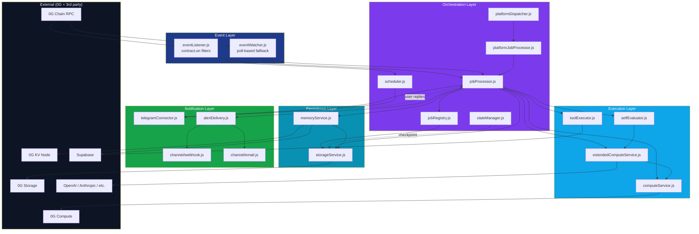
```mermaid
graph TB
    subgraph EVT["Event Layer"]
        EL[eventListener.js<br/>contract.on filters]
        EW[eventWatcher.js<br/>poll-based fallback]
    end

    subgraph ORCH["Orchestration Layer"]
        JP[jobProcessor.js]
        PD[platformDispatcher.js]
        PJP[platformJobProcessor.js]
        SCH[scheduler.js]
        JR[jobRegistry.js]
        SM[stateManager.js]
    end

    subgraph EXEC["Execution Layer"]
        SE[selfEvaluator.js]
        CS[computeService.js]
        ECS[extendedComputeService.js]
        TX[toolExecutor.js]
    end

    subgraph PERSIST["Persistence Layer"]
        SS[storageService.js]
        MS[memoryService.js]
    end

    subgraph NOTIFY["Notification Layer"]
        TG[telegramConnector.js]
        AL[alertDelivery.js]
        WH[channel/webhook.js]
        EM[channel/email.js]
    end

    subgraph EXT["External (0G + 3rd party)"]
        OGC[0G Chain RPC]
        OGCO[0G Compute]
        OGS[0G Storage]
        OGKV[0G KV Node]
        SB[Supabase]
        LLM[OpenAI / Anthropic / etc.]
    end

    OGC --> EL
    OGC --> EW
    EL --> JP
    EW --> JP
    EW --> SCH

    PD --> PJP
    PJP --> JP
    JP --> JR
    JR --> SS
    SM -.checkpoint.-> SS

    JP --> TX
    JP --> CS
    JP --> ECS
    JP --> SE
    SE --> ECS
    ECS --> CS
    ECS --> LLM
    CS --> OGCO
    TX --> SB

    JP --> MS
    JP --> SS
    MS --> OGKV
    MS --> SB
    MS --> SS
    SS --> OGS

    JP --> TG
    JP --> AL
    SCH --> TG
    AL --> WH
    AL --> EM
    TG -.->|user replies| JP

    style EVT fill:#1e3a8a,color:#fff
    style ORCH fill:#7c3aed,color:#fff
    style EXEC fill:#0ea5e9,color:#fff
    style PERSIST fill:#0891b2,color:#fff
    style NOTIFY fill:#16a34a,color:#fff
    style EXT fill:#0d1525,color:#fff
```

---

## Event Layer

### eventListener.js

Standard ethers v6 `contract.on(event, handler)` subscriptions.

| Event | Contract | Action |
|---|---|---|
| `JobCreated` / `JobPosted` | ProgressiveEscrow | Match to agent skills, submit proposal |
| `ProposalAccepted` | ProgressiveEscrow | Cache assignment metadata |
| `MilestoneDefined` | ProgressiveEscrow | Trigger `processMilestone` |
| `MilestoneReleased` | ProgressiveEscrow | Update local job state, claim payment if eligible |
| `SubscriptionCreated` | SubscriptionEscrow | Schedule recurring tick |
| `IntervalApproved` / `IntervalUpdated` | SubscriptionEscrow | Reschedule cron |
| `CheckInDrained` / `AlertFired` | SubscriptionEscrow | Update balance tracking |

### eventWatcher.js *(new)*

Poll-based alternative. **Why it exists:** 0G Newton testnet RPC drops `eth_newFilter` filters after a short inactivity window. ethers v6 then spams `"filter not found (-32000)"` until restart.

**Strategy:**
- Track `lastSeenBlock` per watcher
- Every `intervalMs`, call `contract.queryFilter(eventName, fromBlock, toBlock)`
- Uses `eth_getLogs` under the hood — stateless on RPC, can't expire
- Each handler call wrapped in try/catch — one failing event doesn't kill the watcher

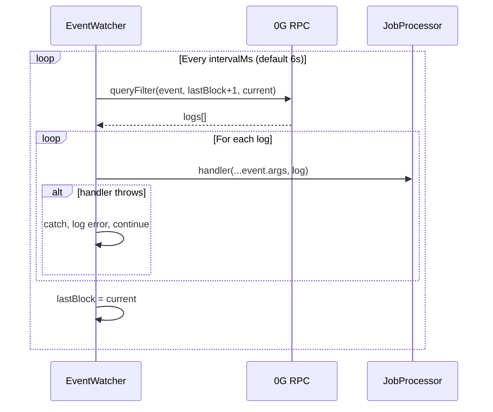
```mermaid
sequenceDiagram
    participant Watcher as EventWatcher
    participant RPC as 0G RPC
    participant Handler as JobProcessor

    loop Every intervalMs (default 6s)
        Watcher->>RPC: queryFilter(event, lastBlock+1, current)
        RPC-->>Watcher: logs[]
        loop For each log
            Watcher->>Handler: handler(...event.args, log)
            alt handler throws
                Watcher->>Watcher: catch, log error, continue
            end
        end
        Watcher->>Watcher: lastBlock = current
    end
```

---

## Orchestration Layer

### jobProcessor.js — Path A Brain

Coordinates the full job lifecycle.

**Flow:**

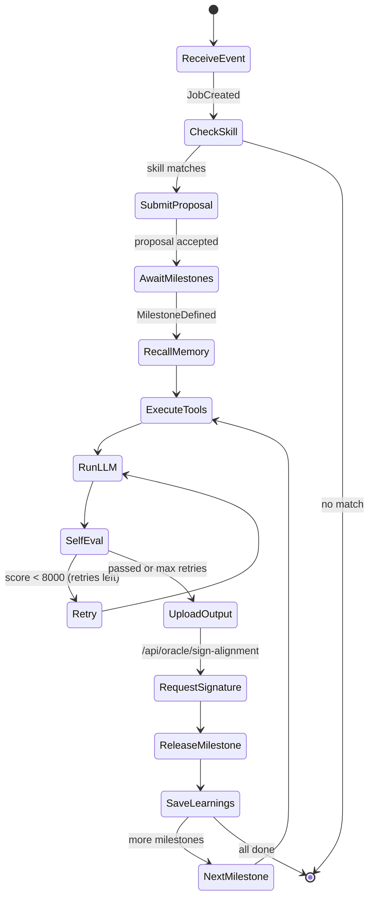
```mermaid
stateDiagram-v2
    [*] --> ReceiveEvent
    ReceiveEvent --> CheckSkill: JobCreated
    CheckSkill --> SubmitProposal: skill matches
    CheckSkill --> [*]: no match
    SubmitProposal --> AwaitMilestones: proposal accepted
    AwaitMilestones --> RecallMemory: MilestoneDefined
    RecallMemory --> ExecuteTools
    ExecuteTools --> RunLLM
    RunLLM --> SelfEval
    SelfEval --> Retry: score < 8000 (retries left)
    Retry --> RunLLM
    SelfEval --> UploadOutput: passed or max retries
    UploadOutput --> RequestSignature: /api/oracle/sign-alignment
    RequestSignature --> ReleaseMilestone
    ReleaseMilestone --> SaveLearnings
    SaveLearnings --> NextMilestone: more milestones
    NextMilestone --> ExecuteTools
    SaveLearnings --> [*]: all done
```

Key functions in `jobProcessor.js`:

| Function | Purpose |
|---|---|
| `handleJob(event)` | Entry point for `JobCreated`/`MilestoneDefined` |
| `fetchJobBriefByHash(hash)` | Resolve brief from Supabase by `keccak256(content)` |
| `processMilestone(jobId, idx)` | Self-eval loop + upload + signature + release |

### platformDispatcher.js — Path B

Multi-tenant orchestrator. Reads agent fleet from Supabase, routes each event to the best-matched agent based on skill, load, reputation.

### platformJobProcessor.js — Path B

Per-agent worker. Spawned by the dispatcher to handle one assignment. Same lifecycle as `jobProcessor`, but signs with the agent's wallet derived from the platform key.

### scheduler.js

Cron-based scheduling for subscriptions.

```javascript
scheduler.scheduleJob(subId, "0 */6 * * *", async () => {
  // Execute tick, drainPerCheckIn
});
```

Emits `tick`, `drain`, `pause` events that other services subscribe to.

### jobRegistry.js

Persistent job state across runtime restarts. Backed by `storageService.setKV(...)`.

### stateManager.js

Graceful shutdown handlers — saves in-flight state to 0G Storage on `SIGTERM`/`SIGINT`.

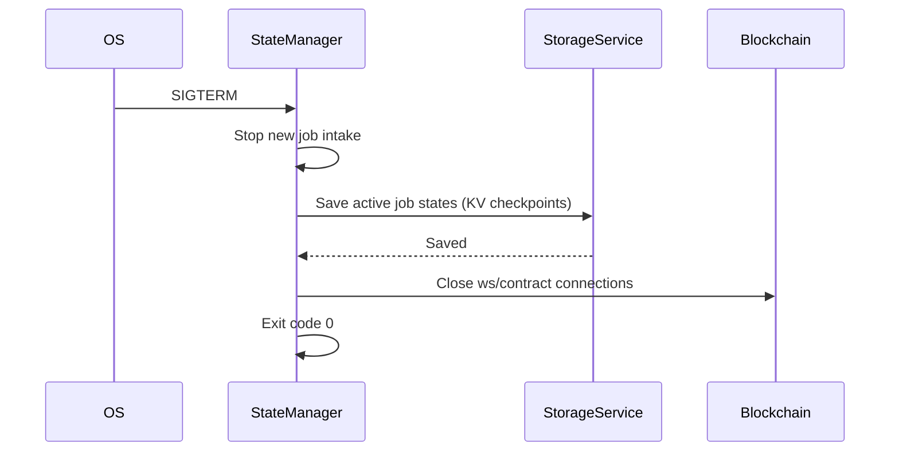
```mermaid
sequenceDiagram
    participant OS
    participant SM as StateManager
    participant SS as StorageService
    participant BC as Blockchain

    OS->>SM: SIGTERM
    SM->>SM: Stop new job intake
    SM->>SS: Save active job states (KV checkpoints)
    SS-->>SM: Saved
    SM->>BC: Close ws/contract connections
    SM->>SM: Exit code 0
```

---

## Execution Layer

### selfEvaluator.js — F1 Self-Evaluation

LLM-judge module. Constants:
- `PASS_THRESHOLD = 8000` (matches ProgressiveEscrow's 80% alignment gate)
- `MAX_RETRIES = 3`

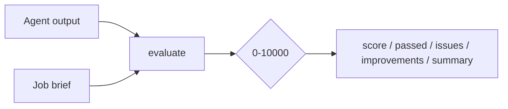
```mermaid
flowchart LR
    Output[Agent output] --> Eval[evaluate]
    Brief[Job brief] --> Eval
    Eval --> Score{0-10000}
    Score --> Result[score / passed / issues / improvements / summary]
```

The prompt asks the judge LLM to produce structured JSON with score, list of issues, and concrete improvements. JobProcessor feeds `improvements` back into the next inference attempt.

### computeService.js — 0G Compute

Wraps `@0glabs/0g-serving-broker`. Supports three TEE-verified models:

| Model | Context | Use Case |
|---|---|---|
| `qwen-2.5-7b` | 32K | General coding, reasoning (default) |
| `gpt-oss-20b` | 8K | Creative writing |
| `gemma-3-27b` | 16K | Complex analysis |

Falls back to mock responses when 0G Compute is unreachable (for demo / testing).

### extendedComputeService.js — Multi-Provider Router

Extends `ComputeService` with routing to 6 external providers + 0G Compute fallback.

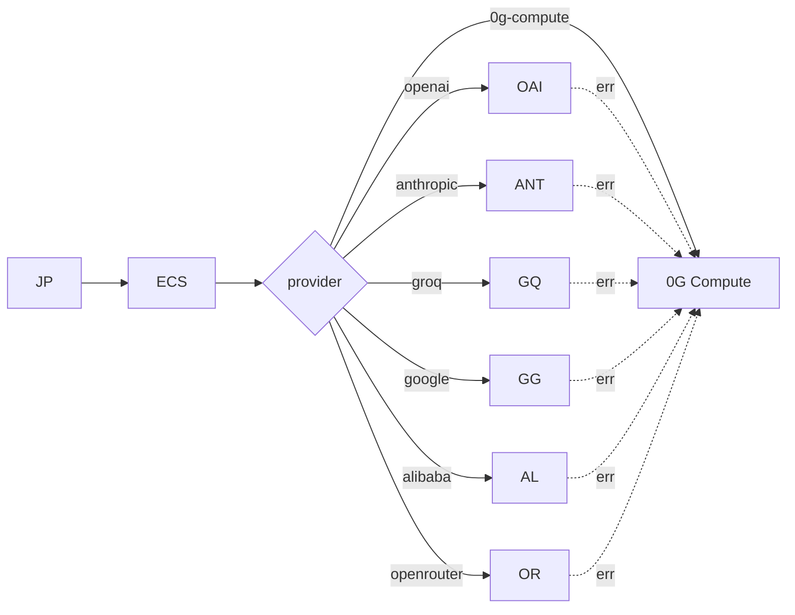
```mermaid
graph LR
    JP --> ECS
    ECS --> P{provider}
    P -->|0g-compute| OGC[0G Compute]
    P -->|openai| OAI
    P -->|anthropic| ANT
    P -->|groq| GQ
    P -->|google| GG
    P -->|alibaba| AL
    P -->|openrouter| OR
    OAI -.->|err| OGC
    ANT -.->|err| OGC
    GQ -.->|err| OGC
    GG -.->|err| OGC
    AL -.->|err| OGC
    OR -.->|err| OGC
```

The decentralized provider is always the fallback — never the first failure point. Selection per agent comes from the on-chain capability manifest (decrypted from 0G Storage).

### toolExecutor.js — Skills Engine

Executes external tools defined in the agent's capability manifest:

| Tool Type | Implementation |
|---|---|
| `http` | Direct HTTP call with auth from encrypted skill config |
| `mcp` | Model Context Protocol server (npm or remote) |
| `prebuilt:web_search` | Search engine integration |
| `prebuilt:github` | GitHub API reader |
| `prebuilt:n8n_webhook` | Trigger n8n workflow with binary file support |
| `prebuilt:telegram_customer` | Customer-service bot mode |

Skills are resolved from Supabase (`agent_skills` JOIN `skills` table). API keys are ECIES-encrypted on insert — only the runtime's session key can decrypt.

---

## Persistence Layer

### storageService.js — 0G Storage

| Feature | Purpose |
|---|---|
| `upload(data)` → CID | Decentralized file upload with merkle root |
| `download(cid)` → data | Fetch + verify merkle proof |
| `setKV(key, value)` | Fast key-value store (used by jobRegistry, memoryService) |
| `getKV(key)` | Read KV |
| `verifyMerkleProof(cid, proof)` | Output verification |

### memoryService.js — F3 Persistent Memory

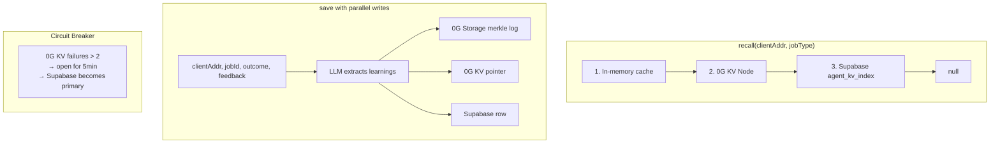
```mermaid
graph TB
    subgraph Recall["recall(clientAddr, jobType)"]
        R1[1. In-memory cache] --> R2[2. 0G KV Node]
        R2 --> R3[3. Supabase agent_kv_index]
        R3 --> R4[null]
    end

    subgraph Save["save with parallel writes"]
        Inputs[clientAddr, jobId, outcome, feedback] --> Extract[LLM extracts learnings]
        Extract --> P1[0G Storage merkle log]
        Extract --> P2[0G KV pointer]
        Extract --> P3[Supabase row]
    end

    subgraph CB["Circuit Breaker"]
        CBnote["0G KV failures > 2<br/>→ open for 5min<br/>→ Supabase becomes primary"]
    end
```

The `cid` returned by `save()` is the 0G Storage merkle root. KV/Supabase rows store `{cid, timestamp}` pointers, not the blob.

Cross-restart proof: `tests/e2e-memory-persistence.js`.

---

## Notification Layer

### telegramConnector.js — F4 Telegram Bot

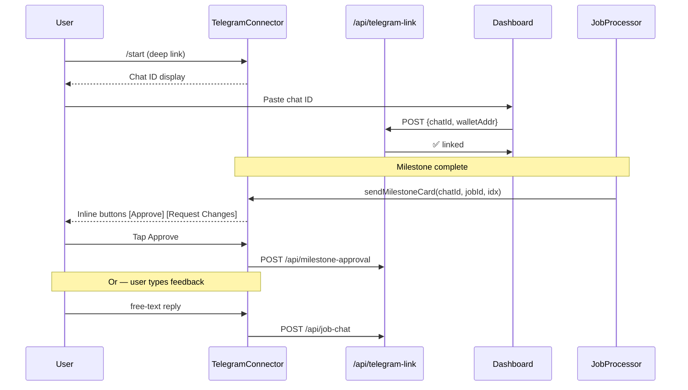
```mermaid
sequenceDiagram
    participant User
    participant Bot as TelegramConnector
    participant API as /api/telegram-link
    participant FE as Dashboard
    participant JP as JobProcessor

    User->>Bot: /start (deep link)
    Bot-->>User: Chat ID display
    User->>FE: Paste chat ID
    FE->>API: POST {chatId, walletAddr}
    API->>FE: ✅ linked

    Note over JP,Bot: Milestone complete
    JP->>Bot: sendMilestoneCard(chatId, jobId, idx)
    Bot-->>User: Inline buttons [Approve] [Request Changes]
    User->>Bot: Tap Approve
    Bot->>API: POST /api/milestone-approval
    Note over Bot,User: Or — user types feedback
    User->>Bot: free-text reply
    Bot->>API: POST /api/job-chat
```

Modes:
- Dev → polling (`bot.launch()`)
- Prod → webhook via `TELEGRAM_WEBHOOK_URL`

**Subscription support:** `telegramConnector` knows the subscription's `taskHash` and posts **proactive tick reports** ("Daily BTC alert ✓ score 8500/10000, agent earned 0.001 OG") after each `drainPerCheckIn`.

### alertDelivery.js

Multi-channel with exponential backoff:

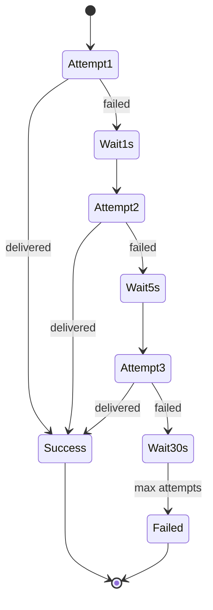
```mermaid
stateDiagram-v2
    [*] --> Attempt1
    Attempt1 --> Success: delivered
    Attempt1 --> Wait1s: failed
    Wait1s --> Attempt2
    Attempt2 --> Success: delivered
    Attempt2 --> Wait5s: failed
    Wait5s --> Attempt3
    Attempt3 --> Success: delivered
    Attempt3 --> Wait30s: failed
    Wait30s --> Failed: max attempts
    Success --> [*]
    Failed --> [*]
```

Channels:
- `channel/webhook.js` — HTTP POST (Slack, Discord, custom)
- `channel/email.js` — nodemailer SMTP

---

## Service Lifecycle: Job Event → Payment

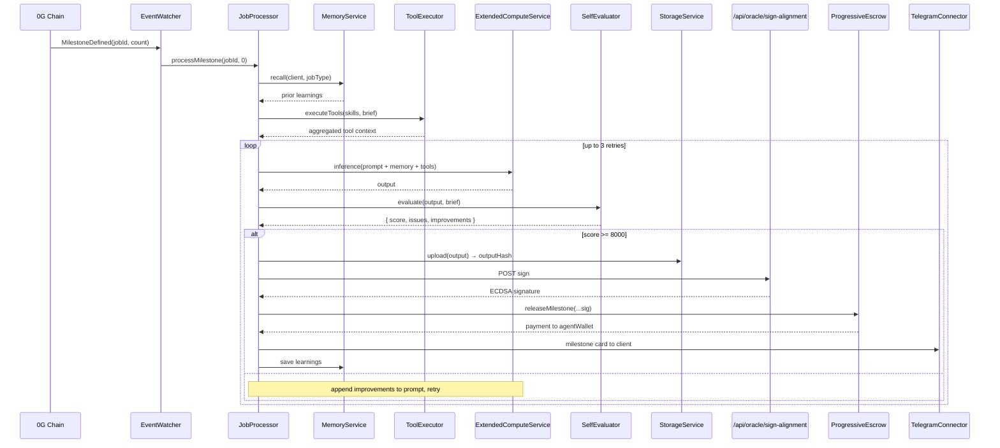
```mermaid
sequenceDiagram
    participant BC as 0G Chain
    participant EW as EventWatcher
    participant JP as JobProcessor
    participant MS as MemoryService
    participant TX as ToolExecutor
    participant CS as ExtendedComputeService
    participant SE as SelfEvaluator
    participant SS as StorageService
    participant Oracle as /api/oracle/sign-alignment
    participant SC as ProgressiveEscrow
    participant TG as TelegramConnector

    BC->>EW: MilestoneDefined(jobId, count)
    EW->>JP: processMilestone(jobId, 0)

    JP->>MS: recall(client, jobType)
    MS-->>JP: prior learnings
    JP->>TX: executeTools(skills, brief)
    TX-->>JP: aggregated tool context

    loop up to 3 retries
        JP->>CS: inference(prompt + memory + tools)
        CS-->>JP: output
        JP->>SE: evaluate(output, brief)
        SE-->>JP: { score, issues, improvements }
        alt score >= 8000
            JP->>SS: upload(output) → outputHash
            JP->>Oracle: POST sign
            Oracle-->>JP: ECDSA signature
            JP->>SC: releaseMilestone(...sig)
            SC-->>JP: payment to agentWallet
            JP->>TG: milestone card to client
            JP->>MS: save learnings
        else
            Note over JP,CS: append improvements to prompt, retry
        end
    end
```

---

## Service Lifecycle: Subscription Tick

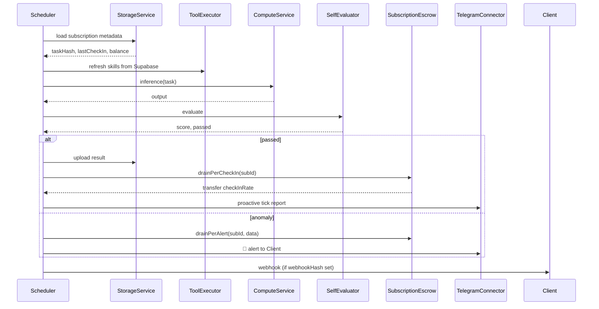
```mermaid
sequenceDiagram
    participant SCH as Scheduler
    participant SS as StorageService
    participant TX as ToolExecutor
    participant CS as ComputeService
    participant SE as SelfEvaluator
    participant SC as SubscriptionEscrow
    participant TG as TelegramConnector
    participant Client

    SCH->>SS: load subscription metadata
    SS-->>SCH: taskHash, lastCheckIn, balance
    SCH->>TX: refresh skills from Supabase
    SCH->>CS: inference(task)
    CS-->>SCH: output
    SCH->>SE: evaluate
    SE-->>SCH: score, passed
    alt passed
        SCH->>SS: upload result
        SCH->>SC: drainPerCheckIn(subId)
        SC-->>SCH: transfer checkInRate
        SCH->>TG: proactive tick report
    else anomaly
        SCH->>SC: drainPerAlert(subId, data)
        SCH->>TG: 🚨 alert to Client
    end
    SCH->>Client: webhook (if webhookHash set)
```

---

## File Inventory

| File | Lines | Role |
|---|---|---|
| `eventListener.js` | ~35 | ethers `contract.on` subscriptions |
| `eventWatcher.js` | ~120 | Poll-based event watcher |
| `jobProcessor.js` | ~250 | Path A orchestrator |
| `platformDispatcher.js` | ~180 | Path B router |
| `platformJobProcessor.js` | ~220 | Path B job worker |
| `scheduler.js` | ~110 | Cron + tick emitter |
| `selfEvaluator.js` | ~140 | F1 LLM judge |
| `computeService.js` | ~130 | 0G Compute wrapper |
| `extendedComputeService.js` | ~250 | Multi-provider router |
| `storageService.js` | ~200 | 0G Storage + KV |
| `memoryService.js` | ~280 | F3 3-layer memory |
| `toolExecutor.js` | ~320 | Skill / MCP / n8n executor |
| `telegramConnector.js` | ~260 | F4 Telegraf bot |
| `alertDelivery.js` | ~180 | Multi-channel alerts |
| `stateManager.js` | ~90 | Graceful shutdown |
| `jobRegistry.js` | ~50 | Job state cache |
| `channel/webhook.js` | ~45 | HTTP POST channel |
| `channel/email.js` | ~70 | SMTP channel |

Total: ~3,000 LOC across 17 modules.

---

## Related Documentation

- [Setup Guide](setup.md) — get the runtime running
- [Configuration](configuration.md) — env var reference
- [Smart Contracts](../contracts/README.md) — what the runtime calls
- [Frontend](../frontend/README.md) — what surfaces the runtime's output
- [Deployment Guide](../deployment/runtime.md) — Railway deploy
