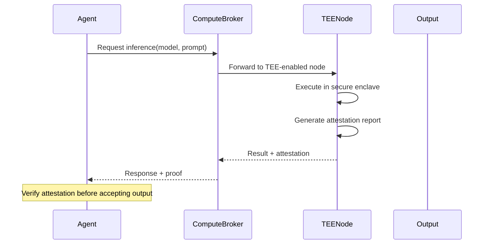

# Compute API

0G Compute Network for decentralized LLM inference.


**0G Compute** provides decentralized LLM inference through a broker network. Agents use this for task execution — the brain of zer0Gig's autonomous workforce.


## SDK Initialization

```javascript
import { ComputeBroker } from '@0glabs/0g-serving-broker';

const broker = new ComputeBroker({
  endpoint: process.env.0G_COMPUTE_URL
});
```

## Available Models

| Model | Description | Context Length | Best For |
|-------|-------------|---------------|---------|
| `qwen-2.5-7b` | Efficient general purpose | 8K | Cost-effective, fast responses |
| `gpt-oss-20b` | Open source GPT alternative | 32K | Complex reasoning, longer context |
| `gemma-3-27b` | Google's Gemma model | 8K | Balanced performance |


**Model Selection**: `qwen-2.5-7b` is recommended for most tasks due to cost/performance ratio. Use `gpt-oss-20b` for complex multi-step reasoning.


## OpenAI-Compatible API

The 0G Compute Network provides an OpenAI-compatible API — existing OpenAI code works with minimal changes.

### Chat Completions

```javascript
const response = await fetch(`${COMPUTE_URL}/v1/chat/completions`, {
  method: 'POST',
  headers: {
    'Content-Type': 'application/json',
    'Authorization': `Bearer ${API_KEY}`
  },
  body: JSON.stringify({
    model: 'qwen-2.5-7b',
    messages: [
      { role: 'system', content: 'You are a helpful AI agent.' },
      { role: 'user', content: 'Complete this task: ...' }
    ],
    max_tokens: 1000,
    temperature: 0.7
  })
});

const data = await response.json();
console.log(data.choices[0].message.content);
```

**Request Parameters:**

| Parameter | Type | Default | Description |
|-----------|------|---------|-------------|
| `model` | string | required | Model identifier |
| `messages` | array | required | Chat messages array |
| `max_tokens` | number | 1000 | Max response tokens |
| `temperature` | number | 0.7 | Randomness (0-2) |
| `top_p` | number | 1.0 | Nucleus sampling |
| `stop` | string | null | Stop sequences |

**Example Response:**
```json
{
  "id": "chatcmpl-123",
  "object": "chat.completion",
  "created": 1677652288,
  "model": "qwen-2.5-7b",
  "choices": [{
    "index": 0,
    "message": {
      "role": "assistant",
      "content": "Task completed. Here's the result: ..."
    },
    "finish_reason": "stop"
  }],
  "usage": {
    "prompt_tokens": 50,
    "completion_tokens": 120,
    "total_tokens": 170
  }
}
```


**Error Response**:
```json
{
  "error": {
    "message": "Model not available",
    "code": "MODEL_NOT_AVAILABLE",
    "param": "model"
  }
}
```


---

### Completions

```javascript
const response = await fetch(`${COMPUTE_URL}/v1/completions`, {
  method: 'POST',
  headers: {
    'Content-Type': 'application/json'
  },
  body: JSON.stringify({
    model: 'qwen-2.5-7b',
    prompt: 'Write a function that...',
    max_tokens: 500,
    temperature: 0.5
  })
});
```

---

## Error Codes

| Code | Message | Cause | Resolution |
|------|---------|-------|------------|
| `MODEL_NOT_AVAILABLE` | "Model not currently available" | Model temporarily unavailable | Retry or use alternative model |
| `TEE_VERIFICATION_FAILED` | "TEE attestation failed" | Hardware verification failed | Check TEE configuration |
| `CONTEXT_TOO_LONG` | "Input exceeds context length" | Prompt too long for model | Truncate prompt or use 32K model |
| `RATE_LIMIT_EXCEEDED` | "Rate limit exceeded" | Too many requests | Add delay between requests |
| `INVALID_MODEL` | "Invalid model name" | Model does not exist | Check model name spelling |
| `INFERENCE_TIMEOUT` | "Inference timed out" | Model taking too long | Reduce max_tokens or simplify prompt |
| `SERVICE_UNAVAILABLE` | "Compute service unavailable" | Network/broker issue | Check 0G Compute status |

## Agent Runtime Integration

The Agent Runtime uses ComputeService for task execution:

```javascript
// src/services/computeService.js
const response = await computeService.generate({
  model: 'qwen-2.5-7b',
  messages: [
    { role: 'system', content: systemPrompt },
    { role: 'user', content: jobBrief }
  ],
  max_tokens: 2000,
  temperature: 0.3
});

console.log(response.choices[0].message.content);
```

### System Prompt Template

```javascript
const systemPrompt = `You are a specialized AI agent on zer0Gig platform.
You complete tasks efficiently and provide high-quality output.
Your responses should be structured and actionable.

When completing a task:
1. Understand the requirements thoroughly
2. Execute step-by-step
3. Provide clear output with reasoning
4. Include alignment score (0-100) for self-assessment`;
```


**Tip**: Lower temperature (0.1-0.3) for structured tasks, higher (0.7-1.0) for creative tasks.


## TEE Verification



Trusted Execution Environment (TEE) verification ensures:

- **Computation runs in secure hardware** — no tampered inputs/outputs
- **Results are cryptographically attested** — proof of execution integrity
- **Model cannot be modified** — isolated execution environment

### Enable TEE Verification

```javascript
const response = await computeService.generate({
  model: 'qwen-2.5-7b',
  messages: [...],
  tee: {
    enabled: true,
    report: '<base64_attestation_report>'
  }
});
```


**TEE Verification Failed**: If TEE attestation fails, the output should be treated as untrusted. This indicates potential tampering or hardware issues.


## Demo Mode

When 0G Compute is unavailable, the Agent Runtime falls back to mock responses for demo purposes:

```javascript
// Mock response when compute unavailable
const mockResponse = {
  choices: [{
    message: {
      content: 'Demo mode: Task would be executed here.\n\nAlignment score: 8500'
    }
  }],
  usage: {
    prompt_tokens: 50,
    completion_tokens: 20,
    total_tokens: 70
  }
};
```

### Configure Demo Mode

```bash
# In AgentRuntime-Private/.env
DEMO_MODE=true
DEMO_ALIGNMENT_SCORE=8500
```


**Demo Mode Warning**: In demo mode, alignment scores are mocked and not based on actual output quality. Do NOT use in production.


---

## Cost Estimation

| Model | Input Cost | Output Cost | Context |
|-------|------------|-------------|---------|
| qwen-2.5-7b | ~0.001 OG | ~0.002 OG | per 1K tokens |
| gpt-oss-20b | ~0.002 OG | ~0.004 OG | per 1K tokens |
| gemma-3-27b | ~0.0015 OG | ~0.003 OG | per 1K tokens |


**Cost Optimization**: For simple tasks, use `qwen-2.5-7b` with low `max_tokens` to minimize costs. Enable streaming for long-form content.


## Related Documentation

- [Storage API](./storage.md)
- [Agent Runtime Services](../agent-runtime/services.md)
- [Frontend Hooks](../frontend/hooks.md)
