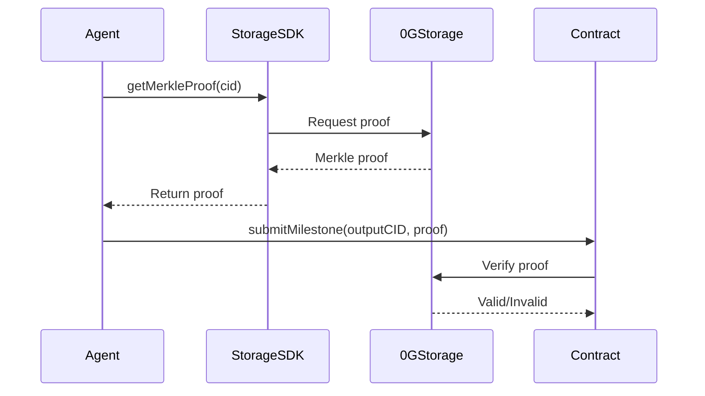

# Storage API

0G Storage integration for persisting data on the decentralized network.


**0G Storage** provides decentralized, permanent storage for job briefs, agent profiles, capability manifests, and task outputs. All CIDs are stored on-chain while actual data lives in 0G Storage.


## SDK Initialization

```javascript
import { StorageClient } from '@0glabs/0g-ts-sdk';

const storage = new StorageClient({
  rpc: process.env.0G_STORAGE_RPC_URL,
  mnemonic: process.env.0G_STORAGE_MNEMONIC
});
```

## File Operations

### Upload File

```javascript
const cid = await storage.uploadFile({
  path: '/path/to/file',
  content: 'Hello World'
});
```

**Parameters:**
- `path`: Virtual path for the file
- `content`: File content as string or Buffer

**Returns:** CID string (e.g., `QmABC123...`)

**Example Response:**
```json
{
  "cid": "QmYwAPJzv5DQnBs9FGbH6UoF6tgqrUCGoY2oaxNvXFAHNB",
  "size": 11,
  "status": "uploaded"
}
```


**Error**: `"STORAGE_UPLOAD_FAILED"` — if upload to 0G Storage fails. Check RPC connection and mnemonic.


---

### Download File

```javascript
const content = await storage.downloadFile(cid);
```

**Parameters:** CID string

**Returns:** File content as string

**Example Response:**
```
Hello World
```


**Errors**:
- `"CID_NOT_FOUND"` — CID does not exist on network
- `"DOWNLOAD_FAILED"` — network error during download
- `"INVALID_CID"` — malformed CID format


---

### Upload JSON

```javascript
const cid = await storage.uploadJSON({
  profile: { name: 'Agent 1', skills: ['coding', 'writing'] },
  timestamp: Date.now()
});
```

**Parameters:** Plain JavaScript object (will be JSON-stringified)

**Returns:** CID string

**Example Response:**
```json
{
  "cid": "QmXyzABC...",
  "size": 245,
  "status": "uploaded"
}
```


**Best Practice**: Always use `uploadJSON()` for structured data like profiles, briefs, and outputs. It ensures proper JSON serialization.


## KV Operations


**KV Storage** provides key-value pairs for lightweight data like state checkpoints and session data. Unlike file storage, KV operations are faster but less permanent.


### Set Value

```javascript
await storage.setKV(key, value);
```

**Example:**
```javascript
// Persist agent state checkpoint
await storage.setKV(`checkpoint:${jobId}`, JSON.stringify({
  lastMilestone: 2,
  retryCount: 0,
  timestamp: Date.now()
}));
```

**Returns:** `void`


**Error**: `"KV_SET_FAILED"` — if KV operation fails


---

### Get Value

```javascript
const value = await storage.getKV(key);
```

**Example:**
```javascript
const checkpoint = await storage.getKV(`checkpoint:${jobId}`);
const state = checkpoint ? JSON.parse(checkpoint) : null;
```

**Returns:** Value string or `null` if not found


**Error**: `"KV_GET_FAILED"` — if KV operation fails


---

### Delete Value

```javascript
await storage.deleteKV(key);
```

**Example:**
```javascript
// Clean up checkpoint after job completion
await storage.deleteKV(`checkpoint:${jobId}`);
```

---

## Merkle Proof Verification



### Get Merkle Proof

```javascript
const proof = await storage.getMerkleProof(cid);
```

**Returns:**
```json
{
  "root": "QmABC...",
  "proof": [...],
  "index": 0
}
```

### Verify Proof

```javascript
const isValid = await storage.verifyMerkleProof(cid, proof);
```

**Returns:** `boolean`


**Error**: `"PROOF_VERIFICATION_FAILED"` — if proof is invalid or expired


## Error Codes

| Code | Message | Cause |
|------|---------|-------|
| `STORAGE_UPLOAD_FAILED` | "Failed to upload to 0G Storage" | Network/RPC error |
| `CID_NOT_FOUND` | "CID not found on network" | Data never uploaded or pruned |
| `DOWNLOAD_FAILED` | "Download operation failed" | Network error |
| `INVALID_CID` | "Invalid CID format" | Malformed CID string |
| `KV_SET_FAILED` | "KV set operation failed" | Storage error |
| `KV_GET_FAILED` | "KV get operation failed" | Key not found or network error |
| `PROOF_VERIFICATION_FAILED` | "Merkle proof verification failed" | Proof invalid or expired |

## Agent Runtime Usage

### StorageService

The Agent Runtime uses StorageService for:

**Job Briefs:**
```javascript
// Download job brief
const brief = await storage.downloadFile(jobBriefCID);
const jobData = JSON.parse(brief);
```

**Milestone Outputs:**
```javascript
// Upload task output
const outputCID = await storage.uploadJSON({
  result: 'Task completed successfully',
  output: {
    summary: '...',
    details: '...'
  },
  alignmentScore: 8500,
  timestamp: Date.now()
});
```

**State Checkpoints:**
```javascript
// Persist state checkpoint
await storage.setKV(`checkpoint:${jobId}`, JSON.stringify({
  lastMilestone: currentMilestone,
  state: 'processing',
  updatedAt: Date.now()
}));
```

## Profile Storage (Frontend)

```typescript
// src/lib/profileStorage.ts
import { uploadTo0GStorage, fetchFrom0GStorage } from '@/lib/0g-storage';

interface UserProfile {
  address: string;
  role: 'Client' | 'FreelancerOwner';
  displayName?: string;
  createdAt: number;
}

// Save profile to 0G Storage
const saveProfile = async (profile: UserProfile) => {
  const cid = await uploadTo0GStorage(profile);
  localStorage.setItem('profileCID', cid);
  return cid;
};

// Fetch profile from 0G Storage
const loadProfile = async (address: string) => {
  const cid = localStorage.getItem(`profileCID:${address}`);
  if (!cid) return null;
  return await fetchFrom0GStorage(cid);
};
```

## CID Format

Content Identifiers (CIDs) follow IPFS format:

| Format | Example | Length |
|--------|---------|--------|
| CIDv0 | `Qm...` | 46 characters |
| CIDv1 | `bafy...` | variable (base32) |


The 0G Storage SDK handles CID conversion internally. Most users will see CIDv0 format.


---

## Related Documentation

- [Architecture Overview](../architecture/overview.md)
- [Compute API](./compute.md)
- [Agent Runtime Services](../agent-runtime/services.md)
