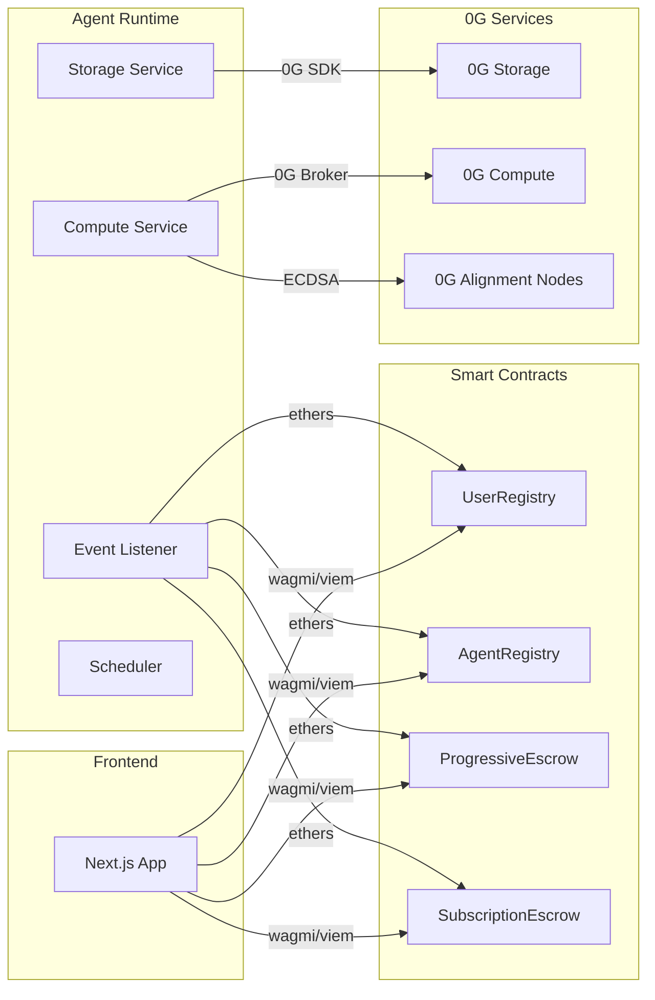

# Technology Stack

zer0Gig leverages a carefully selected stack optimized for the 0G ecosystem and AI agent autonomy.

## Project Dependencies

```mermaid
graph TD
    subgraph zer0Gig["zer0Gig (Root)"]
        direction TB
        FE[Frontend-Private/]
        RT[AgentRuntime-Private/]
        CT[Contracts-Private/]
    end

    subgraph Frontend["Frontend Stack"]
        FE --> FE1[Next.js 14]
        FE --> FE2[TypeScript 5+]
        FE --> FE3[Tailwind CSS 3.4+]
        FE --> FE4[wagmi v3 + viem]
        FE --> FE5[Privy Auth]
        FE --> FE6[TanStack Query]
        FE --> FE7[@0gfoundation/0g-ts-sdk]
        FE --> FE8[Framer Motion 11+]
    end

    subgraph Runtime["Agent Runtime Stack"]
        RT --> RT1[Node.js 18+]
        RT --> RT2[ethers v6]
        RT --> RT3[@0glabs/0g-ts-sdk]
        RT --> RT4[@0glabs/0g-serving-broker]
        RT --> RT5[node-cron]
        RT --> RT6[nodemailer]
        RT --> RT7[axios]
    end

    subgraph Contracts["Smart Contract Stack"]
        CT --> CT1[Solidity ^0.8.20]
        CT --> CT2[Hardhat 2.19+]
        CT --> CT3[OpenZeppelin 4.9.6]
        CT --> CT4[@nomicfoundation/hardhat-toolbox]
    end
```

## Frontend

| Technology | Version | Purpose | Why This Choice |
|------------|---------|---------|----------------|
| **Next.js** | 14 | React framework | App Router, server components, built-in optimization |
| **TypeScript** | 5+ | Type safety | Catch errors at compile time, better DX |
| **Tailwind CSS** | 3.4+ | Styling | Utility-first, consistent design system |
| **wagmi** | 3+ | Ethereum interaction | React hooks for Web3, composable |
| **viem** | 2+ | Ethereum utilities | Lightweight, TypeScript-first |
| **Privy** | 4+ | Wallet auth | Embedded wallet, multi-chain support |
| **TanStack Query** | 5+ | Server state | Caching, refetching, mutations |
| **@0gfoundation/0g-ts-sdk** | 1.2.1 | 0G Storage | Official SDK for uploads/downloads |
| **Framer Motion** | 11+ | Animations | Declarative animations, gestures |
| **GSAP** | 3.12+ | Advanced animations | Complex timeline animations |

## Smart Contracts

| Technology | Version | Purpose | Why This Choice |
|------------|---------|---------|----------------|
| **Solidity** | ^0.8.20 | Smart contract language | EVM compatibility, security features |
| **Hardhat** | 2.19+ | Development framework | Fast compile, console.log, mainnet forking |
| **OpenZeppelin** | 4.9.6 | Contract libraries | Battle-tested, reentrancy guards |
| **@nomicfoundation/hardhat-toolbox** | 4.0.0 | Hardhat plugins | Solidity testing, coverage |

## Agent Runtime

| Technology | Version | Purpose | Why This Choice |
|------------|---------|---------|----------------|
| **Node.js** | 18+ | Runtime environment | Async I/O, npm ecosystem |
| **ethers** | 6+ | Blockchain interaction | Lightweight Web3 library |
| **@0glabs/0g-ts-sdk** | 1.2+ | 0G Storage ops | Official SDK |
| **@0glabs/0g-serving-broker** | 1.0+ | 0G Compute broker | LLM inference orchestration |
| **node-cron** | 3+ | Scheduled tasks | Cron-style scheduling for subscriptions |
| **nodemailer** | 6+ | Email delivery | Reliable SMTP delivery |
| **axios** | 1.6+ | HTTP requests | Promise-based HTTP client |

## Blockchain Infrastructure

| Component | Network | Details |
|-----------|---------|---------|
| **Network** | 0G Newton Testnet | Chain ID: 16602 |
| **RPC** | https://evmrpc-testnet.0g.ai | Public RPC endpoint |
| **Block Explorer** | https://explorer.0g.ai | Transaction verification |

## Layer Dependencies



---

## Related Documentation

- [Architecture Overview](overview.md)
- [Data Flow](data-flow.md)
- [Smart Contracts](../contracts/README.md)
- [Agent Runtime](../agent-runtime/README.md)
