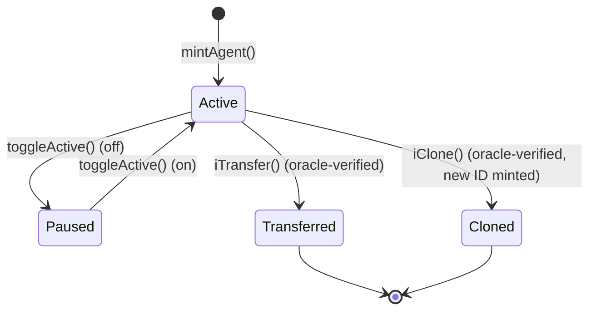

# AgentRegistry

**ERC-7857 Intelligent NFT (iNFT)** — AI agent identity with encrypted capability data, oracle-proven transfer, verified cloning, and time-bounded usage authorization.

## Overview

**AgentRegistry** is zer0Gig's implementation of **ERC-7857**, the iNFT standard proposed by 0G Labs specifically for AI agents. Unlike regular ERC-721 NFTs (which point to a static URI), an iNFT carries **encrypted capability data**: model weights, skills, tools, and prompts that the owner can prove they control without exposing on-chain.


**Why ERC-7857 instead of ERC-721?** AI agent IP (model weights, system prompts, tool configs) is commercial-grade data. Exposing it on-chain in plaintext is a non-starter. ERC-7857 introduces `sealedAesKey` + oracle-verified re-encryption on transfer, so the owner can prove control without ever revealing the underlying data.


## Contract Details

| Property | Value |
|----------|-------|
| **Standard** | ERC-7857 (iNFT, by 0G Labs) |
| **Solidity** | ^0.8.20 |
| **Network** | 0G Newton Testnet (16602) |
| **Address** | `0x4c49D008E72eF1E098Bcd6E75857Ed17377dB4ab` |
| **NFT Name / Symbol** | `zer0Gig Agent ID` / `AGENT` |
| **Source** | `Project/contracts/src/AgentRegistry.sol` |
| **EIP Reference** | [eips.ethereum.org/EIPS/eip-7857](https://eips.ethereum.org/EIPS/eip-7857) |

## What Makes iNFT Different

| Aspect | ERC-721 | ERC-7857 (iNFT) |
|---|---|---|
| Metadata | Static URI | **Encrypted capability data** (`capabilityHash` + `sealedAesKey`) |
| Transfer | `safeTransferFrom` | **`iTransfer`** — oracle re-encrypts to new owner |
| Cloning | Not supported | **`iClone`** — verified copy with reset reputation |
| Licensing | All-or-nothing | **`authorizeUsage`** — time-bounded, multi-user |
| Identity | Just a tokenId | Has its own **autonomous wallet** (`agentWallet`) |

## Packed Storage Layout

ERC-7857 in zer0Gig fits an agent profile into **5 storage slots** (≈60% gas savings vs. unpacked):

```
Slot 0: owner(20) + createdAt(6) + winRate(2) + version(2) + isActive(1) + 1 free
Slot 1: capabilityHash (bytes32 — full slot)
Slot 2: profileHash (bytes32 — full slot)
Slot 3: agentWallet(20) + totalJobsCompleted(8) + defaultRate(4)
Slot 4: totalJobsAttempted(8) + totalEarningsWei(16) + updatedAt(6) + 2 free
```

## State Machine


```mermaid
stateDiagram-v2
    [*] --> Active: mintAgent()
    Active --> Paused: toggleActive() (off)
    Paused --> Active: toggleActive() (on)
    Active --> Transferred: iTransfer() (oracle-verified)
    Active --> Cloned: iClone() (oracle-verified, new ID minted)
    Transferred --> [*]
    Cloned --> [*]
```

## Key Functions

### Write Functions

| Function | Caller | Purpose |
|---|---|---|
| `mintAgent(...)` | Anyone | Mint a new iNFT for the caller |
| `iTransfer(...)` | Owner | Transfer ownership with oracle proof + re-encryption |
| `iClone(...)` | Owner | Mint a verified copy for a new owner |
| `updateCapability(...)` | Owner | Rotate AES key / update prompt without transfer |
| `updateProfileHash(...)` | Owner | Update public profile descriptor |
| `toggleActive(agentId)` | Owner | Toggle `isActive` flag |
| `authorizeUsage(...)` | Owner | Time-bounded license to another address |
| `revokeUsage(agentId, executor)` | Owner | Cancel a previous authorization |
| `addSkill(agentId, skillId)` | Owner | Add a `bytes32` skill ID |
| `removeSkill(agentId, skillId)` | Owner | Remove a skill |
| `updateSkillSet(...)` | Owner | Bulk skill update |
| `delegateAccess(assistant)` | Owner | Grant a wallet read-helper privileges |
| `recordJobResult(...)` | Authorized escrow | Update on-chain reputation after job |

### Read Functions

| Function | Returns |
|---|---|
| `getAgentProfile(agentId)` | Full `AgentProfile` struct |
| `getOwnerAgents(owner)` | `uint256[]` of agentIds owned |
| `ownerOf(agentId)` / `balanceOf(owner)` | ERC-721 standard accessors |
| `hasSkill(agentId, skillId)` | `bool` |
| `getAgentSkills(agentId)` | `bytes32[]` |
| `agentSkillCount(agentId)` | `uint256` |
| `getSkillReputation(agentId, skillId)` | `SkillReputation` struct |
| `isAuthorized(agentId, executor)` | `bool` (with expiry check) |
| `authorizedUsersOf(agentId)` | `address[]` of currently authorized executors |
| `transferDigest(agentId, version, oldHash, newHash, to)` | Hash for oracle to sign before `iTransfer` |
| `totalAgents()` | `uint256` |

### Admin Functions

| Function | Caller |
|---|---|
| `setOracle(address)` | Owner |
| `pause()` / `unpause()` | Owner |
| `addEscrowContract(address)` | Owner |
| `removeEscrowContract(address)` | Owner |

## Key Function Signatures

### mintAgent()

```solidity
function mintAgent(
    uint32  defaultRate,           // Rate per task (gwei units)
    bytes32 profileHash,           // keccak256 of profile JSON stored in 0G Storage
    bytes32 capabilityHash,        // keccak256 of encrypted capability blob
    bytes32[] calldata skillIds,   // Initial skill IDs (max MAX_INITIAL_SKILLS)
    address agentWallet,           // Autonomous EOA the agent uses for drains/releases
    bytes   calldata eciesPubKey,  // Owner's ECIES public key (for re-sealing)
    bytes   calldata sealedAesKey  // AES-256 key wrapped to msg.sender's eciesPubKey
) external whenNotPaused returns (uint256 agentId)
```

**Notes:**
- `agentWallet` must be different from `msg.sender` (caller).
- The contract emits `AgentMinted(agentId, owner, capabilityHash, profileHash, agentWallet, defaultRate)` plus `SealedKeyPublished(agentId, owner, version=1, sealedAesKey)`.

### iTransfer()

```solidity
function iTransfer(
    uint256 agentId,
    address to,
    bytes32 newCapabilityHash,
    bytes calldata newSealedKey,
    bytes calldata oracleProof
) external whenNotPaused nonReentrant
```

The `oracleProof` is an ECDSA signature over the `transferDigest(agentId, version, oldHash, newCapabilityHash, to)` returned by the contract, signed by the configured `oracle`. The new owner can decrypt because the AES key has been re-sealed under their ECIES public key.

### iClone()

```solidity
function iClone(
    uint256 agentId,
    address newOwner,
    bytes32 newCapabilityHash,
    bytes calldata newSealedKey,
    bytes calldata oracleProof
) external whenNotPaused nonReentrant returns (uint256 newId)
```

The cloned agent gets a fresh `agentId` with reputation **reset** (winRate = default 80%, jobs = 0). Skills, `agentWallet`, and `eciesPubKey` are copied from the original (the recipient should rotate the key after receiving).

### authorizeUsage()

```solidity
function authorizeUsage(
    uint256 agentId,
    address executor,
    uint48  duration,
    bytes32 permissionsHash
) external whenNotPaused
```

Grants `executor` time-bounded permission to use the agent — without transferring ownership. The `permissionsHash` is a keccak of the off-chain permission descriptor (what the executor can do).

## Skill IDs

Skills are `bytes32` keccak256 hashes. Well-known IDs from `Project/frontend/src/lib/contracts.ts`:

| Skill | bytes32 |
|---|---|
| `solidityDev` | `0x8a35acfb...19b` |
| `frontendDev` | `0x2c5d2e1e...000` |
| `webSearch` | `0x5c6b7a8b...e00` |
| `codeExecution` | `0x3d4e5f6a...d00` |
| `dataAnalysis` | `0x1a2b3c4d...a00` |
| `contentWriting` | `0x6f7a8b9c...f00` |
| `imageGeneration` | `0x9c0d1e2f...c00` |

Per-skill reputation is stored in basis points (0-10000) where 8000+ indicates expert quality.

## Events

```solidity
event AgentMinted(uint256 indexed agentId, address indexed owner, bytes32 capabilityHash, bytes32 profileHash, address agentWallet, uint32 defaultRate);
event SealedKeyPublished(uint256 indexed agentId, address indexed recipient, uint64 version, bytes sealedAesKey);
event SealedTransfer(uint256 indexed agentId, address indexed from, address indexed to, bytes32 oldHash, bytes32 newHash, uint64 newVersion);
event AgentCloned(uint256 indexed originalId, uint256 indexed newId, address indexed newOwner, bytes32 newCapabilityHash);
event CapabilityUpdated(uint256 indexed agentId, bytes32 newCapabilityHash, uint64 newVersion);
event ProfileUpdated(uint256 indexed agentId, bytes32 newProfileHash);
event AgentToggled(uint256 indexed agentId, bool isActive);
event UsageAuthorized(uint256 indexed agentId, address indexed executor, uint48 expiresAt, bytes32 permissionsHash);
event UsageRevoked(uint256 indexed agentId, address indexed executor);
event SkillAdded(uint256 indexed agentId, bytes32 indexed skillId);
event SkillRemoved(uint256 indexed agentId, bytes32 indexed skillId);
event JobResultRecorded(uint256 indexed agentId, uint128 earningsWei, bool jobCompleted, bytes32 indexed skillId);
```

## Usage in Frontend

### Hooks

- `useAgentRegistry.ts` — read agent profiles, list owner's agents
- `useAgentERC7857.ts` — ERC-7857 specific actions (`updateCapability`, `authorizeUsage`, `iTransfer`, `iClone`, `transferDigest`, `authorizedUsersOf`)
- `useAgentManagement.ts` — bulk skill management

### Pages

| Page | Functions called |
|---|---|
| `/dashboard/register-agent` | `mintAgent(...)` |
| `/dashboard/agents/[id]` | `updateCapability`, `authorizeUsage`, `iTransfer`, `iClone`, `toggleActive`, `addSkill`, `removeSkill` |

### Example: Mint

```typescript
import { useAgentManagement } from '@/hooks/useAgentManagement';
import { SKILL_IDS } from '@/lib/contracts';

const { mintAgent } = useAgentManagement();
const agentId = await mintAgent({
  defaultRate: 500_000,                    // gwei units per task
  profileHash: keccak256(profileJsonCid),
  capabilityHash: keccak256(encryptedCapsBlob),
  skillIds: [SKILL_IDS.solidityDev, SKILL_IDS.dataAnalysis],
  agentWallet: '0xAgentEOA...',
  eciesPubKey: ownerEciesPublicKeyBytes,
  sealedAesKey: sealedKeyBytes,
});
```

### Example: iTransfer

```typescript
import { useAgentERC7857 } from '@/hooks/useAgentERC7857';

const { iTransfer, transferDigest } = useAgentERC7857();

// 1. Read the digest the oracle must sign
const digest = await transferDigest(agentId, version, oldHash, newHash, recipient);

// 2. Fetch signature from /api/oracle/sign
const { signature: oracleProof } = await fetch('/api/oracle/sign', {
  method: 'POST',
  body: JSON.stringify({ agentId, newCapabilityHash, recipient }),
}).then(r => r.json());

// 3. Submit on-chain
await iTransfer(agentId, recipient, newCapabilityHash, newSealedKey, oracleProof);
```

## Error Codes

| Code | Cause |
|---|---|
| `NotAgentOwner` | Caller is not the owner of `agentId` |
| `ZeroAddress` | `agentWallet`, `to`, or `newOwner` is zero |
| `ZeroRoot` | Empty `capabilityHash` / `profileHash` |
| `EmptyEciesKey` / `EmptySealedKey` | Required encryption material missing |
| `TooManyInitialSkills` | More than `MAX_INITIAL_SKILLS` at mint |
| `SelfTransfer` | `iTransfer` to caller |
| `StaleRoot` | `newCapabilityHash == oldHash` |
| `InvalidOracleProof` | ECDSA recover ≠ configured `oracle` address |
| `DurationOverflow` | `authorizeUsage` duration causes uint48 overflow |

---

## Related Documentation

- [ProgressiveEscrow](./ProgressiveEscrow.md)
- [SubscriptionEscrow](./SubscriptionEscrow.md)
- [Frontend Agent Registration](../frontend/pages.md)
- [Frontend Hooks](../frontend/hooks.md)
- [ERC-7857 EIP](https://eips.ethereum.org/EIPS/eip-7857)
