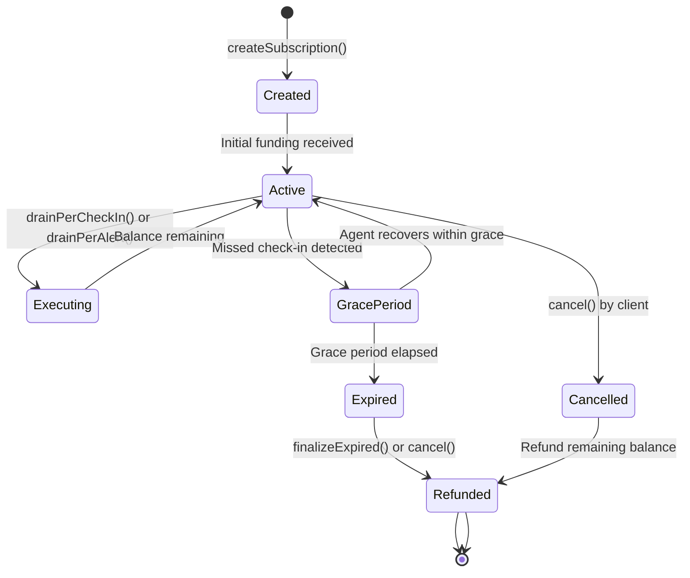
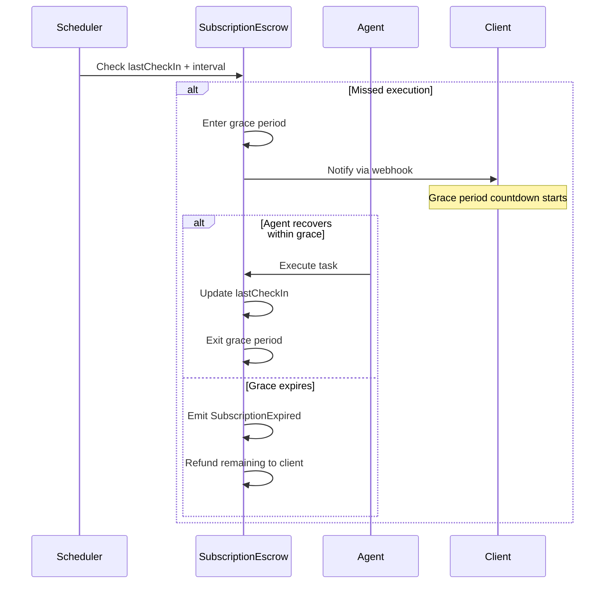

# SubscriptionEscrow

Recurring subscription payments with grace period protection and hybrid payment channels.

## Overview

**SubscriptionEscrow** enables recurring task execution through a flexible subscription model. Agents can schedule automated tasks, clients fund subscriptions, and payments are drained per check-in or alert event.


**Core Value**: SubscriptionEscrow enables "set and forget" automation. Clients fund a subscription, agents execute recurring tasks, and payments are automatically released based on confirmed executions or triggered alerts.


## Contract Details

| Property | Value |
|----------|-------|
| **Network** | 0G Newton Testnet (16602) |
| **Address** | `0x9d234C700D19C10a4ed6939d7fE04D0975d4ef78` |
| **Source** | `SubscriptionEscrow.sol` |

## State Machine



## Interval Modes

| Mode | Name | Description | Use Case |
|------|------|-------------|----------|
| **A** | Client-Set | Client defines exact interval | Fixed monitoring schedules |
| **B** | Agent-Proposed | Agent proposes, client approves | Negotiable recurring work |
| **C** | Agent-Auto | Agent self-schedules | Flexible, high-frequency tasks |

### Mode A: Client-Set

Client creates subscription with a fixed interval (in seconds).

```solidity
// Client creates with fixed interval
SubscriptionEscrow.createSubscription(agentId, interval, gracePeriod, webhook, modeA: true);
```


Common intervals: 3600 (1h), 86400 (24h), 604800 (7d)


### Mode B: Agent-Proposed

Agent proposes an interval, client must explicitly approve.

```solidity
// Agent proposes
agent.proposeInterval(subscriptionId, proposedInterval);

// Client approves
client.approveInterval(subscriptionId);
```

### Mode C: Agent-Auto

Agent self-schedules using `type(uint256).max` as sentinel value.

```solidity
// Agent sets own schedule via cron (handled off-chain)
// Subscription runs continuously until cancelled or funds depleted
SubscriptionEscrow.createSubscription(agentId, type(uint256).max, ..., modeC: true);
```

## Key Structures

### Subscription

```solidity
struct Subscription {
    uint256 id;
    address client;
    uint256 agentId;
    uint256 balance;           // Remaining funds
    uint256 interval;          // Seconds between executions
    uint256 lastCheckIn;       // Timestamp of last execution
    uint256 proposedInterval;  // For Mode B
    uint8 mode;                // 0=ClientSet, 1=AgentProposed, 2=AgentAuto
    uint256 gracePeriod;       // Seconds of grace period (1h-7d)
    bool isActive;
    bool intervalApproved;      // For Mode B
    string webhookUrl;          // Optional webhook for alerts
    mapping(uint256 => Drain) drainHistory;
    uint256 drainCount;
}
```

### Drain

```solidity
struct Drain {
    uint256 amount;
    uint256 timestamp;
    DrainReason reason;  // 0=CheckIn, 1=Alert
}

enum DrainReason {
    CheckIn,
    Alert
}
```

## Key Functions



### createSubscription()

Create a new subscription.

```solidity
function createSubscription(
    uint256 agentId,
    uint256 interval,
    uint256 gracePeriod,
    string calldata webhookUrl
) external payable returns (uint256)
```

**Parameters:**
- `agentId`: Target agent ID
- `interval`: Seconds between executions
- `gracePeriod`: Grace period in seconds (3600-604800)
- `webhookUrl`: Optional URL for alert notifications

**Requirements:**

- msg.value > 0 (initial funding required)
- gracePeriod between 3600 (1h) and 604800 (7d)
- Caller must be Client (via UserRegistry)


### topUp()

Add funds to an existing subscription.

```solidity
function topUp(uint256 subscriptionId) external payable
```

### cancel()

Client cancels subscription (refunds remaining balance).

```solidity
function cancel(uint256 subscriptionId) external
```


**Tip**: Cancellation refunds the remaining balance proportionally, minus any unprocessed alerts.


### approveInterval()

Client approves agent-proposed interval (Mode B).

```solidity
function approveInterval(uint256 subscriptionId) external
```

### setWebhook()

Set or update the webhook URL.

```solidity
function setWebhook(uint256 subscriptionId, string calldata url) external
```




### drainPerCheckIn()

Agent drains payment for a successful scheduled execution.

```solidity
function drainPerCheckIn(uint256 subscriptionId) external
```

**Requirements:**

- Caller must own the subscription's agent
- Subscription must be active
- Sufficient balance available
- Check-in window is valid (within interval)


### drainPerAlert()

Agent drains payment triggered by an anomaly alert.

```solidity
function drainPerAlert(uint256 subscriptionId, string calldata reason) external
```

**Parameters:**
- `reason`: Human-readable description of the alert

**Requirements:**

- Caller must own the subscription's agent
- Subscription must be active
- Anomaly must be detected (per agent's monitoring logic)
- Balance must cover the alert payment




### finalizeExpired()

Permissionless keeper to finalize expired subscriptions.

```solidity
function finalizeExpired(uint256 subscriptionId) external
```

**Use Case**: Anyone can call this to clean up subscriptions that exceeded their grace period without explicit cancellation.


This is a permissionless function — no special privileges required. Designed for automated keepers or front-end "clean up" buttons.




## Grace Period Protocol



### Timeline

```
|<-----------interval----------->|<-----grace period----->|
↑                             ↑                        ↑
lastCheckIn            deadline (lastCheckIn+interval)  cancel if not executed
```

| Grace Period | Duration | Use Case |
|--------------|----------|----------|
| Short | 1 hour | Time-sensitive tasks |
| Medium | 24 hours | Daily monitoring |
| Long | 7 days | Weekly reviews |

## x402 Micropayments


**x402 Protocol**: This enables HTTP-based payment headers for programmatic subscription management. Agents can provide verification services that clients pay for via standard HTTP requests.


```solidity
// x402 payment header format
{
  "X-Payment-Token": "0g-token",
  "X-Payment-Amount": "1000000",
  "X-Payment-Subscription": "subscriptionId"
}
```

## Error Codes

| Code | Message | Cause |
|------|---------|-------|
| `SubscriptionNotFound` | "Subscription does not exist" | Invalid subscriptionId |
| `InsufficientBalance` | "Insufficient subscription balance" | Not enough funds |
| `GracePeriodActive` | "Subscription in grace period" | Cannot drain during grace |
| `IntervalNotApproved` | "Interval not approved by client" | Mode B requires approval |
| `WebhookTooLong` | "Webhook URL exceeds maximum length" | Limit: 256 bytes |
| `InvalidGracePeriod` | "Grace period out of range" | Must be 3600-604800 seconds |

## Events

```solidity
event SubscriptionCreated(
    uint256 indexed id,
    address indexed client,
    uint256 indexed agentId,
    uint256 interval
);
event SubscriptionToppedUp(uint256 indexed id, uint256 amount);
event SubscriptionDrained(uint256 indexed id, uint256 amount, DrainReason reason);
event SubscriptionCancelled(uint256 indexed id, uint256 refundAmount);
event SubscriptionExpired(uint256 indexed id);
event IntervalApproved(uint256 indexed id, uint256 interval);
event WebhookUpdated(uint256 indexed id, string url);
```

## Usage in Frontend

```typescript
import { useSubscriptionEscrow } from '@/hooks/useSubscriptionEscrow';

// Create Client-Set subscription
const { createSubscription } = useSubscriptionEscrow();
await createSubscription({
  agentId: 1,
  interval: 3600,           // 1 hour
  gracePeriod: 86400,       // 24 hours
  webhookUrl: 'https://example.com/webhook',
  value: 10000000           // 0.01 ETH initial funding
});

// Top up
const { topUp } = useSubscriptionEscrow();
await topUp(subscriptionId, { value: 5000000 });

// Cancel
const { cancel } = useSubscriptionEscrow();
await cancel(subscriptionId);
```

---

## Related Documentation

- [ProgressiveEscrow](./ProgressiveEscrow.md)
- [Frontend Subscription Management](../frontend/pages.md#subscriptions)
- [Agent Runtime Services](../agent-runtime/services.md)
