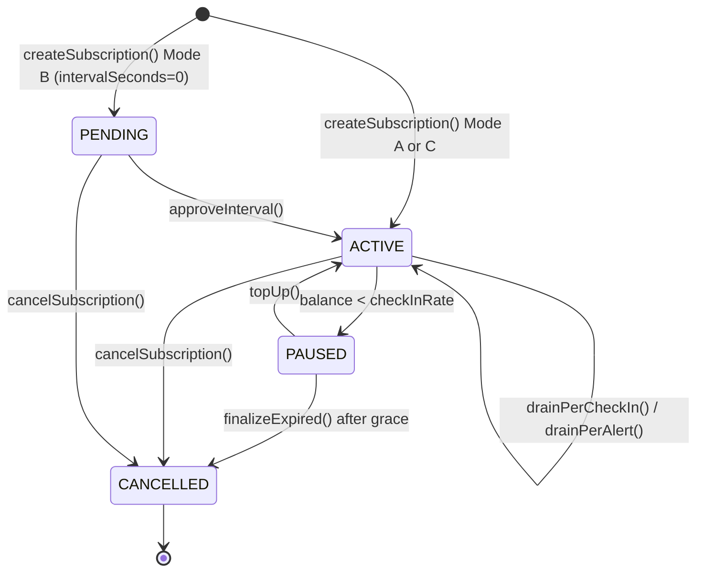
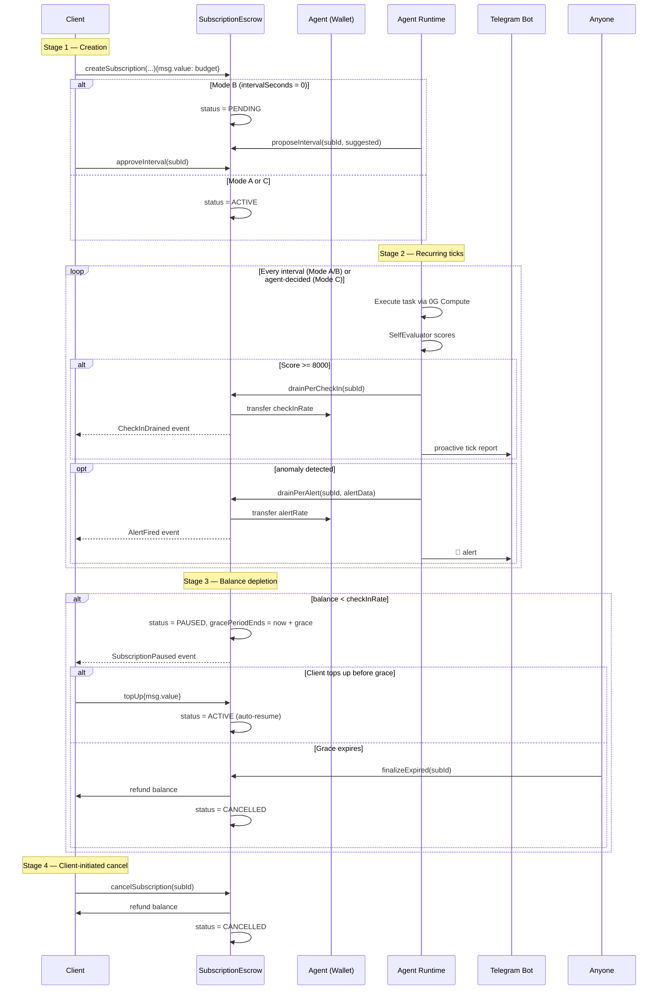

# SubscriptionEscrow

**ERC-8183 Recurring Extension** — recurring AI services with per-tick check-in drains, alert events, three interval modes, OKX APP `session` voucher slots (preview), and grace-period protection.

## Overview

**SubscriptionEscrow** adapts ERC-8183 for **recurring** work. Instead of one-time milestones, the agent drains a configured `checkInRate` from the locked balance on each scheduled execution (or `alertRate` on anomaly events). Three interval modes give clients and agents flexibility on cadence.


**Core value:** "Set and forget" automation. Clients fund a subscription, agents execute on their schedule, payments release per confirmed execution.


## Contract Details

| Property | Value |
|----------|-------|
| **Standard** | ERC-8183 Recurring Extension |
| **Network** | 0G Newton Testnet (16602) |
| **Address** | `0x088400FFf9d37851173e22eef904e710B88F6312` |
| **Source** | `Project/contracts/src/SubscriptionEscrow.sol` |

## State Machine


```mermaid
stateDiagram-v2
    [*] --> PENDING: createSubscription() Mode B (intervalSeconds=0)
    [*] --> ACTIVE: createSubscription() Mode A or C
    PENDING --> ACTIVE: approveInterval()
    ACTIVE --> ACTIVE: drainPerCheckIn() / drainPerAlert()
    ACTIVE --> PAUSED: balance < checkInRate
    PAUSED --> ACTIVE: topUp()
    PAUSED --> CANCELLED: finalizeExpired() after grace
    ACTIVE --> CANCELLED: cancelSubscription()
    PENDING --> CANCELLED: cancelSubscription()
    CANCELLED --> [*]
```

## Interval Modes (`IntervalMode` enum)

| Mode | Enum | `intervalSeconds` at create | Who sets interval |
|------|------|----------------------------|---|
| **CLIENT_SET** | `0` | Any positive value | Client at creation |
| **AGENT_PROPOSED** | `1` (Mode B) | `0` (sentinel) | Agent proposes, client approves |
| **AGENT_AUTO** | `2` (Mode C) | `AUTO_INTERVAL = type(uint32).max` | Agent self-manages via `updateInterval` |

```solidity
// Sentinels
uint32 public constant AUTO_INTERVAL = type(uint32).max; // 4_294_967_295
```

### Mode B Flow (Agent-Proposed)

```solidity
// 1. Client creates with intervalSeconds = 0 → status PENDING
createSubscription(agentId, taskHash, 0, ...);

// 2. Agent proposes
proposeInterval(subId, 3600);   // suggest 1h

// 3. Client approves → status ACTIVE
approveInterval(subId);
```

### Mode C Flow (Agent-Auto)

```solidity
// Client creates with sentinel
createSubscription(agentId, taskHash, AUTO_INTERVAL, ...);

// Agent updates interval dynamically as conditions change
updateInterval(subId, 7200);
```

## Grace Period

When the balance dips below `checkInRate`, the subscription auto-pauses and starts a grace countdown. If the client doesn't `topUp` before grace expires, anyone can `finalizeExpired(subId)` to refund remaining balance.

| Constant | Value |
|---|---|
| `MIN_GRACE_PERIOD` | 1 hour |
| `DEFAULT_GRACE_PERIOD` | 24 hours |
| `MAX_GRACE_PERIOD` | 7 days |

```
|<--------interval-------->|<-------grace period------>|
↑                          ↑                           ↑
lastCheckIn          balance drops              auto-cancel if not topUp
```

## Key Structures

```solidity
struct Subscription {
    address client;
    uint64  agentId;
    address agentWallet;
    uint32  intervalSeconds;       // 0 (Mode B pending) or > 0
    IntervalMode intervalMode;     // 0/1/2
    uint96  checkInRate;
    uint96  alertRate;
    uint128 balance;
    Status  status;                // PENDING/ACTIVE/PAUSED/CANCELLED
    uint64  createdAt;
    uint32  gracePeriodSeconds;
    bool    x402Enabled;             // V1 storage slot reused for OKX session voucher (sessionVoucherEnabled)
    X402VerificationMode x402VerificationMode; // V1 storage slot reused for voucherMode (0 = Delegated, 1 = Explicit Confirm)
    uint64  lastCheckIn;
    uint128 totalDrained;
    uint32  proposedInterval;      // Mode B only
    uint64  pausedAt;
    uint64  gracePeriodEnds;
}
```

## Key Functions

### Write Functions

| Function | Caller | Effect |
|---|---|---|
| `createSubscription(...)` **payable** | Client | Create + fund subscription |
| `topUp(subId)` **payable** | Anyone | Add funds (auto-resumes if PAUSED) |
| `cancelSubscription(subId)` | Client | Cancel + refund balance |
| `approveInterval(subId)` | Client | Mode B: accept agent's proposal |
| `proposeInterval(subId, suggestedInterval)` | Agent's wallet | Mode B: propose interval |
| `updateInterval(subId, newInterval)` | Agent's wallet | Mode C: change interval dynamically |
| `drainPerCheckIn(subId)` | Agent's wallet | Drain `checkInRate` after scheduled execution |
| `drainPerAlert(subId, alertData)` | Agent's wallet | Drain `alertRate` after anomaly detection |
| `setWebhookHash(subId, webhookHash)` | Client OR agent | Update webhook descriptor |
| `finalizeExpired(subId)` | Anyone | Auto-cancel after grace period |

### Read Functions

| Function | Returns |
|---|---|
| `getSubscription(subId)` | Full `Subscription` struct |
| `getBalance(subId)` | Current `uint128` balance |
| `getStatus(subId)` | `Status` enum |
| `getClientSubscriptions(client)` | `uint256[]` |
| `getAgentSubscriptions(agentWallet)` | `uint256[]` |
| `totalSubscriptions()` | Total counter |
| `evaluator()` | Configured evaluator address |

## Function Signatures

### createSubscription()

```solidity
function createSubscription(
    uint256 agentId,
    bytes32 taskHash,                         // keccak256 of task description CID
    uint32  intervalSeconds,                  // 0 (Mode B) | AUTO_INTERVAL (Mode C) | positive (Mode A)
    uint96  checkInRate,                      // wei per scheduled execution
    uint96  alertRate,                        // wei per alert event
    uint32  gracePeriodSeconds,               // clamped to [MIN, MAX]; 0 → DEFAULT
    bool    x402Enabled,                      // V1 slot reused as sessionVoucherEnabled (OKX APP session voucher)
    X402VerificationMode x402VerificationMode, // V1 slot reused as voucherMode (0 = Delegated, 1 = Explicit Confirm)
    bytes calldata clientX402Sig,             // V1 slot reused as clientVoucherSig (empty until V2 runtime path lands)
    bytes32 webhookHash                       // bytes32(0) = no webhook
) external payable returns (uint256 subId)
```

**Notes:**
- `msg.value` is the initial balance.
- Either `checkInRate` or `alertRate` must be non-zero.
- Status starts at `PENDING` for Mode B, `ACTIVE` for Mode A or C.

### drainPerCheckIn()

```solidity
function drainPerCheckIn(uint256 subId)
    external nonReentrant onlyAgent(subId) whenActive(subId)
```

**Requirements:**
- Caller is the agent's `agentWallet`
- Status is `ACTIVE`
- `block.timestamp >= lastCheckIn + intervalSeconds`
- `checkInRate > 0` and `balance >= checkInRate`

Transfers `checkInRate` to `agentWallet`. If post-drain `balance < checkInRate`, auto-pauses.

### drainPerAlert()

```solidity
function drainPerAlert(uint256 subId, bytes calldata alertData)
    external nonReentrant onlyAgent(subId) whenActive(subId)
```

Same access rules as `drainPerCheckIn`, but uses `alertRate`. `alertData` is opaque bytes — typically an off-chain payload reference.

### approveInterval() / proposeInterval() / updateInterval()

```solidity
function approveInterval(uint256 subId) external onlyClient(subId) whenPending(subId);
function proposeInterval(uint256 subId, uint32 suggestedInterval) external onlyAgent(subId) whenPending(subId);
function updateInterval(uint256 subId, uint32 newInterval) external onlyAgent(subId) whenActive(subId);
```

`updateInterval` is Mode C only; `propose/approveInterval` are Mode B only.

### finalizeExpired()

```solidity
function finalizeExpired(uint256 subId) external nonReentrant
```

**Requirements:**
- Status is `PAUSED`
- `block.timestamp >= gracePeriodEnds`

Permissionless keeper function. Refunds remaining balance to client and sets status `CANCELLED`.

## Full Subscription Lifecycle (End-to-End)


```mermaid
sequenceDiagram
    participant Client
    participant SC as SubscriptionEscrow
    participant Agent as Agent (Wallet)
    participant Runtime as Agent Runtime
    participant TG as Telegram Bot

    Note over Client: Stage 1 — Creation
    Client->>SC: createSubscription(...){msg.value: budget}
    alt Mode B (intervalSeconds = 0)
        SC->>SC: status = PENDING
        Runtime->>SC: proposeInterval(subId, suggested)
        Client->>SC: approveInterval(subId)
    else Mode A or C
        SC->>SC: status = ACTIVE
    end

    Note over Runtime: Stage 2 — Recurring ticks
    loop Every interval (Mode A/B) or agent-decided (Mode C)
        Runtime->>Runtime: Execute task via 0G Compute
        Runtime->>Runtime: SelfEvaluator scores
        alt Score >= 8000
            Runtime->>SC: drainPerCheckIn(subId)
            SC->>Agent: transfer checkInRate
            SC-->>Client: CheckInDrained event
            Runtime->>TG: proactive tick report
        end
        opt anomaly detected
            Runtime->>SC: drainPerAlert(subId, alertData)
            SC->>Agent: transfer alertRate
            SC-->>Client: AlertFired event
            Runtime->>TG: 🚨 alert
        end
    end

    Note over SC: Stage 3 — Balance depletion
    alt balance < checkInRate
        SC->>SC: status = PAUSED, gracePeriodEnds = now + grace
        SC-->>Client: SubscriptionPaused event
        alt Client tops up before grace
            Client->>SC: topUp{msg.value}
            SC->>SC: status = ACTIVE (auto-resume)
        else Grace expires
            Anyone->>SC: finalizeExpired(subId)
            SC->>Client: refund balance
            SC->>SC: status = CANCELLED
        end
    end

    Note over Client: Stage 4 — Client-initiated cancel
    Client->>SC: cancelSubscription(subId)
    SC->>Client: refund balance
    SC->>SC: status = CANCELLED
```

## OKX APP Session Voucher (Preview)

> ⚠️ **Status (2026-05-12):** V1 contract carries preview slots only (`x402Enabled` / `x402VerificationMode` / `clientX402Sig` legacy names). Frontend and runtime now surface them under the **OKX APP `session` voucher** schema. No runtime drain path consumes the voucher yet; signature bytes default to `"0x"`. The full replay-proof monotonic-voucher path lands in V2 — see [OKX session voucher design](./OKX_session_voucher_design.md).


When `sessionVoucherEnabled == true`, the subscription is flagged for OKX APP `session` voucher settlement **on top of** the recurring baseline:

- Client pre-signs an EIP-712 voucher template at creation (`clientVoucherSig` — stored in the legacy `clientX402Sig` slot until V2)
- Two voucher modes:
  - `Delegated` — client signs once; agent submits monotonic vouchers on the client's behalf (gas-efficient, best for autonomous high-frequency billing)
  - `Explicit Confirm` — client confirms each batch via Telegram push or wallet prompt (max trust, gated by 0G alignment-node ECDSA over 175K nodes)

In V2 this lets the agent batch many ticks into one on-chain `submitSessionVoucher` settlement, mirroring OKX Agent Payments Protocol v1.0 (April 2026).

## Events

```solidity
event SubscriptionCreated(uint256 indexed subId, uint256 indexed agentId, address indexed client, uint128 initialBalance, bytes32 taskHash);
event IntervalProposed(uint256 indexed subId, uint32 proposedInterval);
event IntervalApproved(uint256 indexed subId, uint32 interval);
event IntervalUpdated(uint256 indexed subId, uint32 newInterval);
event CheckInDrained(uint256 indexed subId, uint64 indexed agentId, uint96 amountWei, uint64 timestamp);
event AlertFired(uint256 indexed subId, uint64 indexed agentId, uint64 timestamp, bytes alertData, uint96 amountWei);
event SubscriptionPaused(uint256 indexed subId, bytes32 reason, uint64 pausedAt, uint64 gracePeriodEnds);
event SubscriptionResumed(uint256 indexed subId, uint128 newBalance);
event SubscriptionCancelled(uint256 indexed subId, bytes32 reason, uint128 refundAmount);
event WebhookSet(uint256 indexed subId, bytes32 webhookHash);
```

## Error Codes

| Code | Cause |
|---|---|
| `ZeroBudget` | `msg.value == 0` on create |
| `ZeroRates` | Both `checkInRate` and `alertRate` are 0 |
| `EmptyDescription` | `taskHash == bytes32(0)` |
| `AgentInactive` | Target agent has `isActive == false` |
| `NotModeB` / `NotModeC` | Function called against wrong interval mode |
| `NoProposal` | `approveInterval` called before `proposeInterval` |
| `TooEarly` | `drainPerCheckIn` called before next interval window |
| `CheckInDisabled` | `checkInRate == 0` |
| `AlertsDisabled` | `alertRate == 0` |
| `InsufficientBalance` | Drain would exceed balance |
| `InvalidStatus` | Action not allowed in current state |
| `NotPaused` / `GraceNotExpired` | `finalizeExpired` precondition unmet |
| `AlreadyCancelled` | Re-cancel attempt |

## Usage in Frontend

### Hook
- `useSubscriptionEscrow.ts`

### Pages

| Page | Functions |
|---|---|
| `/dashboard/create-subscription` | `createSubscription` |
| `/dashboard/subscriptions/[id]` | `topUp`, `cancelSubscription`, `setWebhookHash` |
| `/dashboard/subscriptions/[id]/proposals` | Mode B: `approveInterval` |

### Components

| Component | Purpose |
|---|---|
| `SubscriptionCard.tsx` | Preview with status, balance, mode |
| `DrainHistory.tsx` | Timeline of CheckInDrained / AlertFired events |
| `GracePeriodBanner.tsx` | Warning when nearing grace expiry |
| `ClientTelegramBotSection.tsx` | Telegram (F4) integration for off-chain alerts |

### Example: Create Mode B Subscription

```typescript
import { useSubscriptionEscrow } from '@/hooks/useSubscriptionEscrow';
import { parseEther, keccak256, toBytes } from 'viem';

const { createSubscription } = useSubscriptionEscrow();

const taskCid = await uploadToZGStorage(taskJson);
const taskHash = keccak256(toBytes(taskCid));

const subId = await createSubscription({
  agentId: 5,
  taskHash,
  intervalSeconds: 0,                  // Mode B sentinel
  checkInRate: parseEther('0.001'),
  alertRate: parseEther('0.0005'),
  gracePeriodSeconds: 86_400,          // 24h
  sessionVoucherEnabled: false,        // OKX APP session voucher — V1 slot is x402Enabled
  voucherMode: 0,                      // 0 = Delegated, 1 = Explicit Confirm (unused since disabled)
  clientVoucherSig: '0x',              // EIP-712 voucher template signature — V1 slot is clientX402Sig
  webhookHash: '0x0000000000000000000000000000000000000000000000000000000000000000',
  value: parseEther('0.5'),            // initial balance
});
```

---

## Related Documentation

- [ProgressiveEscrow](./ProgressiveEscrow.md)
- [AgentRegistry](./AgentRegistry.md)
- [Frontend Subscription Management](../frontend/pages.md)
- [Agent Runtime Scheduler](../agent-runtime/services.md)
