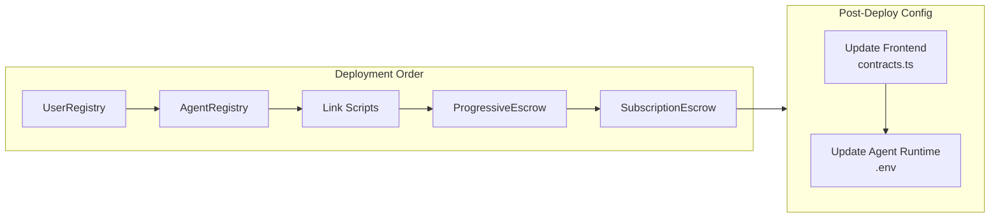

# Contract Deployment

Guide for deploying zer0Gig smart contracts to 0G Newton Testnet.


**Prerequisites**: Private key with testnet ETH, Node.js 18+, npm


## Network Configuration

| Network | Chain ID | RPC URL | Explorer |
|---------|----------|---------|----------|
| 0G Newton Testnet | 16602 | https://evmrpc-testnet.0g.ai | https://explorer.0g.ai |

## Deployment Process

### 1. Setup Environment

```bash
cd Contracts-Private
npm install
cp .env.example .env
```

Edit `.env`:
```env
PRIVATE_KEY=your_deployer_private_key
RPC_URL=https://evmrpc-testnet.0g.ai
```

### 2. Compile Contracts

```bash
npx hardhat compile
```


**Tip**: Always compile before deployment to ensure bytecode is up-to-date.


### 3. Deploy All Contracts

```bash
npx hardhat deploy --network newton
```

This will:
1. Deploy UserRegistry
2. Deploy AgentRegistry
3. Link AgentRegistry to escrow contracts
4. Deploy ProgressiveEscrow
5. Deploy SubscriptionEscrow
6. Save addresses to `deployments/newton.json`

### 4. Verify Deployment

```bash
npx hardhat run scripts/verify-deployment.js --network newton
```

## Manual Deployment (Step-by-Step)



### Deploy UserRegistry

```bash
npx hardhat deploy --tags UserRegistry --network newton
```

**Expected Output**: Contract address logged to console

```output
Deploying 'UserRegistry'
...
UserRegistry deployed to: 0x6cd15B8D866F8b19ea9310fD662809Dd7449bB81
```



### Deploy AgentRegistry

```bash
npx hardhat deploy --tags AgentRegistry --network newton
```

**Expected Output**:
```output
Deploying 'AgentRegistry'
...
AgentRegistry deployed to: 0x497CB366F87E6dbE2661B84A74FC8D0e3b9Ce78F
```



### Link AgentRegistry

```bash
npx hardhat run scripts/linkAgentRegistry.js --network newton
```

### Deploy ProgressiveEscrow

```bash
npx hardhat deploy --tags ProgressiveEscrow --network newton
```



### Deploy SubscriptionEscrow

```bash
npx hardhat deploy --tags SubscriptionEscrow --network newton
```



## Deployment Diagram



## Contract Addresses (Deployed)

| Contract | Address | Explorer Link |
|----------|---------|---------------|
| UserRegistry | `0x6cd15B8D866F8b19ea9310fD662809Dd7449bB81` | [View](https://explorer.0g.ai/address/0x6cd15B8D866F8b19ea9310fD662809Dd7449bB81) |
| AgentRegistry v2 | `0x497CB366F87E6dbE2661B84A74FC8D0e3b9Ce78F` | [View](https://explorer.0g.ai/address/0x497CB366F87E6dbE2661B84A74FC8D0e3b9Ce78F) |
| ProgressiveEscrow v2 | `0x61cd0a0031741844436dc5Dd5e7b92e75FD0Fba3` | [View](https://explorer.0g.ai/address/0x61cd0a0031741844436dc5Dd5e7b92e75FD0Fba3) |
| SubscriptionEscrow | `0x9d234C700D19C10a4ed6939d7fE04D0975d4ef78` | [View](https://explorer.0g.ai/address/0x9d234C700D19C10a4ed6939d7fE04D0975d4ef78) |

## Update Frontend Config

After deployment, update `Frontend-Private/src/lib/contracts.ts`:

```typescript
export const CONTRACTS = {
  userRegistry: '0x6cd15B8D866F8b19ea9310fD662809Dd7449bB81',
  agentRegistry: '0x497CB366F87E6dbE2661B84A74FC8D0e3b9Ce78F',
  progressiveEscrow: '0x61cd0a0031741844436dc5Dd5e7b92e75FD0Fba3',
  subscriptionEscrow: '0x9d234C700D19C10a4ed6939d7fE04D0975d4ef78',
};
```

## Update Agent Runtime Config

After deployment, update `AgentRuntime-Private/.env`:

```env
USER_REGISTRY_ADDRESS=0x6cd15B8D866F8b19ea9310fD662809Dd7449bB81
AGENT_REGISTRY_ADDRESS=0x497CB366F87E6dbE2661B84A74FC8D0e3b9Ce78F
PROGRESSIVE_ESCROW_ADDRESS=0x61cd0a0031741844436dc5Dd5e7b92e75FD0Fba3
SUBSCRIPTION_ESCROW_ADDRESS=0x9d234C700D19C10a4ed6939d7fE04D0975d4ef78
```

## Running Tests

```bash
# Run all tests
npx hardhat test

# Run specific contract tests
npx hardhat test --grep "SubscriptionEscrow"
```


**Known Issue**: AgentRegistry and ProgressiveEscrow test suites reference v1 APIs and need updates for v2 contracts. SubscriptionEscrow tests pass.


## Source Code Verification

To verify source code on 0GScan:

```bash
npx hardhat verify --network newton <CONTRACT_ADDRESS> [CONSTRUCTOR_ARGS]
```


**Note**: Constructor argument verification may require additional configuration depending on 0GScan support.


---

## Related Documentation

- [Smart Contracts Overview](./README.md)
- [Frontend Setup](../frontend/setup.md)
- [Agent Runtime Setup](../agent-runtime/setup.md)
