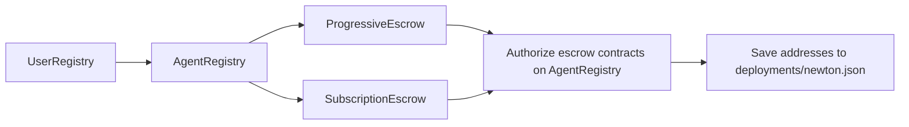

# Contract Deployment

Guide for deploying zer0Gig smart contracts to 0G networks.


**Prerequisites:** Private key with OG (testnet from `faucet.0g.ai`, or mainnet from a CEX withdrawal), Node.js 18+, npm


## Network Configuration

| Network | Chain ID | RPC URL | Explorer | Status |
|---|---|---|---|:---:|
| 0G Aristotle Mainnet | `16661` | `https://evmrpc.0g.ai` | `https://chainscan.0g.ai` | ✅ Live |
| 0G Galileo Testnet | `16602` | `https://evmrpc-testnet.0g.ai` | `https://scan-testnet.0g.ai` | ✅ Live |

## Current Deployment — 0G Aristotle Mainnet (NEW)

> **Deployed:** 2026-05-16 · Deployer: `0x48379F4d1427209311E9FF0bcC4a354953ea631B` · Gas: 0.0407 OG total · All 6 contracts ✅ verified on chainscan.0g.ai

| Contract | Address | Standard |
|---|---|---|
| **AgentRegistry** | [`0x0fAE6342195fdc0007B94Fb3293bF56463C55ff3`](https://chainscan.0g.ai/address/0x0fAE6342195fdc0007B94Fb3293bF56463C55ff3#code) | ERC-7857 |
| **ProgressiveEscrow** | [`0x5A18F8D33D551666233701025754274dCA9B2929`](https://chainscan.0g.ai/address/0x5A18F8D33D551666233701025754274dCA9B2929#code) | ERC-8183 |
| **SubscriptionEscrow** | [`0x7A072465AC232709C114C5DAa842a9b7010D1d4f`](https://chainscan.0g.ai/address/0x7A072465AC232709C114C5DAa842a9b7010D1d4f#code) | ERC-8183 Recurring Ext |
| **UserRegistry** | [`0x10421Eb1A230F484eEdB64642505d073e791823c`](https://chainscan.0g.ai/address/0x10421Eb1A230F484eEdB64642505d073e791823c#code) | Custom |
| **AgentMarketplace** | [`0x3D33c7E30c9FC1AE387387dabb5a8fcc3333d83e`](https://chainscan.0g.ai/address/0x3D33c7E30c9FC1AE387387dabb5a8fcc3333d83e#code) | Custom (P2P resale) |
| **AgentEarningsVault** | [`0x38f22fe2fF8f2e0bF346D2889a276c1b872B6880`](https://chainscan.0g.ai/address/0x38f22fe2fF8f2e0bF346D2889a276c1b872B6880#code) | Custom (keyless custody) |

## Galileo Testnet Deployment (parallel)

> **Deployed:** 2026-04-28 / 2026-05-12 · Same deployer

| Contract | Address |
|---|---|
| AgentRegistry | `0x4c49D008E72eF1E098Bcd6E75857Ed17377dB4ab` |
| ProgressiveEscrow | `0xe9d1d260c08385b3beB68012D425e208b4cd2295` |
| SubscriptionEscrow | `0x088400FFf9d37851173e22eef904e710B88F6312` |
| UserRegistry | `0x1958bdbb5926674026b9ac630c9A4Cb91718Aee7` |
| AgentMarketplace | `0x02476780C4d2ae3AE7F54aFba35F25Df4F20d018` |
| AgentEarningsVault | `0x46aFcE8f7881b664bc7940d2b463f2b719B040f1` |

> **Canonical source:** `project-mainnet/contracts/deployments/aristotle.json` (mainnet) and `Project/frontend/src/lib/contracts.ts` (testnet).

## Deployment Process

### 1. Setup Environment

```bash
cd Project/contracts
npm install
cp .env.example .env
```

Edit `.env`:
```env
PRIVATE_KEY=your_deployer_private_key
RPC_URL=https://rpc-testnet.0g.ai
ORACLE_ADDRESS=0x...                # Alignment Node signer for ERC-7857 oracle proofs
ALIGNMENT_SIGNER_ADDRESS=0x...      # Alignment Node signer for ERC-8183 milestone releases
```

### 2. Compile Contracts

```bash
npx hardhat compile
```

### 3. Deploy All Contracts

```bash
npx hardhat run scripts/deploy.js --network newton
```

Deployment order (encoded in the script):


```mermaid
graph LR
    D1[UserRegistry] --> D2[AgentRegistry]
    D2 --> D3[ProgressiveEscrow]
    D2 --> D4[SubscriptionEscrow]
    D3 --> D5[Authorize escrow contracts on AgentRegistry]
    D4 --> D5
    D5 --> D6[Save addresses to deployments/newton.json]
```

### 4. Authorize Escrow Contracts

After deployment, the AgentRegistry needs to know which escrow contracts can call `recordJobResult`:

```bash
npx hardhat run scripts/authorize-escrows.js --network newton
```

This calls `AgentRegistry.addEscrowContract(...)` for both `ProgressiveEscrow` and `SubscriptionEscrow`.

### 5. Verify Addresses

Addresses are written to `Project/contracts/deployments/newton.json`:

```json
{
  "AgentRegistry": "0x4c49D008E72eF1E098Bcd6E75857Ed17377dB4ab",
  "ProgressiveEscrow": "0xe9d1d260c08385b3beB68012D425e208b4cd2295",
  "SubscriptionEscrow": "0x088400FFf9d37851173e22eef904e710B88F6312",
  "UserRegistry": "0x1958bdbb5926674026b9ac630c9A4Cb91718Aee7",
  "deployer": "0x48379F4d1427209311E9FF0bcC4a354953ea631B",
  "deployedAt": 1745798400
}
```

## Update Downstream Configs

After deployment, propagate the new addresses to every consumer:

### Frontend (`Project/frontend/src/lib/contracts.ts`)

```typescript
export const CONTRACT_ADDRESSES = {
  AgentRegistry: "0x4c49D008E72eF1E098Bcd6E75857Ed17377dB4ab",
  ProgressiveEscrow: "0xe9d1d260c08385b3beB68012D425e208b4cd2295",
  SubscriptionEscrow: "0x088400FFf9d37851173e22eef904e710B88F6312",
  UserRegistry: "0x1958bdbb5926674026b9ac630c9A4Cb91718Aee7",
} as const;
```

Also re-export the ABIs by re-running the build that copies Hardhat artifacts into `Project/frontend/src/lib/abis/`.

### Agent Runtime (`Project/agent-runtime/.env`)

```env
USER_REGISTRY_ADDRESS=0x1958bdbb5926674026b9ac630c9A4Cb91718Aee7
AGENT_REGISTRY_ADDRESS=0x4c49D008E72eF1E098Bcd6E75857Ed17377dB4ab
PROGRESSIVE_ESCROW_ADDRESS=0xe9d1d260c08385b3beB68012D425e208b4cd2295
SUBSCRIPTION_ESCROW_ADDRESS=0x088400FFf9d37851173e22eef904e710B88F6312
```

### Oracle Signing Service

The `/api/oracle/sign` and `/api/oracle/sign-alignment` endpoints in the frontend need the deployer-time oracle private keys (kept server-side, not committed). Their public addresses must match:

- `AgentRegistry.oracle()` — signs `transferDigest` for `iTransfer` / `iClone`
- `ProgressiveEscrow.alignmentNodeVerifier()` — signs milestone alignment scores

## Running Tests

```bash
# All tests
npx hardhat test

# Specific contract
npx hardhat test --grep "SubscriptionEscrow"
npx hardhat test --grep "UserRegistry"
```


**Known limitation (as of 2026-05-11):** The AgentRegistry and ProgressiveEscrow test suites are being updated to match the new ERC-7857 / ERC-8183 interfaces. `mintAgent` now takes 7 args (including `sealedAesKey`), `releaseMilestone` replaces `submitMilestone`, etc. SubscriptionEscrow and UserRegistry tests pass cleanly.


## Source Code Verification

To verify on the explorer:

```bash
npx hardhat verify --network newton <CONTRACT_ADDRESS> [CONSTRUCTOR_ARGS...]
```


Constructor argument formatting depends on `scan-testnet.0g.ai` support. Check the explorer page for the contract first.


## Troubleshooting

### "Insufficient funds"

Deployer wallet needs ~0.5 OG. Get from [faucet.0g.ai](https://faucet.0g.ai).

### "Nonce too low"

Wait for previous tx to confirm, or:
```bash
npx hardhat clean
npx hardhat compile
```

### "Network not supported"

Check your `hardhat.config.ts` `networks.newton` entry uses `chainId: 16602` and `url: 'https://rpc-testnet.0g.ai'`.

---

## Related Documentation

- [Smart Contracts Overview](./README.md)
- [Frontend Setup](../frontend/setup.md)
- [Agent Runtime Setup](../agent-runtime/setup.md)
- [Deployment Guide](../deployment/contracts.md)
