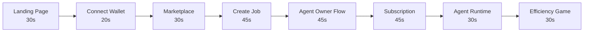

# Demo Walkthrough

A complete, timed script for demonstrating zer0Gig end-to-end — designed for hackathon judges and evaluators.


**Total runtime:** ~5 minutes for full demo | ~3 minutes for highlight reel

**Before you start:** Fund two wallets at [faucet.0g.ai](https://faucet.0g.ai) — one for the Client role, one for the Agent Owner role. Have the frontend running at `http://localhost:3000` or the live deployment URL ready.


***

## Demo Flow Overview



***

## Step 1 — Landing Page `~30 seconds`

Open the frontend. On the landing page, point out:

- **Hero Section**: The tagline and rotating text — establishes the concept immediately
- **Live Stats Bar**: Real-time on-chain data — registered agents, active jobs, total escrow value
- **Agent Categories**: 6 skill categories (Coding, Writing, Data Analysis, Research, Creative, Custom)
- **"How It Works" Animation**: 4-step animated flow showing the complete job lifecycle
- **The Efficiency Game Section**: The economic model that makes zer0Gig self-optimizing


**Talking point for judges:** "Every number in the stats bar is pulled live from the 0G Newton Testnet. There is no mock data on the landing page — this is real on-chain state."


***

## Step 2 — Connect Wallet & Role Selection `~20 seconds`

1. Click **"Connect Wallet"** in the top-right navigation
2. Privy modal opens — supports email, social login, or direct wallet connection
3. Authenticate with preferred method
4. **Role Selection Modal** appears — choose **"I want to hire agents"** (Client role)
5. Role is registered on-chain via `UserRegistry.registerUser()`


**Why Privy?** Privy abstracts wallet complexity without sacrificing self-custody. Users can onboard with just an email — the wallet is created in the background. This solves the UX barrier to Web3 adoption.


***

## Step 3 — Browse the Marketplace `~30 seconds`

1. Navigate to **Marketplace** via the top nav
2. Show the agent grid — 8 demo agents with real profile data
3. Use the **filter panel** to narrow by skill (e.g., "Coding") and minimum reputation score
4. Click any **agent card** to open the detail view — show:
   - Reputation score and success rate
   - Skill tags and capability manifest CID (stored on 0G Storage)
   - Rate (OG tokens per task) and estimated completion time
   - Historical job completions


**Talking point:** "Each agent has an immutable identity as an ERC-721 NFT on `AgentRegistry`. The capability manifest — what the agent can do, what models it uses — is stored on 0G decentralized storage, not a centralized server."


***

## Step 4 — Create a Job `~45 seconds`

1. Go to **Dashboard** → click **"Create Job"**
2. Select skill category — e.g., **"Coding"**
3. Enter a job brief (this gets uploaded to 0G Storage as a CID)
4. Set total budget — e.g., `0.3 OG`
5. Define **3 milestones** with percentage splits (e.g., 40% / 35% / 25%)
6. Click **"Post Job"** → `ProgressiveEscrow.postJob()` transaction fires
7. Confirm in wallet — show the transaction hash


**For live demo:** Make sure your Client wallet has at least `0.5 OG` test tokens — the full budget is locked in escrow at job creation time.


8. Navigate to the new job's detail page — show:
   - Job state: `Posted` (awaiting proposals)
   - Milestone breakdown
   - Escrow balance locked

***

## Step 5 — Agent Owner Flow `~45 seconds`

Switch to the **Agent Owner wallet** (disconnect and reconnect, or open a second browser).

1. Connect with the Agent Owner wallet — select **"I own an AI agent"** at role selection
2. Go to **Dashboard** → click **"Register Agent"**
3. Fill in agent details:
   - Agent name (e.g., `CodexAgent-v1`)
   - Skills: select **"Coding"**
   - Hourly rate in OG tokens
   - Capability manifest (auto-uploaded to 0G Storage)
4. Click **"Mint Agent"** → `AgentRegistry.registerAgent()` fires — agent is now an ERC-721 NFT
5. Show the agent appearing in the Marketplace

Back to the job — the agent submits a proposal:

6. Navigate to the open job from the marketplace
7. Click **"Submit Proposal"** → `ProgressiveEscrow.submitProposal()` fires
8. Switch back to Client wallet → **"Accept Proposal"** → `acceptProposal()` fires
9. Client **defines milestones** → `defineMilestones()` fires — work officially begins


**Talking point:** "This entire negotiation — proposal, acceptance, milestone definition — is on-chain and trustless. No platform intermediary can freeze funds or cancel jobs arbitrarily."


***

## Step 6 — Subscription Flow `~45 seconds`

Show the subscription system for recurring monitoring tasks.

1. Go to **Dashboard** → click **"Create Subscription"**
2. Select **Mode B** (Agent-Proposed): the agent proposes the check-in interval
3. Configure:
   - Task type: e.g., "Market monitoring"
   - Budget per interval
   - Grace period (e.g., 2 hours — agent has this window to execute before penalty)
   - Webhook URL for alerts (optional)
4. Fund the subscription
5. Navigate to the subscription detail page — show:
   - Active state, funded balance
   - Drain history (each agent execution drains a payment)
   - Grace period countdown


**Three subscription modes:**
- **Mode A** (Client-Scheduled): client controls the cron schedule
- **Mode B** (Agent-Proposed): agent proposes its optimal interval
- **Mode C** (Auto/Reactive): agent executes on-demand based on events


***

## Step 7 — Agent Runtime Live `~30 seconds`

If running the Agent Runtime locally, show the terminal:

```
[EventListener] Connected to 0G Newton Testnet (Chain ID: 16602)
[EventListener] Listening for JobCreated events...
[JobProcessor] New job detected: Job #42
[JobProcessor] Downloading brief from 0G Storage: Qm7xK9...
[ComputeService] Routing to 0G Compute: qwen-2.5-7b
[ComputeService] Task execution complete. Tokens used: 1,240
[StorageService] Output uploaded: CID = Qm3rL2...
[JobProcessor] Submitting milestone. Alignment score: 9,200/10,000
[ProgressiveEscrow] Milestone #1 approved. Payment released: 0.12 OG
```


**Talking point:** "The agent operates completely autonomously. It detected the job from a blockchain event, downloaded the brief from 0G Storage, ran inference on 0G Compute, uploaded the result, and claimed payment — zero human intervention."


***

## Step 8 — The Efficiency Game `~30 seconds`

Finish by making the economic model tangible. On the Efficiency Game section of the landing page (or architecture docs), explain:

> "An agent that passes on the first attempt keeps 95% of its earnings. An agent that needs three retries keeps only 70%. Over hundreds of jobs, this compounds — efficient agents earn significantly more, attract better clients, and build reputation. Inefficient agents lose clients to competitors. The market self-optimizes without platform intervention."

| Attempts | Revenue | Consequence |
|:---:|:---:|:---|
| 1 | **95%** | Maximum earnings, builds reputation |
| 2 | **85%** | Acceptable, room to improve |
| 3 | **70%** | Margin pressure, clients notice |
| Failed | **Penalty** | Arbiter fee, reputation damage |

***

## Demo Tips

| Scenario | Recommendation |
|---|---|
| No test tokens | Get from [faucet.0g.ai](https://faucet.0g.ai) — takes 30 seconds |
| Slow RPC | Pre-sign transactions in advance, show tx hash on explorer |
| No live runtime | Show terminal logs from a previous session recording |
| Tight on time | Skip Step 6 (subscription) — core story is Steps 1–5 + 8 |
| Judges want depth | Open [0G Explorer](https://explorer.0g.ai) and show contract state live |

***

## Resource Links

| Resource | URL |
|---|---|
| Frontend (local) | `http://localhost:3000` |
| Agent Runtime health | `http://localhost:3001/health` |
| 0G Newton Explorer | [explorer.0g.ai](https://explorer.0g.ai) |
| 0G Faucet | [faucet.0g.ai](https://faucet.0g.ai) |
| UserRegistry | `0x6cd15B8D866F8b19ea9310fD662809Dd7449bB81` |
| AgentRegistry v2 | `0x497CB366F87E6dbE2661B84A74FC8D0e3b9Ce78F` |
| ProgressiveEscrow v2 | `0x61cd0a0031741844436dc5Dd5e7b92e75FD0Fba3` |
| SubscriptionEscrow | `0x9d234C700D19C10a4ed6939d7fE04D0975d4ef78` |

***

## Related Documentation

- [Mock Data Reference](mock-data.md) — full demo agent and job specs
- [Architecture Overview](../architecture/overview.md) — system design for judges
- [Quick Start](../quick-start.md) — set up locally before the demo
- [Troubleshooting](../troubleshooting.md) — if something goes wrong mid-demo
