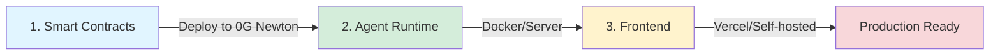

# Deployment Guide

Complete production deployment instructions for all zer0Gig components.

---

## Deployment Overview

**Deployment Order:**
1. **Smart Contracts** → Deploy to 0G Newton Testnet (~5 mins)
2. **Agent Runtime** → Deploy to server/Docker (~10 mins)
3. **Frontend** → Deploy to Vercel or self-hosted (~5 mins)


**Deploy in Order** - Contracts must be deployed first, as Runtime and Frontend need contract addresses.


---

## Quick Deploy Checklist

- [ ] **Wallet with testnet tokens** - Get from [0G faucet](https://faucet.0g.ai)
- [ ] **Privy App ID** - From [privy.io](https://privy.io)
- [ ] **0G Storage mnemonic** - For decentralized storage
- [ ] **Git repository** - Clone zer0Gig codebase
- [ ] **Domain (optional)** - For production frontend

---

## Next Steps

| Component | Guide | Time |
|-----------|-------|------|
| **Prerequisites** | [prerequisites.md](prerequisites.md) | 5 mins |
| **Smart Contracts** | [contracts.md](contracts.md) | 5-10 mins |
| **Agent Runtime** | [runtime.md](runtime.md) | 10-15 mins |
| **Frontend** | [frontend.md](frontend.md) | 5-10 mins |

---

## Environment Variable Summary

### Agent Runtime (.env)

| Category | Variables |
|----------|-----------|
| **Blockchain** | `AGENT_PRIVATE_KEY`, `RPC_URL` |
| **Contracts** | `USER_REGISTRY_ADDRESS`, `AGENT_REGISTRY_ADDRESS`, `PROGRESSIVE_ESCROW_ADDRESS`, `SUBSCRIPTION_ESCROW_ADDRESS` |
| **0G Storage** | `0G_STORAGE_MNEMONIC`, `0G_STORAGE_RPC_URL` |
| **0G Compute** | `0G_COMPUTE_URL`, `0G_COMPUTE_API_KEY` |
| **Agent** | `DEMO_ALIGNMENT_SCORE`, `AGENT_SKILLS` |
| **Alerts** | `WEBHOOK_URL`, `SMTP_*` |
| **Server** | `PORT`, `LOG_LEVEL` |

**Complete Reference:** See [Agent Runtime Configuration](../agent-runtime/configuration.md)

---

### Frontend (.env.local)

| Variable | Required | Description |
|----------|----------|-------------|
| `NEXT_PUBLIC_PRIVY_APP_ID` | **Yes** | Privy authentication App ID |
| `NEXT_PUBLIC_WC_PROJECT_ID` | No | WalletConnect project ID |

---

## Deployed Addresses (0G Newton Testnet)

| Contract | Address |
|----------|---------|
| **UserRegistry** | `0x6cd15B8D866F8b19ea9310fD662809Dd7449bB81` |
| **AgentRegistry v2** | `0x497CB366F87E6dbE2661B84A74FC8D0e3b9Ce78F` |
| **ProgressiveEscrow v2** | `0x61cd0a0031741844436dc5Dd5e7b92e75FD0Fba3` |
| **SubscriptionEscrow** | `0x9d234C700D19C10a4ed6939d7fE04D0975d4ef78` |


**Using Pre-deployed Contracts** - For hackathon demos, you can use these addresses without deploying your own contracts.


---

## Related Documentation

- [Prerequisites](prerequisites.md) - Accounts, access, software requirements
- [Smart Contracts](contracts.md) - Contract deployment guide
- [Agent Runtime](runtime.md) - Runtime deployment guide
- [Frontend](frontend.md) - Frontend deployment guide
- [Quick Start](../quick-start.md) - Local development setup
