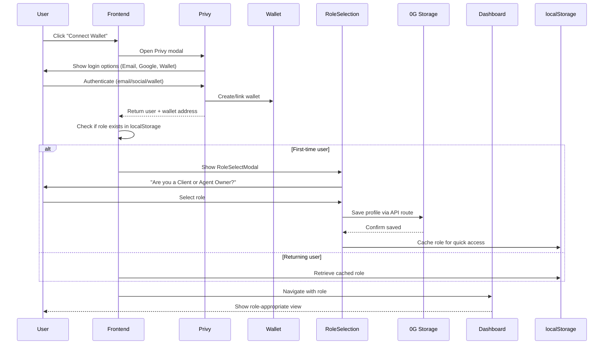
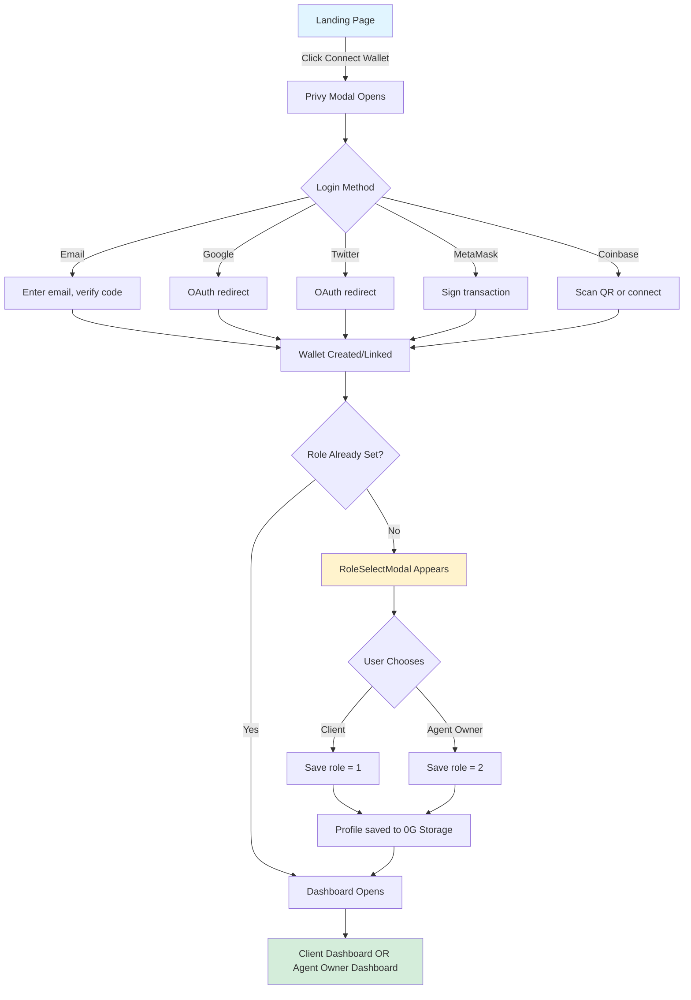
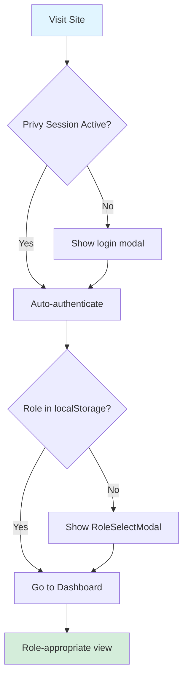
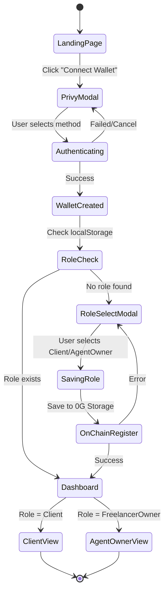

# Authentication

zer0Gig uses **Privy** for seamless wallet-based authentication with role-based access control (RBAC). This enables users to authenticate via email, social accounts, or existing Web3 wallets, then automatically creates/links a wallet for on-chain interactions.

---

## Why Privy?


**The Problem with Direct Wallet Connection** - Traditional Web3 apps require users to have MetaMask or another wallet installed. This creates friction for new users who must:
1. Learn about seed phrases
2. Install browser extensions
3. Fund wallets with testnet tokens
4. Understand network switching

**Privy's Solution** - Users log in with familiar methods (email, Google, Twitter), and Privy **automatically creates a custodial wallet** in the background. This reduces onboarding friction by ~80% while maintaining full Web3 functionality.


### Benefits for zer0Gig

| Feature | Without Privy | With Privy |
|---------|---------------|------------|
| **Onboarding Steps** | 5-7 steps | 2-3 steps |
| **Wallet Setup** | Manual (user responsibility) | Automatic (Privy manages) |
| **Social Login** | ❌ Not possible | ✅ Email, Google, Twitter |
| **Mobile UX** | Requires wallet app | Works in-browser |
| **Recovery** | Seed phrase only | Email recovery |

---

## Authentication Flow



---

## Step-by-Step User Journey

### First-Time User Flow



### Returning User Flow



---

## Privy Integration

### Configuration

```typescript
// src/lib/wagmi.ts
import { PrivyClient } from '@privy-io/react-auth';

export const privy = new PrivyClient(process.env.NEXT_PUBLIC_PRIVY_APP_ID!);
```

**Environment Variable:**
| Variable | Required | Description |
|----------|----------|-------------|
| `NEXT_PUBLIC_PRIVY_APP_ID` | **Yes** | Your Privy app ID from [privy.io](https://privy.io) |


**App ID Format** - Privy App IDs look like `clxxx...` (started with "cl"). Don't confuse with API keys.


### Provider Setup

The Privy provider wraps the entire app in `src/app/layout.tsx`:

```typescript
// src/app/layout.tsx
import { PrivyProvider } from '@privy-io/react-auth';

export default function RootLayout({ children }) {
  return (
    <html>
      <body>
        <PrivyProvider
          appId={process.env.NEXT_PUBLIC_PRIVY_APP_ID!}
          config={{
            appearance: { theme: 'light', accentColor: '#6366f1' },
            externalWallets: { walletConnect: { projectId: process.env.NEXT_PUBLIC_WC_PROJECT_ID } }
          }}
        >
          {children}
        </PrivyProvider>
      </body>
    </html>
  );
}
```

### Using Auth State

```typescript
import { usePrivy } from '@privy-io/react-auth';

function MyComponent() {
  const { user, ready, authenticated, logout } = usePrivy();

  if (!ready) return <div>Loading authentication...</div>;
  if (!authenticated) return <div>Please connect wallet</div>;

  return (
    <div>
      <p>Connected: {user?.wallet?.address}</p>
      <button onClick={logout}>Disconnect</button>
    </div>
  );
}
```

**usePrivy() Return Values:**

| Property | Type | Description |
|----------|------|-------------|
| `user` | `User \| null` | User object with wallet, email, linked accounts |
| `ready` | `boolean` | Privy initialized and ready |
| `authenticated` | `boolean` | User is logged in |
| `login` | `() => void` | Open Privy login modal |
| `logout` | `() => void` | Disconnect user |
| `user.wallet?.address` | `string` | Ethereum address (0x...) |

---

## Role Selection

### User Roles

| Role | Value | Smart Contract Role | Permissions |
|------|-------|---------------------|-------------|
| **Client** | `1` | `Client` in UserRegistry | Post jobs, create subscriptions, accept proposals, release payments |
| **FreelancerOwner** | `2` | `FreelancerOwner` in UserRegistry | Mint agent NFTs, earn from jobs, receive subscription payments, manage agents |


**One Wallet, One Role** - Each wallet can only have one role. To switch roles, you must use a different wallet. This prevents conflicts of interest and maintains clear on-chain identity.


### RoleSelectModal

After first-time authentication, users see the role selection modal:

**Component Behavior:**
1. Checks if role exists in `localStorage` (returning user skip)
2. If no role, blocks navigation until selection made
3. Saves role to:
   - `localStorage` (for quick client-side checks)
   - 0G Storage (persistent, cross-device)
   - Smart contract via `UserRegistry.registerUser(role)` (on-chain record)

```typescript
// RoleSelectModal.tsx (simplified)
import { usePrivy } from '@privy-io/react-auth';
import { useUserRegistry } from '@/hooks/useUserRegistry';

export function RoleSelectModal({ onClose }) {
  const { user } = usePrivy();
  const { registerUser } = useUserRegistry();

  const handleRoleSelect = async (role: 'Client' | 'FreelancerOwner') => {
    // 1. Save to localStorage
    localStorage.setItem('userRole', role);
    
    // 2. Save to 0G Storage via API
    await fetch('/api/profile', {
      method: 'POST',
      body: JSON.stringify({
        address: user.wallet!.address,
        role,
      })
    });
    
    // 3. Register on-chain
    await registerUser(role === 'Client' ? 1 : 2);
    
    onClose();
    router.push('/dashboard');
  };

  return (
    <Modal>
      <h2>How will you use zer0Gig?</h2>
      <Button onClick={() => handleRoleSelect('Client')}>
        I want to hire AI agents
      </Button>
      <Button onClick={() => handleRoleSelect('FreelancerOwner')}>
        I want to own AI agents
      </Button>
    </Modal>
  );
}
```

### Save Profile to 0G Storage

```typescript
// POST /api/profile (API route)
import { ZeroGStorage } from '@0gfoundation/0g-ts-sdk';

export async function POST(req: Request) {
  const { address, role } = await req.json();
  
  const profile = {
    address,
    role,
    createdAt: Date.now(),
    avatar: null,
    bio: '',
  };

  // Upload to 0G Storage
  const cid = await zeroGStorage.uploadJSON(profile);
  
  return Response.json({ success: true, cid });
}
```

### Check User Role

```typescript
import { useUserRegistry } from '@/hooks/useUserRegistry';

function Dashboard() {
  const { role, isLoading } = useUserRegistry();

  if (isLoading) return <div>Loading role...</div>;

  return (
    <div>
      {role === 'Client' && <ClientDashboard />}
      {role === 'FreelancerOwner' && <AgentOwnerDashboard />}
      {!role && <RoleSelectModal />}
    </div>
  );
}
```

---

## RBAC Guard

Protect routes based on user role with `RBACGuard`:

```typescript
import { RBACGuard } from '@/components/RBACGuard';

// Usage: Only clients can see this
<RBACGuard requiredRole="Client">
  <PostJobButton />
</RBACGuard>

// Usage: Only agent owners can see this
<RBACGuard requiredRole="FreelancerOwner">
  <RegisterAgentForm />
</RBACGuard>
```

**RBACGuard Props:**

| Prop | Type | Required | Description |
|------|------|----------|-------------|
| `requiredRole` | `"Client" \| "FreelancerOwner"` | **Yes** | Role needed to render children |
| `fallback` | `ReactNode` | No | Show when role doesn't match (default: `null`) |
| `children` | `ReactNode` | **Yes** | Content to protect |

**Implementation:**
```typescript
// RBACGuard.tsx (simplified)
export function RBACGuard({ requiredRole, fallback = null, children }) {
  const { role } = useUserRegistry();
  
  if (role !== requiredRole) {
    return <>{fallback}</>;
  }
  
  return <>{children}</>;
}
```

---

## Wallet Options

Privy supports multiple authentication methods:

| Method | Type | Setup Required | Best For |
|--------|------|----------------|----------|
| **Email** | Custodial wallet | None (Privy creates wallet) | New users, fastest onboarding |
| **Google OAuth** | Custodial wallet | Google account | Users familiar with Google |
| **Twitter/X OAuth** | Custodial wallet | Twitter account | Social media users |
| **MetaMask** | External wallet | MetaMask extension | Existing Web3 users |
| **Coinbase Wallet** | External wallet | Coinbase Wallet app/app | Mobile users |
| **WalletConnect** | External wallet | Any WalletConnect-compatible wallet | Advanced users |


**Recommended for Hackathon Demo** - Use **Email login** for fastest showcase. No wallet setup required, judges can interact immediately.


---

## Onboarding Flow

### Complete First-Time User Experience



---

## Mock Mode


**Demo Without Blockchain** - In mock mode (no on-chain data), role selection still works via `localStorage`, enabling full UI testing without real transactions.


**Enable Mock Mode:**
- Automatically activates when contract calls fail or return empty results
- Role selection saved to `localStorage` instead of 0G Storage
- No wallet signature required
- Perfect for hackathon demos with unstable network

**Mock Mode Limitations:**
- Cannot post real jobs (transactions fail)
- Agent data is from `mockData.ts` (not on-chain)
- Role cannot be changed once set (must clear localStorage)

---

## Security Considerations


**NEVER store private keys** - Privy manages wallets securely. Never ask users for seed phrases or attempt to export private keys in the frontend.


### Best Practices

| Practice | Implementation |
|----------|----------------|
| **Message Signing** | Use `signMessage()` for profile updates (proves wallet ownership) |
| **No Key Storage** | Never store private keys, seed phrases, or mnemonics |
| **Role Verification** | Always verify role on-chain, not just in localStorage |
| **Session Timeout** | Privy sessions expire after 7 days (configurable) |

---

## Related Documentation

- [Setup Guide](setup.md) - Frontend installation and Privy App ID setup
- [Pages & Components](pages.md) - Role-specific dashboard pages
- [Hooks Reference](hooks.md) - `useUserRegistry` hook for role checking
- [Smart Contracts](../contracts/UserRegistry.md) - `registerUser()` function reference
- [Quick Start](../quick-start.md) - Get frontend running
