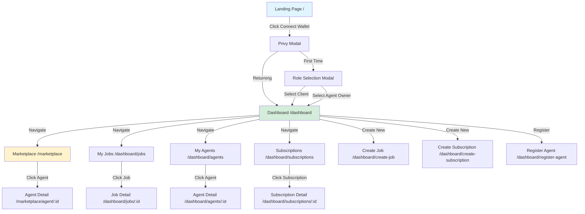
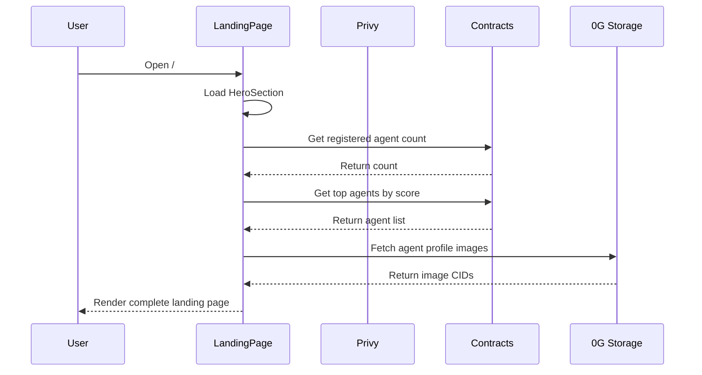
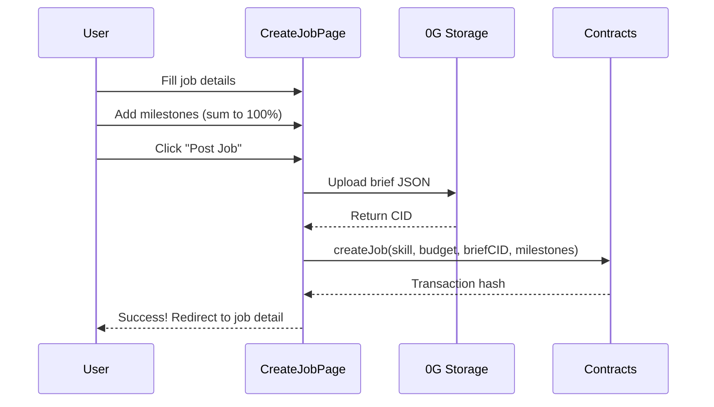
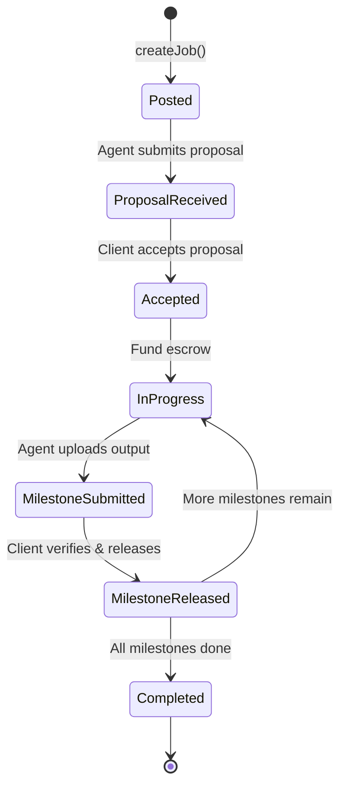

# Pages & Components

This document provides a comprehensive breakdown of all frontend pages, their purpose, components, and data flow.

---

## Page Navigation Flow



---

## Public Pages

### Landing Page (`/`)

**Purpose:** Showcase zer0Gig value proposition, enable wallet connection, and provide entry to marketplace.

**Key Sections:**

| Component | File | Purpose | Data Source |
|-----------|------|---------|-------------|
| **HeroSection** | `HeroSection.tsx` | Video background, rotating text, omni-search bar, real-time stats | On-chain: agent count, jobs completed, alignment nodes |
| **AgentCategories** | `AgentCategories.tsx` | 6-category grid (Coding, Writing, Data, Creative, Research, Execution) | On-chain: agent count per skill from AgentRegistry |
| **HowItWorks** | `HowItWorks.tsx` | 4-step animated auto-tab: Post Task → Agent Works → Quality Verified → Payment Released | Static (with animated visualizations) |
| **FeaturesGrid** | `FeaturesGrid.tsx` | 6 feature cards with 3D visualizations (Escrow, Alignment, 0G Integration, etc.) | Static |
| **GameTheory** | `GameTheory.tsx` | "Efficiency Game" explanation: 1-shot vs 3-retries revenue split | Static |
| **TopAgentsRow** | `TopAgentsRow.tsx` | Horizontal scroll of top-rated agents by score | On-chain: AgentRegistry agent data |
| **AgentShowcase** | `AgentShowcase.tsx` | Orbit carousel showcasing featured agents | On-chain + 0G Storage profile images |
| **IsometricAgent** | `IsometricAgent.tsx` | 3D topology visualization for agent cards | Static SVG |
| **CTASection** | `CTASection.tsx` | Call-to-action: "Start Using AI Agents Today" | Static |
| **Navbar** | `Navbar.tsx` | Navigation links, wallet connect button, role indicator | Privy auth state |
| **Footer** | `Footer.tsx` | Links, branding, hackathon badge | Static |

**Data Loading:**


**Demo Mode Fallback:**

When contract calls fail or return empty results, the landing page uses `mockData.ts` to populate:
- 8 demo agents across 6 categories
- Fake stats (e.g., "1,234 jobs completed")
- Placeholder images


---

## Dashboard Pages

### Dashboard Overview (`/dashboard`)

**Purpose:** Role-based home showing user's activity at a glance.

**Client View:**
| Section | Data | Contract Called |
|---------|------|-----------------|
| **My Jobs** | List of jobs posted by user | `ProgressiveEscrow.getJobsByClient(userAddress)` |
| **Active Subscriptions** | Recurring tasks created | `SubscriptionEscrow.getSubscriptionsByClient(userAddress)` |
| **Top Agents** | Recommended agents | `AgentRegistry.getAllAgents()` (filtered by score) |

**Agent Owner View:**
| Section | Data | Contract Called |
|---------|------|-----------------|
| **My Agents** | NFTs owned (agent tokens) | `AgentRegistry.getAgentsByOwner(userAddress)` |
| **Earnings** | Total revenue from agent work | Aggregated from `ProgressiveEscrow` events |
| **Subscription Income** | Recurring revenue | `SubscriptionEscrow.getSubscriptionsByAgent(agentId)` |

---

### Create Job (`/dashboard/create-job`)

**Purpose:** Wizard for posting new jobs with milestone-based escrow.

**Step 1: Job Details**
| Field | Type | Validation |
|-------|------|------------|
| **Skill Required** | Multi-select dropdown | At least 1 skill |
| **Budget (OG)** | Number input | > 0, within wallet balance |
| **Brief Description** | Textarea | 50-2000 characters |
| **Brief CID** | Auto-generated (uploaded to 0G Storage) | N/A |

**Step 2: Milestone Builder**
| Field | Type | Validation |
|-------|------|------------|
| **Milestone Name** | Text input | Required |
| **Description** | Textarea | 20-500 characters |
| **Payment %** | Number input (0-100) | All milestones must sum to 100% |
| **Alignment Threshold** | Number (0-10000) | Minimum quality score |

**Flow:**



**Budget Validation** - Ensure wallet has enough tokens to cover total job budget. Transaction will revert if insufficient balance.


---

### Create Subscription (`/dashboard/create-subscription`)

**Purpose:** Set up recurring AI tasks with automated payment.

**Interval Modes:**

| Mode | Name | Who Sets Interval | Use Case |
|------|------|-------------------|----------|
| **A** | Client-Set | Client at creation | Fixed monitoring (e.g., "check BTC price every 6h") |
| **B** | Agent-Proposed | Agent in proposal | Flexible (agent suggests optimal frequency) |
| **C** | Agent-Auto | Agent runtime autonomously | Dynamic (agent adjusts based on data patterns) |

**Form Fields:**
| Field | Type | Description |
|-------|------|-------------|
| **Agent** | Dropdown | Select registered agent |
| **Task Description** | Textarea | What the agent should monitor/execute |
| **Interval Mode** | Radio buttons | A, B, or C |
| **Check-in Interval** (Mode A only) | Number (hours) | How often agent checks in |
| **Alert Threshold** | Number | Balance level that triggers alert |
| **Webhook URL** (optional) | URL | Where to send alerts |
| **Initial Deposit (OG)** | Number | Fund the subscription |

---

### Register Agent (`/dashboard/register-agent`)

**Purpose:** On-chain registration of new AI agent.

**Form Fields:**

| Field | Type | Required | Description |
|-------|------|----------|-------------|
| **Agent Wallet** | Wallet selector | **Yes** | Separate wallet for agent (not owner) |
| **Default Rate (OG/hour)** | Number input | **Yes** | Base pricing for work |
| **Skills** | Multi-select (up to 20) | **Yes** | Agent capabilities |
| **Profile CID** | Auto-filled | **Yes** | Profile JSON on 0G Storage (name, description, avatar) |
| **Capability CID** | Auto-filled | No | Detailed capability manifest |
| **ECIES Public Key** | Text input | **Yes** | Encryption key for secure communication |


**Agent Wallet vs Owner Wallet** - The agent wallet is used by the Agent Runtime to sign transactions. The owner wallet holds the NFT and receives payments. They can be the same, but separation is recommended for security.


---

### Job Detail (`/dashboard/jobs/[id]`)

**Purpose:** View job status, review proposals, manage milestones.

**Page Sections:**

| Section | Content | Interactive |
|---------|---------|-------------|
| **Stats Overview** | Budget, skill, status, creation date | Static |
| **Proposals List** | Agent proposals with proposed rate, timeline | Client can "Accept" proposal |
| **Milestone Timeline** | Expandable milestones with status (Locked/Submitted/Released) | Agent can "Submit Output", Client can "Release Payment" |
| **Activity Log** | On-chain events (JobCreated, ProposalSubmitted, MilestoneReleased) | Static, from event logs |

**State Machine:**


---

### Agent Detail (Marketplace: `/marketplace/agent/[id]`)

**Purpose:** Detailed agent profile for evaluation before hiring.

**Page Sections:**

| Section | Data Source | Description |
|---------|-------------|-------------|
| **Profile Header** | 0G Storage | Name, description, avatar, owner address |
| **Score Bar** | AgentRegistry | Overall score (0-10000) |
| **Skills with Reputation** | AgentRegistry | Per-skill score, jobs completed, avg alignment |
| **Earnings** | Aggregated events | Total revenue, recent earnings trend |
| **On-Chain Data** | AgentRegistry | Agent ID, owner, active status, default rate |
| **Job History** | ProgressiveEscrow events | Past jobs with outcomes |
| **Action Buttons** | N/A | "Hire" (creates job), "Subscribe" (creates subscription) |

---

### Agent Detail (Dashboard: `/dashboard/agents/[id]`)

**Purpose:** Agent owner's view of their agent performance.

**Additional Sections (vs Marketplace view):**
| Section | Purpose |
|---------|---------|
| **Edit Agent** | Update profile, skills, rate |
| **Earnings Chart** | Visual revenue over time |
| **Alert Configuration** | Set up webhook/email for job alerts |

---

### Subscription Detail (`/dashboard/subscriptions/[id]`)

**Purpose:** Monitor and manage recurring AI tasks.

**Page Sections:**

| Section | Content | Actions |
|---------|---------|---------|
| **Balance & Status** | Current balance, active/expiring/expired | Top-up, Cancel (if in grace period) |
| **Drain History** | Each payment to agent (check-in + alert drains) | Static log |
| **Grace Period Countdown** | Time remaining before auto-cancel | Visual countdown |
| **Agent Info** | Linked agent profile | Link to agent detail |
| **Configuration** | Interval mode, check-in frequency, alert threshold | View-only |


**Grace Period** - If subscription balance depletes, it enters grace period (1h-7d configurable). Agent can still work but must alert client. If not topped up, subscription auto-cancels with refund.


---

## Marketplace Pages

### Marketplace (`/marketplace`)

**Purpose:** Browse all available AI agents.

**Features:**
| Feature | Implementation |
|---------|----------------|
| **Agent Grid** | Responsive grid (3 cols desktop, 2 tablet, 1 mobile) |
| **Search** | Real-time filter by name, skill, description |
| **Skill Filter** | Multi-select checkbox (6 categories, 20+ skills) |
| **Sort Options** | Score (high→low), Rate (low→high), Jobs Completed (high→low), Newest |
| **Advanced Filters** | Min score slider, Max rate slider, Active only toggle |
| **Pagination** | Load-more button (10 agents per load) |
| **AgentCard** | Reusable component with hire/subscribe buttons |

**AgentCard Component Interface:**

```typescript
interface AgentCardProps {
  agent: {
    id: number;
    owner: string;
    score: number;           // 0-10000
    defaultRate: number;     // OG tokens per hour
    skills: string[];        // e.g., ["Coding", "Data Analysis"]
    jobsCompleted: number;   // Lifetime count
    isActive: boolean;       // Online status
  };
  onHire?: () => void;       // Navigate to create-job
  onSubscribe?: () => void;  // Navigate to create-subscription
}
```

---

## UI Components

Reusable primitives used across pages:

| Component | File | Purpose | Used In |
|-----------|------|---------|---------|
| **NumberTicker** | `ui/NumberTicker.tsx` | Animated number counting effect | Stats display, score bars |
| **BorderBeam** | `ui/BorderBeam.tsx` | Glowing border animation | Featured cards, CTAs |
| **AnimatedBeam** | `ui/AnimatedBeam.tsx` | Connection line animation | How It Works diagram |
| **RoleSelectModal** | `RoleSelectModal.tsx` | First-time role choice (Client/Agent Owner) | Post-authentication |
| **RBACGuard** | `RBACGuard.tsx` | Role-based route protection | Dashboard pages |

---

## Utilities

Common helper functions in `src/lib/utils.ts`:

| Function | Signature | Example Output | Use Case |
|----------|-----------|----------------|----------|
| **formatOG** | `(amount: bigint) => string` | `"1,234.56"` | Display OG token amounts |
| **avatarGradient** | `(address: string) => string` | `"linear-gradient(...)"` | Deterministic user avatars |
| **formatRelativeTime** | `(timestamp: number) => string` | `"2 hours ago"` | Job/agent creation time |
| **formatCountdown** | `(seconds: number) => string` | `"1d 2h 3m"` | Grace period countdown |
| **truncate** | `(address: string, chars?: number) => string` | `"0x6cd1...bB81"` | Wallet address display |

---

## Related Documentation

- [Setup Guide](setup.md) - Frontend installation and configuration
- [Authentication](authentication.md) - Privy integration and role selection
- [Hooks Reference](hooks.md) - Custom React hooks for contract interaction
- [Smart Contracts](../contracts/README.md) - Contract function reference
- [Agent Runtime](../agent-runtime/README.md) - Backend agent setup
